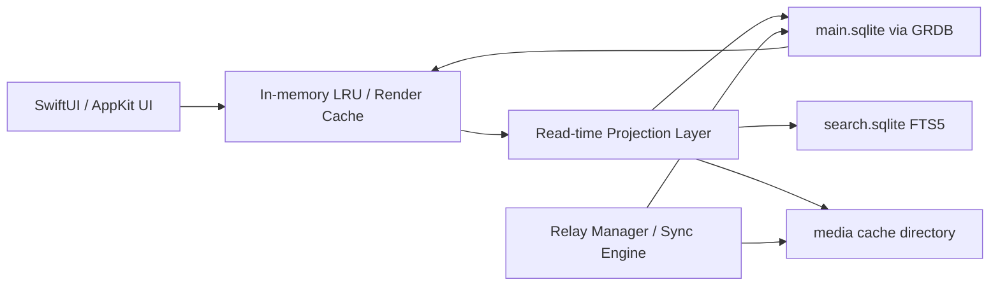

# Astrenza の端末内ローカル永続化設計に関する深掘り調査

> 脚注修正版: 文字化けしていた引用・footnote 表記を通常の Markdown 脚注に置き換えた版です。本文の設計判断は、前回レポートの内容を維持しています。

## 1. Executive Summary

結論から言うと、**Astrenza の端末内主DBは、当面は GRDB + SQLite を継続するのが最善**です。理由は「SQLite が無難だから」ではありません。Astrenza が必要とする、時系列 Home Timeline の即時復元、複数リレーからの重複排除、replaceable / addressable head 解決、局所的な再描画、オフライン復元、段階的 pruning、SwiftUI / Swift Concurrency との接続を、Apple 配布の現実性と保守性を維持したまま最もバランスよく満たせるからです。添付 Research も、Apple-first / local-first / 正規化 event store / `timeline_entries` 重視 / まず GRDB + SQLite を軸にする、という方向を示しています。[^research-report][^research-comparison][^grdb][^sqlite-wal]

一方で、**LMDB / nostrdb をいま主ストアへ全面移行する判断は推奨しません**。LMDB 系は memory-mapped、zero-copy、単一 writer / 複数 reader、安価な read transaction という強みを持ち、nostrdb も LMDB バックの Nostr 特化DBとして魅力があります。Damus は `nostrdb` を取り込み、Notedeck も nostrdb を基盤にする方向を示し、Gossip も LMDB を性能志向の中核として採用しています。[^nostrdb][^damus][^notedeck][^gossip]

ただし LMDB 系には、`map_size` 超過、active transaction 中の resize 失敗、long-lived reader によるページ再利用阻害、reader table の掃除、copy-based compaction という運用上の鋭い角があります。特に UI 観測やスクロール中読み取りが多い iOS アプリでは、long-lived reader による肥大化が現実的なリスクになります。nostrdb 自身も README 上で API が unstable / heavy development mode であることを明示しており、Astrenza の現段階で primary store にするにはリスクが高いです。[^lmdb][^nostrdb]

設計方針としては、**「正規化 event store + lightweight timeline index + read-time projection」**が妥当です。ただし read-time projection とは、毎回すべてを重い JOIN で解決することではありません。避けるべきなのは、`TimelinePost` のような完成済み最終表示 Row を唯一の真実として永続化することです。代わりに、`events`、`event_tags`、`replaceable_heads`、`addressable_heads`、`timeline_entries` を正とし、その上に軽量な render hints / resolved refs / precomputed flags を載せるのがよいです。[^nips-01][^research-report]

最終アーキテクチャを一つに絞るなら、**GRDB + SQLite を主ストア、FTS5 は rebuildable な SQLite sidecar、media 本体は file cache、nostrdb / LMDB は将来の raw event archive sidecar 候補**です。具体的には、`events` / `event_tags` / `replaceable_heads` / `addressable_heads` / `timeline_entries` / `relay_state` / `sync_cursors` / `media_assets` / `link_previews` は SQLite、検索だけ `search.sqlite` に FTS5 を切り出し、画像・動画・thumbnail・blurhash などの実体はファイルで持ちます。[^sqlite-fts5][^sqlite-vacuum-pragma]

## 2. 添付Researchの要約

2つの添付 Research は、かなり一貫した前提を置いています。

第一に、Astrenza は **Apple-first / local-first** であること。第二に、Nostr クライアントの価値は UI 再現だけではなく、**relay の上に載る local-first event browser / signer** を作ることにあること。第三に、ローカルデータ層は **event store、profile cache、relay status、timeline index、UI state を分離**すべきこと。第四に、Apple 実装では **GRDB + SQLite を起点にし、必要になった時点で Rust core や NostrDB を検討**するのが現実的であることです。[^research-report][^research-comparison]

添付 Report は、`events` / `event_tags` / `replaceable_heads` / `addressable_heads` / `timeline_entries` / `sync_cursors` / `media_assets` を含む論理スキーマをすでに提示しています。また観測指標として、`EOSE` 到達時間、timeline hydration time、first interactive scroll、未送信 outbox 件数なども挙げています。これは今回の benchmark plan の土台としてそのまま使えます。[^research-report]

## 3. Researchとの照合結果

### 一致する点

今回の追加調査で最も強く裏付けられたのは、**GRDB + SQLite をまず主ストアにする**という既存方針です。GRDB は Database Observation、Robust Concurrency、Migrations、SQLCipher 連携、WAL を使う DatabasePool を明示しており、SQLite 側も WAL、VACUUM、FTS5、`PRAGMA optimize`、`WITHOUT ROWID` など、Astrenza に必要な基礎機能を手厚く文書化しています。[^grdb][^sqlite-wal][^sqlite-fts5][^sqlite-without-rowid]

### 変更した方がよい点

添付 Report の「正規化 event store + 画面最適化ビュー」という方向は正しいですが、ここは一歩進めて、**“画面最適化ビュー”を完成済み `TimelinePost` 永続化とは切り分ける**べきです。`timeline_entries` は、ID、sort key、少数の flags を持つ軽量 index に留めます。必要なら `timeline_render_hints` のような補助テーブルで relation edge や predecoded flag だけを保持し、最終表示 Row そのものは source of truth にしない方が、削除、quote 遅延到着、kind:0 更新、NIP-05 変化に強くなります。[^research-report][^nips-01]

### 不足していた観点

不足していたのは、**LMDB を iOS アプリ主ストアにした場合の運用負債の具体性**です。LMDB 系には、`map_size` 超過、active transaction 中の resize 失敗、active reader による reclaim 停止、stale reader の reader table 清掃、copy-based compaction という実務上の論点があります。これは「速いか遅いか」ではなく、App Store 配布される iOS/macOS クライアントの運用性の問題です。[^lmdb]

### 古い・曖昧・追加検証が必要な点

nostrdb は、Damus 系で魅力がある一方、README 上で API unstable と明示されています。そのため「Damus 系で魅力がある」は正しいものの、「今すぐ primary store として成熟している」とは解釈しない方がよいです。Realm は 2024年9月以降の deprecation / Device Sync 整理の影響を踏まえる必要があり、ObjectBox Swift は Swift エコシステム上の更新・採用状況の見え方が SQLite / GRDB より弱いです。Amethyst / Quartz / Kadenz については、今回確認できた一次情報だけでは Astrenza に直接転用できる永続化スキーマまでは固定化できませんでした。[^nostrdb][^realm][^objectbox]

### Astrenzaに取り込むべき結論

取り込むべきなのは、主ストア変更ではなく **GRDB の使い方の絞り込み**です。つまり、`TimelinePost` 永続化を厚くするのではなく、`timeline_entries` と `heads` を主役にし、Observation は軽い read model に限定し、検索は sidecar FTS5 に逃がし、メディアは file cache に切る、という方針です。[^grdb][^sqlite-fts5]

## 4. 最終推奨

Astrenza の端末内ローカル永続化は、**主ストアを GRDB + SQLite のまま継続**し、**`events` / `event_tags` / `replaceable_heads` / `addressable_heads` / `timeline_entries` / `relay_state` / `sync_cursors` / `media_assets` / `link_previews` を SQLite に置き、検索だけ FTS5 sidecar、メディア本体は file cache** に分離する構成を推奨します。

もし将来 LMDB / nostrdb を使うなら、primary store ではなく **raw event archive / specialized search sidecar** から始めるべきです。全面移行は最後の手段です。[^lmdb][^nostrdb]

### 重点質問への回答

| 論点 | 結論 |
|---|---|
| Astrenza の端末内主DBは GRDB/SQLite 継続でよいか | はい。継続が妥当です。Nostr の source of truth を関係付きで保持しつつ、SwiftUI / Concurrency / Observation / Migration / SQLCipher 候補まで含めた保守性が高いです。 |
| LMDB/nostrdb に移るべき条件 | 100万 event 級で、SQLite を正規化・index 最適化しても cold-start / ingest / search が目標値を下回り、C/Rust sidecar の運用を受け入れられる場合です。最初は raw archive / search accelerator として使うべきです。 |
| LMDB の肥大化・compaction・map size・reader 問題 | 実害はあります。long-lived reader による reclaim 停止、`map_size` 上限、resize の難しさ、copy-based compaction は iOS のストレージ制約やアプリ寿命と相性が悪いです。 |
| 完成済み `TimelinePost` をDB保存すべきか | source of truth としては避けるべきです。保存するなら relation edge や render hints までに留めます。 |
| 正規化 event store + lightweight timeline index + read-time projection は妥当か | 妥当です。今回の最終推奨そのものです。 |
| FTS5、media cache、OGP cache、relay stats、byte counters を同一DBに置くべきか | structured state は主SQLite、FTS5 は sidecar、media 実体は file store がよいです。OGP metadata、relay stats、byte counters は主SQLiteでよいです。 |
| GRDB のまま改善するなら何をやるべきか | schema 正規化、heads 分離、`timeline_entries` 軽量化、Observation を軽クエリに限定、WAL / checkpoint / pruning の運用設計です。 |
| 乗り換え判断の benchmark | cold launch、first interactive scroll、ingest throughput、dedupe、thread / quote resolution、FTS latency、WAL / checkpoint、DB肥大、battery / CPU、migration time です。 |
| MVP、1年後、巨大ユーザー向け | MVP は主SQLite一本、1年後に FTS sidecar、巨大ユーザー向けで nostrdb / LMDB sidecar 評価です。 |
| 最終推奨アーキテクチャ | GRDB + SQLite 主ストア、FTS5 sidecar、file-based media cache、read-time projection、nostrdb は将来補助 sidecar です。 |

## 5. 比較表

| 候補 | Astrenza適合 | 強み | 弱み | 最終判断 |
|---|---:|---|---|---|
| GRDB + SQLite | 非常に高い | SQLite の全機能を使いながら、Observation、Migration、WAL、SQLCipher 経路を Swift で扱いやすい。 | 1 writer 制約はある。projection 設計を誤ると複雑化する。 | 主ストア推奨 |
| 素の SQLite C API | 高いが開発コスト大 | 最低レベルまで制御可能。 | Observation、Migration、Swift Concurrency 接続を自前構築する必要がある。 | 特殊最適化用途のみ |
| SwiftData / Core Data | 中〜低 | Apple 純正で UI 統合は魅力。 | raw event / tags / explicit SQL tuning には不向き。 | 主ストア非推奨 |
| LMDB | 中 | zero-copy、memory-mapped、安い read。 | map size、long-lived reader、resize、copy compaction が iOS 主ストアには重い。 | sidecar候補 |
| nostrdb | 中 | Nostr 特化、LMDB バック、Damus / Notedeck 文脈。 | API unstable、release 整備が弱い。 | 将来 sidecar 候補 |
| SQLDelight | 中〜高 | compile-time schema / statement / migration 検証、KMP 対応。 | Apple-only MVP では GRDB より回り道。 | Android/KMP 前提なら有力 |
| Realm Swift | 中 | local DB、live objects、SwiftUI integration、encryptionKey。 | Device Sync / SDK deprecation 周辺のガバナンスリスク。 | 主ストア非推奨 |
| ObjectBox Swift | 中 | object DB、relations、自動 migration、iOS/macOS 対応。 | SQLite/GRDB より採用・更新の見え方が弱い。 | 本命ではない |
| DuckDB | 低 | in-process、Swift package、分析系に強い。 | OLAP / columnar が主戦場で feed state とズレる。 | 非推奨 |
| file/blob store + SQLite index | 非常に高い | media 実体をDB肥大から切り離せる。 | cache 整合と GC が必要。 | media の本命 |
| 複数ローカルストア併用 | 高い | main DB を壊さず search / archive / media を分離可能。 | 境界設計を誤ると複雑化する。 | 推奨。ただし責務分離を厳格に |

## 6. 各ローカルDB候補の詳細評価

### GRDB + SQLite

Astrenza に最も合います。Nostr の競合規則を理解した local-first read model を運用するには、raw SQL の見通し、index 設計の可視性、migration、observation、Swift Concurrency との接続が重要です。GRDB はその中間点としてちょうどよく、SQLite の WAL、FTS5、`WITHOUT ROWID`、`PRAGMA optimize`、`incremental_vacuum` をそのまま使えます。[^grdb][^sqlite-wal][^sqlite-fts5][^sqlite-without-rowid]

### 素の SQLite C API

「もっと速い主ストア」というより、特定ボトルネックの外科手術用です。Astrenza の課題は DB ドライバの微小オーバーヘッドより、projection の粒度と observation の張り方にある可能性が高いです。まず GRDB 上で設計を正し、その後にごく狭い hot path だけ C レベル最適化を検討すべきです。

### LMDB / nostrdb

魅力は本物ですが、主ストアにはまだ早いです。raw event archive や specialized search には向いていますが、iOS/macOS の UI 主導アプリで primary store として採用すると、map size、reader transaction、compaction、migration、debugging の負債が増えます。採用するなら sidecar から始めるべきです。[^lmdb][^nostrdb]

### SwiftData / Core Data

Apple 純正の高水準永続化として魅力はありますが、Astrenza の主ストアには向きません。Astrenza が扱うのは、大量 append、dedupe、tags 検索、replaceable head 解決、explicit timeline index であり、ここでは SQL と index の見通しが本質です。

### SQLDelight

Apple-only MVP の置き換え候補ではなく、将来 Android / KMP を本気でやる場合の共有 SQL 層です。1年以内に Android を強く見据えるなら、論理 schema と migrations を SQLDelight 互換に寄せておく価値があります。[^sqldelight]

### Realm / ObjectBox

object DB としての魅力はありますが、Astrenza では normalize された event graph と timeline index の明示制御が重要です。object DB の abstraction は Nostr 仕様との差を見えにくくする恐れがあります。長期保守性でも SQLite 系の方が有利です。[^realm][^objectbox]

### DuckDB

DuckDB は analytical database / columnar engine として優秀ですが、Astrenza の主用途である feed-centric な mutable local state には合いません。分析・一括集計用の開発ツールとしては有用でも、主ストア候補からは外してよいです。[^duckdb]

## 7. Astrenza向け端末内ローカル永続化アーキテクチャ

primary truth は常に `main.sqlite` に置きます。`main.sqlite` には、`events`、`event_tags`、`replaceable_heads`、`addressable_heads`、`timeline_entries`、`relay_state`、`sync_cursors`、`accounts`、`outbox_events`、`drafts`、`media_assets`、`link_previews`、`nip05_cache`、`profile_cache`、`network_counters` を置きます。検索だけ `search.sqlite` に切り、画像・動画・thumb・blurhash の実体は `media/` に出します。

この構成により、検索 index の rebuild、メディアキャッシュの全削除、主DB migration を独立して扱えます。

## 8. schema / index / projection 方針

### `events`

`events` は raw JSON を保持しつつ、主要列を抽出した正規化テーブルにします。最低限必要な列は以下です。

- `event_id` primary key
- `pubkey`
- `kind`
- `created_at`
- `content`
- `raw_json`
- `deleted_at`
- `expires_at`
- `ingested_at`

推奨 index は、`events(kind, created_at desc)`、`events(pubkey, created_at desc)`、`events(deleted_at)`、`events(expires_at)` です。

### `event_tags`

`event_tags` は `event_id`、`pos`、`tag_name`、`tag_value`、`tail_json` を持つ正規化テーブルにします。主な index は `event_tags(tag_name, tag_value, event_id)` です。これにより `#e`、`#p`、`#a`、`#t`、`emoji`、`imeta` などの検索と解決を行います。

### `replaceable_heads` / `addressable_heads`

`replaceable_heads` は `(pubkey, kind)`、`addressable_heads` は `(kind, pubkey, d_tag)` を主キーにします。これらは composite PK の小さなテーブルなので、`WITHOUT ROWID` の候補です。[^sqlite-without-rowid]

### `timeline_entries`

`timeline_entries` は完成済み `TimelinePost` ではなく、軽量 index にします。推奨列は、`entry_id`、`account_id`、`timeline_key`、`event_id`、`sort_ts`、`source_flags`、`gap_state`、`visible_state`、`inserted_at` です。

必要なら `timeline_render_hints` を別テーブルとして置き、`repost_target_event_id`、`quote_target_event_id`、`root_event_id`、`parent_event_id`、`effective_profile_event_id`、`media_flag`、`preview_flag`、`sensitive_flag` などを保持します。ただし source of truth は常に `events` と head tables です。

### GRDB Observation

Observation は使うべきですが、完成済み表示オブジェクト全体を observe しない方がよいです。observe 対象は、`timeline_entries` の ID list、未読カウント、gap 状態、relay 状態、検索結果 ID 群のような軽量 read model に限定します。描画モデル化は別レイヤーで batch projection します。[^grdb]

### FTS5

FTS5 は `search.sqlite` sidecar として導入します。対象は、kind:1 本文、kind:0 の `name` / `display_name` / `about`、URL preview の title / description です。FTS5 は `bm25()`、`highlight()`、`snippet()` を持つため、端末内だけで実用的なランキングと抜粋表示ができます。[^sqlite-fts5]

## 9. pruning / compaction / disk usage 方針

Astrenza は DB 作成時点で **`auto_vacuum=INCREMENTAL`** を選ぶべきです。SQLite 公式は、`FULL` auto-vacuum は freelist を末尾に寄せて truncate する一方、defragment はせず、むしろ fragmentation を悪化させうると説明しています。したがって prune は、論理削除、`incremental_vacuum(N)`、アイドル時 checkpoint の組み合わせがよいです。[^sqlite-vacuum-pragma][^sqlite-wal]

`PRAGMA optimize` は SQLite 3.46.0 以降の推奨経路なので、長寿命接続では起動時に `optimize=0x10002`、その後は日次 `optimize`、index 追加後にも `optimize` を実行します。

WAL は自動 checkpoint でも動きますが、WAL が大きくなると read performance が落ちるため、アプリが background に入る直前やアイドル時に明示 checkpoint を入れるべきです。通常 `VACUUM` / `VACUUM INTO` は、充電中、十分な空き容量、非インタラクティブ時に限定します。

残すべきものは、tombstone、現在 head に採用されている replaceable / addressable、bookmark / mute / list 参照先、可視範囲近傍、thread root / parent、未解決 quote 元候補です。regular events は age / LRU / feed relevance で prune して構いません。

## 10. benchmark plan

ベンチマークは **10,000 / 100,000 / 1,000,000 events** の3段階で実施します。

| 項目 | 測るもの |
|---|---|
| cold launch | アプリ起動から first paint まで |
| first interactive scroll | 起動後に実際にスクロール可能になるまで |
| read position restore | 既読位置復元の p50 / p95 |
| ingest throughput | dedupe + tag insert + head update の write throughput |
| scrolling under ingest | relay ingest 中の dropped frame / hitch |
| projection latency | thread / quote / repost / kind:0 解決の p50 / p95 |
| FTS latency | query p50 / p95、sidecar rebuild 時間 |
| disk behavior | main DB size、WAL size、search DB size、media cache size |
| maintenance | checkpoint、incremental vacuum、full VACUUM / VACUUM INTO 時間 |
| energy | CPU、battery、memory pressure |
| migration | schema migration 時間と失敗復帰 |
| crash recovery | クラッシュ後の DB 整合性と outbox / cursor 復帰 |

候補比較は、GRDB + SQLite、GRDB + SQLite + FTS sidecar、素の SQLite hot path、LMDB / nostrdb sidecar の順で十分です。

## 11. 移行が必要になる条件

GRDB / SQLite から乗り換えを考えるのは、次の条件が揃ったときだけでよいです。

1. schema 正規化、index 最適化、projection 粒度調整、FTS sidecar 導入後でも cold restore や ingest-scroll が目標を外している。
2. ボトルネックが SQLite そのものにあり、Swift 層や projection 層ではないと測定で示せる。
3. 100万 event 級の常用ユーザーが実際に現れ、raw archive / fulltext の要求が主ストアに悪影響を与え始めている。
4. C/Rust sidecar のビルド、デバッグ、クラッシュ復帰、migration、App Store 配布をチームが受け入れられる。

この条件を満たした場合でも、最初の一手は **nostrdb sidecar 追加**です。全面移行は最後の手段です。

## 12. 外部サービスを使わない場合の制約と割り切り

端末スタンドアローン前提では、全履歴の保証、全体検索、トレンド、完全な通知、削除の完全反映は約束できません。NIP-01 の `REQ` / `EOSE` は relay ごとの stored events 境界を示すに過ぎず、削除や replace の反映にも relay 差があります。[^nips-01]

Astrenza は、これを隠すのではなく、**現在この端末にある範囲で最速・最良の読書き体験を出す**方向に振るべきです。検索 UI も「この端末に保存済みの範囲を検索」と明示するのが誠実です。外部 indexer や Pubky Nexus 的な集中 social graph service は、今回の主案とは目的が異なります。将来の補助案として扱うことはできますが、MVP の前提にはしない方がよいです。

## 13. 参考にした一次情報・公式ドキュメント・実装リンク

[^research-report]: 添付 Research: `tweetbot_ivory_nostr_client_report.md`
[^research-comparison]: 添付 Research: `tweetbot_ivory_nostr_client_research.md`
[^grdb]: GRDB.swift README: https://raw.githubusercontent.com/groue/GRDB.swift/master/README.md
[^sqlite-wal]: SQLite WAL: https://www.sqlite.org/wal.html
[^sqlite-fts5]: SQLite FTS5: https://www.sqlite.org/fts5.html
[^sqlite-vacuum-pragma]: SQLite PRAGMA / VACUUM 関連: https://www.sqlite.org/pragma.html
[^sqlite-without-rowid]: SQLite WITHOUT ROWID: https://www.sqlite.org/withoutrowid.html
[^sqlcipher]: SQLCipher: https://www.zetetic.net/sqlcipher/ and https://www.zetetic.net/sqlcipher/design/
[^lmdb]: LMDB documentation: https://lmdb.readthedocs.io/en/release/
[^nostrdb]: nostrdb: https://github.com/damus-io/nostrdb
[^damus]: Damus: https://github.com/damus-io/damus
[^notedeck]: Notedeck: https://github.com/damus-io/notedeck
[^gossip]: Gossip: https://github.com/mikedilger/gossip
[^sqldelight]: SQLDelight: https://sqldelight.github.io/sqldelight/2.1.0/
[^realm]: Realm Swift README: https://raw.githubusercontent.com/realm/realm-swift/master/README.md
[^objectbox]: ObjectBox Swift: https://github.com/objectbox/objectbox-swift
[^duckdb]: DuckDB Swift / DuckDB: https://duckdb.org/docs/stable/clients/swift.html and https://duckdb.org/
[^nips-01]: NIP-01: https://raw.githubusercontent.com/nostr-protocol/nips/master/01.md
[^nips-02]: NIP-02: https://raw.githubusercontent.com/nostr-protocol/nips/master/02.md
