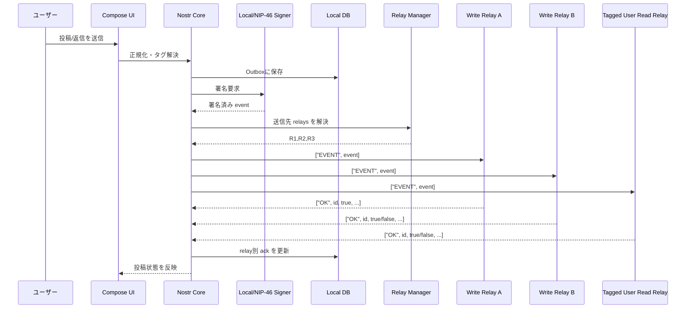
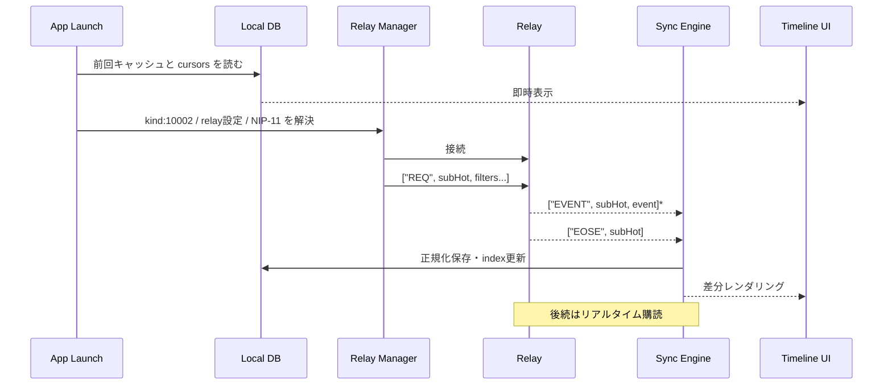
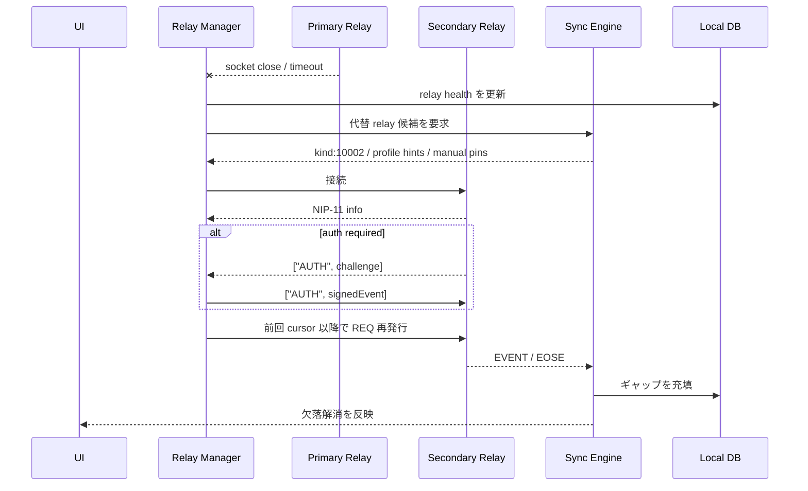
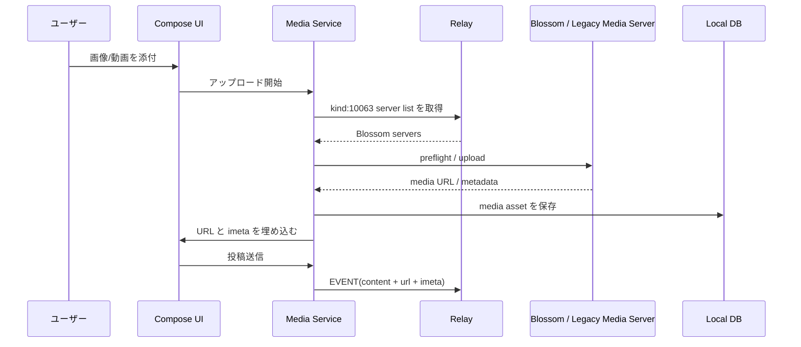

# Tweetbot/Ivoryに着想を得たNostrクライアント構築レポート

## エグゼクティブサマリー

Tweetbot/Ivory的な体験をNostrで再構成する場合、単に「見た目が近いクライアント」を作るだけでは不十分です。TapbotsがIvoryを「Tweetbotで良かったものを出発点にした」と明言し、複数タイムライン、強力なフィルター、複数カラム、テーマ、ジェスチャー、アクセシビリティ、堅牢なタイムライン位置保持を前面に出している一方、Nostrは公式に「スマートクライアント／ダムサーバー」に近い思想を持ち、ユーザーが自分でリレーを選ぶ構造です。したがって、成功条件は **UI の再現** ではなく、**Tapbots的な操作哲学をNostrの分散・断片化・鍵中心モデルに適合させること** です。[^tapbots-nostr-core]

初期版で必須にすべきユーザー機能は、時系列ホーム、カスタムタイムライン、リスト、保存可能なフィルター、ミュート、スレッド閲覧、下書き、複数アカウント、ジェスチャー、テーマ、既読位置復帰です。Tapbotsの公開資料からは、Ivoryが複数タイムライン／リスト／保存フィルター／ミュート／テーマ切替／複数アカウント切替／長押しクイックアクション／iPad・Macでの複数カラムを重視していること、Tweetbotが下書き・トピック連投・リストのメインタイムライン化・スワイプ操作・フィルター・テーマ切替を備えていたことが確認できます。予約投稿は今回の依頼には含まれていますが、本調査で確認できた公式Tapbots資料では中核機能として確認しきれなかったため、**Ivory/Tweetbotの厳密な同型要件ではなく、運用拡張機能** として扱うのが妥当です。[^tapbots-features]

アーキテクチャ上の中核は、**リレー単位の接続管理**、**画面単位ではなく意図単位の購読計画**、**正規化されたローカルイベントストア**、**永続アウトボックス**、**リレー品質と制限に応じた再送・再購読** です。NIP-01はリレーごとに単一WebSocket上で `EVENT`/`REQ`/`CLOSE` を多重化する前提を置き、NIP-11は `max_limit`、`max_subscriptions`、`auth_required`、`restricted_writes`、`payment_required` などの制約を公開し、NIP-65は `kind:10002` により読み取り・書き込み先リレーの分離を定義しています。これらを踏まえると、Tweetbot/Ivory流の「軽快で途切れない」体験をNostr上で実現するには、単純な“全リレー総当たり”ではなく、**NIP-65ベースの outbox/read モデル** を採るべきです。オフライン再同期は `EOSE` を基本にしつつ、後期フェーズで NIP-77 Negentropy を導入すると帯域効率が大きく改善します。[^nips-core-sync]

プロトコル採用の優先順位は明確です。**必須** は NIP-01/02/05/09/10/11/42/51/65、**強く推奨** は NIP-13/17/44/46/49/57/59/77/92/B7/98、**条件付き** は NIP-26/37/40/45/47/50/70/78/89/94、**互換目的でのみ扱うべき** は NIP-04 と NIP-96 です。NIP-04は明示的にNIP-17へ非推奨化され、NIP-96はNIP-B7へ非推奨化されています。また、NIP-26は仕様自体に「little gain に対して burden が大きい」との注意が付いています。したがって、DM は **NIP-17 + NIP-44 + NIP-59** を主系にし、メディアは **NIP-92 + Blossom/NIP-B7** を主系にし、NIP-04/NIP-96 は既存エコシステム互換の残置機能として分離実装するのが最も現実的です。[^nips-dm-media]

実装方針として最も有望なのは、**Apple-first なら SwiftUI 前面 + Nostrコア共有層**、**広いマルチプラットフォームなら Rustコア + 薄い各プラットフォームUI** です。理由は、Tapbots的な体験は細かなジェスチャー、カラム、アクセシビリティ、スクロール品質、タイムライン位置保持が本質であり、これはUI層をネイティブに寄せるほど作りやすい一方、Nostrの暗号・NIP追随・同期ロジックは共有コアのほうが保守しやすいからです。`rust-nostr` は高レベルクライアント機能と多言語バインディングを持ち、Swift/JS/Flutter向けの経路もあります。Web は `nostr-tools` か NDK が有力で、特に NDK は outbox model と Negentropy sync を含む高レベル実装を志向しています。[^rust-web-ui]

最大リスクは三つです。第一に、**鍵管理**。Nostrでは秘密鍵がアカウントそのものであり、日本語の入門資料でも `nsec` を絶対に他人に渡してはいけないと明示されています。第二に、**リレー断片化**。どのリレーに接続するかで可視データが大きく変わります。第三に、**周辺インフラの信頼面**。Push は APNs/FCM を経由するためメタデータ面のプライバシーに注意が必要で、メディアはNIP-96からBlossom系へ移行中です。したがって、UIの出来以上に、**鍵を安全に持ち、どのリレーから何を読むかを説明可能にし、補助サーバーを最小化すること** が製品価値になります。[^privacy-push-media]

## 前提と評価軸

この依頼では、対象プラットフォーム、予算、チーム規模、収益モデル、独自リレー保有の有無、モデレーション責任範囲が未指定です。そこで本レポートでは、**「テキスト中心のソーシャルNostrクライアント」** を前提にし、長文・動画・コミュニティ・DVM・市場系は拡張領域として扱います。また、工数ラベルの「低・中・高」は **3〜5人程度のプロダクトチーム** を仮定した相対評価とし、1〜2人の小規模チームなら 1.7〜2.3 倍程度の実時間を見込む前提で読み替えてください。これは前提条件であり、外部仕様ではありません。

Nostr側の評価軸として重要なのは、**鍵の安全性**、**リレー断片化への耐性**、**帯域効率**、**オフライン復帰速度**、**説明可能なUX** の五つです。日本語のNostr解説でも、クライアントはリレーから取得しリレーへ公開し、接続先リレーが誰の投稿を見られるかに大きく影響すると説明されています。また、ユーザー向け日本語ガイドは、削除の完全性に期待できないこと、通信量が多くなりがちなこと、秘密鍵の扱いが最優先であることを強調しています。したがって、Tweetbot/Ivory的な「軽快さ」は、単なる描画性能ではなく、**分散ネットワークの複雑さをUIで吸収する能力** として設計すべきです。[^nostr-jp]

未指定項目に対する設計上の分岐は、次のように整理するのが実務的です。

| 未指定項目 | 本レポートの標準前提 | 代替案 |
|---|---|---|
| 対象プラットフォーム | iOS/macOS優先、Android/Webは追随 | 初期から全方位なら Rust共有コア + 各プラットフォーム薄いUI |
| 鍵管理方針 | 端末内保管を基本、NIP-49でエクスポート | 高セキュリティ用途は NIP-46 リモート署名を標準にする |
| メディア方針 | Blossom/NIP-B7 を第一候補 | 既存互換のため NIP-96 を暫定残置 |
| 通知方針 | 最小限の補助バックエンドで Push | Push 無しの完全ローカル運用も選択肢 |
| 収益化 | 未前提 | サブスク、Pro機能、ホスティング課金、企業向け管理機能 |
| モデレーション責任 | クライアント側の可視性制御を中心 | 独自リレー運営なら abuse 運用が追加で必要 |

プラットフォーム選定の初手としては、Tapbots自身がAppleプラットフォーム上でIvoryの価値を、複数カラム、細かなジェスチャー、アクセシビリティ、タイムライン位置保持として表現しているため、**「Tweetbot/Ivoryらしさ」を最短で再現するなら Apple-first** が自然です。他方、Nostrは複数言語・複数環境のクライアント実装が活発で、`rust-nostr` や Tauri、Flutter、NDK のような共有化手段も成熟しつつあるため、**市場到達速度を優先するなら共有コア戦略** も十分現実的です。[^platform-first]

## UX要件とTweetbot/Ivoryマッピング

Tweetbot/Ivory的なUI/UXの本質は、装飾的な見た目ではなく、**「閲覧・操作・切替・抑制」の密度が高いこと** です。Ivoryは、ホームからローカル／連合タイムライン／リストを切り替えられ、読み込み済み範囲に対する強力な検索と保存フィルターを提供し、複数アカウントやテーマをジェスチャーで切り替えられます。Tweetbotは、スワイプによる返信・会話展開・短縮アクション、リストをメインタイムラインに据える運用、下書き、トピック連投、フィルターを備えていました。Nostrクライアントでも、この「素早い視点切替」と「ノイズ制御」を最優先要件に置くべきです。[^tapbots-features]

| 項目 | Tweetbot/Ivoryで確認できる示唆 | Nostrクライアントへの具体要件 | 根拠 |
|---|---|---|---|
| 時系列ホームと複数タイムライン | Ivory はホームからリスト・ローカル・連合タイムラインへ切替、複数タイムラインをサイドバー/カラムで扱う | ホーム、メンション、プロフィール、リスト、カスタムリレー集合を一級の timeline type として実装 | Ivory タイムライン切替と複数タイムライン。[^ivory-timeline] |
| リスト | Ivory はリストをホームと同列で扱い、ホームから除外も可能。Tweetbot はリストをメインタイムライン化できた | NIP-02 の follow list に加え、NIP-51 の follow sets / bookmark sets を UI の主役に据える | Ivory リスト運用、Tweetbot list tips。[^ivory-lists] |
| フィルター | Ivory は保存可能な強力フィルター、Tweetbot は saved search 的フィルターと quick filters を提供 | ローカルDB前提の on-device filter engine、保存済みフィルター、クイックフィルター、アカウント別Filterプリセット | Ivory filters、Tweetbot timeline filters。[^ivory-filters] |
| ミュート | Ivory はユーザー・キーワード・ハッシュタグ・正規表現・一時/永続ミュートを提供 | NIP-51 mute list をベースに、公開/非公開ミュート項目、正規表現、期限付きミュート、通知ミュートを分離 | Ivory mute filters/regex。[^ivory-mute] |
| スレッド閲覧 | Tweetbot は左スワイプで会話/返信詳細、Topics で連投を制御 | NIP-10 root/reply を正しく解釈し、会話の root・parent・children を段差表示。投稿時はチェーン作成支援が必要 | Tweetbot timeline gestures と compose topics、NIP-10。[^threading] |
| 下書き | Tweetbot は無制限下書きを提供 | ローカル下書きは必須。後期フェーズで NIP-37 による暗号化クロスデバイス案を追加 | Tweetbot drafts、NIP-37 draft wraps。[^drafts] |
| 予約投稿 | 本調査で確認できたTapbots公式資料では中核機能として確認できず | Nostrのコア体験とは分離し、ローカル予約 or 信頼できる補助ワーカーとして実装 | 調査対象のTapbots資料群。[^scheduled-posts] |
| 複数アカウント | Ivory はタイトルバーで即時切替、長押しで別アカウントからのアクション。Tweetbot Mac は複数窓で同時閲覧可能 | アカウントごとに色・署名元・送信先を明示し、誤投稿防止を組み込む。並列閲覧/同時送信も前提にする | Ivory misc、Tweetbot Mac multiple accounts。[^accounts] |
| ジェスチャー | Ivory は長押し、二本指テーマ切替、タイトルバーアカウント切替、既読位置復帰。Tweetbot は左右スワイプで主要操作 | 片手操作と視線遷移を減らす gesture map を仕様化し、各画面で意味を揃える | Ivory misc、Tweetbot timeline gestures。[^gestures] |
| テーマ/アクセシビリティ | Ivory は 11色テーマ、高低コントラスト、VoiceOver、文字サイズ、Alt-text reminder | テーマ色、行間、メディア密度、コントラスト、Dynamic Type 相当、alt text 未入力警告を実装 | Ivory features と accessibility。[^ivory-theme-a11y] |
| カラムUI | iPad は最大3列、Macは最大6列 | タブレット/デスクトップは column-based dashboard を前提設計し、単純モバイル拡大にしない | Ivory iPadOS/macOS。[^ivory-columns] |
| 既読位置保持 | Ivory は cross-deviceの timeline position retention を訴求、Tweetbotも既読復帰重視の文化を持つ | per-feed/per-account の read cursor を永続化し、戻った時に飛ばないことを最重要KPIにする | Ivory top page、Tweetbot misc。[^read-position] |

Nostr向けに特に重要なのは、**フィルターとミュートを「表示制御」だけでなく「ネットワーク戦略」にも結び付けること** です。Ivoryのフィルターは loaded posts 向け検索と保存済み条件として説明されていますが、Nostrでは同じ条件を、ローカルDB上の表示条件と、サブスクリプション条件の双方で使い分ける必要があります。たとえば「Media Only」は表示レイヤーだけでよい一方、「特定語句ミュート」や「特定スレッドの通知抑止」は、受信はしても通知キューへは入れない、という別経路の制御が必要です。[^filter-network]

リスト機能も、NostrではTwitter/Mastodon型の単純フォルダ分けより一段深く実装できます。NIP-02 の `kind:3` は基本フォロー一覧であり、新しいものが過去を上書きするバックアップ用途も持ちます。NIP-51 は follow sets `30000`、relay sets `30002`、bookmark sets `30003`、interest sets `30015`、kind mute sets `30007` などを定義しているため、Ivory/Tweetbotの「リスト」と「フィルター」を分離するより、**Nostrでは「人セット」「リレーセット」「関心セット」「ミュートセット」を横断的に扱う情報設計** が適しています。[^nips-lists]

## プロトコル要件とNIPサポート

Nostrクライアントの成否は、UIより先に **どのNIPをどの深さで扱うか** によって決まります。NIP-01 はイベントの基本形、kindの大分類、`REQ`/`EVENT`/`EOSE`/`OK` などのメッセージ、フィルターのAND/OR意味論、単一文字タグのインデックス期待を定義しています。NIP-11 はリレーごとの制約を公開し、NIP-65 はどのリレーで読み書きすべきかの手掛かりを与えます。ここを浅く実装すると、クライアントは動いても「見落とす・重い・送れない・つながらない」を招きます。[^nips-core-min]

### 推奨NIPサポート行列

| NIP | 用途 | 推奨度 | 設計判断 | 根拠 |
|---|---|---|---|---|
| NIP-01 | 基本イベント、kind分類、REQ/EVENT/EOSE/OK、フィルター | 必須 | コア実装 | `REQ`/`EVENT`/`EOSE`、replaceable/addressable、single-letter tag indexing。[^nip-01] |
| NIP-02 | 基本フォローリスト `kind:3` | 必須 | コア実装 | `kind:3` follow list、最新が過去を上書き。[^nip-02] |
| NIP-04 | 旧DM暗号 | 互換のみ | 主系にしない | NIP-17 への非推奨化が明記。[^nip-04] |
| NIP-05 | DNSベース識別子 | 必須 | 表示・検証に実装。WebはCORS考慮 | `.well-known/nostr.json` と CORS/redirect 制約。[^nip-05] |
| NIP-09 | 削除要求 | 必須 | トゥームストーン処理 | 削除要求・クライアント側の非表示推奨。[^nip-09] |
| NIP-10 | スレッド/返信マーカー | 必須 | root/reply 正規解釈 | root/reply marker と e-tags の規約。[^nip-10] |
| NIP-11 | Relay info document | 必須 | 起動時・接続時に参照 | `auth_required`、`max_limit`、`max_subscriptions`、`payment_required` 等。[^nip-11] |
| NIP-13 | Proof of Work | 推奨 | アンチスパム/高負荷リレー対策 | difficulty commitment の扱い。[^nip-13] |
| NIP-16 | Event treatment | 条件付き | 互換理解として扱う | relay実装側機能一覧での採用例あり。[^relay-impl] |
| NIP-17 + 44 + 59 | 現代的DM | 強く推奨 | DM主系 | NIP-17 は NIP-44/59 を利用し、漏えい時の否認性も意識。[^nip-17-44-59] |
| NIP-26 | 委任署名 | 原則 open | デフォルトでは使わない | 仕様自体が burden 大と警告。[^nip-26] |
| NIP-37 | Draft wraps | 推奨 | クロスデバイス下書き用 | `kind:31234` に暗号化下書きを保持。[^nip-37] |
| NIP-40 | 有効期限 | 推奨 | 表示/通知抑制に実装 | `expiration` tag。[^nip-40] |
| NIP-42 | Relay AUTH | 必須 | 認証つきリレー対応 | relay が `auth-required` を返せる。[^nip-42] |
| NIP-45 | COUNT | 条件付き | 件数最適化に有効 | フォロワー数や件数取得の軽量化。[^nip-45] |
| NIP-46 | Remote signing | 強く推奨 | 高セキュリティ標準候補 | 秘密鍵を少数システムにしか晒さない設計。[^nip-46] |
| NIP-47 | Nostr Wallet Connect | 推奨 | Zap UXに重要 | remote lightning wallet 接続。[^nip-47] |
| NIP-49 | 秘密鍵暗号化 | 強く推奨 | エクスポート/バックアップ必須 | password で private key を暗号化。[^nip-49] |
| NIP-50 | Search | 条件付き | relay依存機能として実装 | `search` filter field。[^nip-50] |
| NIP-51 | Lists | 必須 | ミュート・ブクマ・カスタム集合の中心 | 公開/非公開項目、mute/bookmark/relay/search relays 等。[^nip-51] |
| NIP-57 | Zaps | 推奨 | Nostrらしさを高める | `9734`/`9735` zap request/receipt。[^nip-57] |
| NIP-65 | Relay list metadata | 必須 | outbox/read モデルの核 | `kind:10002` の read/write relay list。[^nip-65] |
| NIP-70 | Protected events | 条件付き | 自己公開制限の高度機能 | `["-"]` tag と NIP-42 前提。[^nip-70] |
| NIP-77 | Negentropy syncing | 推奨 | 後期フェーズで帯域最適化 | ID差分同期で帯域削減。[^nip-77] |
| NIP-78 | App-specific data | 条件付き | 非相互運用な設定同期に有効 | custom app data 用。[^nip-78] |
| NIP-89 | App handler discovery | open | 未知kindへの導線 | unknown kind の handler 発見。[^nip-89] |
| NIP-92 | inline media metadata | 推奨 | 投稿内メディアの主系 | `imeta` tag と rich preview。[^nip-92] |
| NIP-94 | file metadata events | 条件付き | social clientでは補助的 | social clientへは必須ではないと明記。[^nip-94] |
| NIP-96 | legacy HTTP file storage | 互換のみ | 既存サーバー互換 | NIP-B7 へ非推奨化。[^nip-96] |
| NIP-B7 | Blossom media | 強く推奨 | メディア主系 | `kind:10063` server list と SHA-256 検証。[^nip-b7] |
| NIP-98 | HTTP Auth | 推奨 | 補助API/メディア/自社バックエンド向け | `kind:27235` で HTTP auth。[^nip-98] |

未指定NIPは、今回の要件では原則 **open backlog** として扱うのが安全です。日本語の NIPs 目録を見ると、長文投稿 NIP-23、公開チャット NIP-28、グループ NIP-29、絵文字 NIP-30、センシティブ表示 NIP-36、ユーザーステータス NIP-38、動画イベント NIP-71、コミュニティ NIP-72、ハイライト NIP-84、DVM用 NIP-90 など、社会系クライアントを肥大化させうる仕様が多数あります。これらは「将来拡張候補」として分離し、初期版では **時系列ソーシャル・読みやすさ・安全性** を損なわない範囲に留めるべきです。[^nips-ja]

### 競合解決とイベント解釈の原則

Nostrでは複数リレーから同じイベントや競合するイベントが届くため、クライアント側で一貫した競合解決規則を持つ必要があります。正規イベントは `id` で重複排除し、replaceable は `(pubkey, kind)` ごとに最新を採用し、同一タイムスタンプなら辞書順で低い `id` を残し、addressable は `(kind, pubkey, d)` ごとに最新を採用します。削除要求は参照先著者の `pubkey` が一致するときだけ有効扱いし、`expiration` が過ぎたイベントは表示・通知・検索結果の候補から外します。これは NIP-01 の replaceable/addressable 規約、NIP-09 の削除要求、NIP-40 の expiration に基づく実装原則です。[^event-resolution]

## クライアントアーキテクチャ

推奨アーキテクチャは、**UI層、ドメイン層、Nostrコア、ローカルストア、補助バックエンド** の五層です。Nostrコアは、イベント正規化、署名、購読計画、リレー選定、再送、競合解決を担い、UI層は timeline state と gesture state の表現に集中します。ローカルストアは「ただのキャッシュ」ではなく、**閲覧モデルそのもの** です。Ivoryが loaded posts に対してローカル検索や保存フィルターを前提にすることを考えると、Nostrクライアントでも timeline 表示は常に local-first にすべきです。[^architecture]

### 投稿フロー

投稿時は、単１リレー送信ではなく **著者の write relays + 参照/タグ対象の read relays** を意識した fan-out が必要です。NIP-65 は、イベント公開時に著者の write relays へ送り、タグ付けしたユーザーの read relays にも送るべきだとしています。署名はローカル鍵でも NIP-46 remote signer でもよく、送信後は relay ごとの `OK` を保持し、全部成功と一部成功をUIで区別すべきです。[^publish-flow]

このフローの根拠は NIP-01 の `EVENT`/`OK`、NIP-65 の relay list metadata、NIP-46 の remote signing にあります。[^publish-flow-detail]

### 購読と初期同期

購読戦略は画面ごとではなく、**目的ごと** に設計するのがよいです。ホームは follow set と relay set を元にした outbox model、メンションは自アカウントの read relays、プロフィール画面は対象ユーザーの metadata/list/relay list、スレッド画面は root/reply chain の event ID と author hints を起点にします。NIP-01 では単一接続上で複数フィルターをOR結合でき、`EOSE` は初期蓄積分の終端を示します。NIP-11 は `max_limit` や `max_subscriptions` の存在を前提にクライアントが大きな範囲を分割すべきことを示唆しています。[^subscription-sync]

この設計により、起動直後はキャッシュで即時描画し、その後に `EOSE` 到達で catch-up 完了を判定できます。さらに NIP-77 を後期導入すると、手元の event set と relay 側との差分をIDレベルで帯域効率よく確認でき、フル再取得を避けられます。[^eose-negentropy]

### リレーフェイルオーバー

Nostrでは「落ちたから別リレーに切り替える」だけでは不十分です。どのリレーが **誰の write relay なのか**、どのリレーが **mentions の read relay なのか** を区別しないと、フェイルオーバー後に thread の片割れだけ消えたり、メンションだけ見えなくなったりします。また、relay によっては `AUTH` が必要で、支払い要求や書き込み制限もあります。したがって、Relay Manager は relay health だけでなく、**役割と制約** を保持すべきです。[^relay-failover]

フェイルオーバーの際は、NIP-11の `max_limit` を見て time-slice を細かくし、問題のフィードだけを優先復旧させるのが良い実装です。全購読を一気に張り直すと、むしろ NIP-11 制約に衝突しやすくなります。[^relay-failover-detail]

### メディアアップロード

メディアは、2026年時点では **NIP-B7 Blossom 主系、NIP-96 互換残し** が妥当です。NIP-B7 は `kind:10063` によるユーザーの Blossom サーバー一覧を参照し、SHA-256 アドレスの再解決やハッシュ検証を推奨しています。Blossom本体のBUD群では、取得、アップロード、削除、ミラー、メディア最適化、事前検査のHTTPエンドポイントが定義されています。表示側は NIP-92 の `imeta` を優先し、必要なら NIP-94互換メタデータも読む形が合理的です。[^media-upload]

設計上の注意は、**アップロード完了前の投稿送信を許すかどうか** です。ユーザー体験としては optimistic UI が望ましい一方、Nostrイベントは送信後の書き換えが難しいため、MVPでは「アップロード完了後に送信」、上級版で「仮メディアアセット + retryable compose queue」に進むのが無難です。これは NIP-01 の即時 publish モデルと、NIP-92/B7 のメディア後付け構造を踏まえた実装判断です。[^media-upload-detail]

## セキュリティ性能データ設計

### セキュリティとプライバシー

鍵管理は最優先です。日本語のNostr入門は `nsec` を誰にも教えてはいけないと明言しており、NIP-46 は秘密鍵の露出先を減らすための remote signing を定義し、NIP-49 はパスワードによる秘密鍵暗号化エクスポートを定義しています。したがって、通常運用では **OS の secure storage に鍵参照を置く**、エクスポートは **NIP-49**、高リスク利用者には **NIP-46 signer/bunker** を提供する、という三層構えが適切です。[^keys]

DMについては、**NIP-04 を新規主系にしてはいけません**。NIP-04 自体が NIP-17 による非推奨を明示しており、NIP-17 は NIP-44 の versioned encryption と NIP-59 の seal / gift wrap を前提にしています。特に NIP-59 は rumor・seal・gift wrap を分離し、漏えい時の否認可能性や受信者秘匿に配慮しています。したがって、DM や private list、秘密下書きの暗号部品は、**NIP-44 系に一本化** するのが正しい方向です。[^dm-security]

Relay privacy については、ユーザーに明確な説明が必要です。クライアントはどのリレーへ何を送るかで可視範囲が変わり、Nostter/Welcome系の日本語資料でも「どのリレーに接続するか」が見える世界を左右すると説明されています。また、NIP-51 の lists は公開項目を `tags` に、非公開項目を NIP-44 で暗号化して `.content` に持てるため、ミュート語句や blocked relay のような“嗜好と対立関係が露出しやすい情報”は既定で private list 化すべきです。[^relay-privacy]

削除に関しては、**完全削除を約束してはいけません**。NIP-09 は削除要求を relay/client が尊重すべきだとしつつ、削除要求イベント自体は広く保持・伝搬されるべきとしています。日本語のWelcome to Nostrでも「完全な消去は期待できない」と明記されています。製品文言、ヘルプ、確認ダイアログ、設定文面のすべてで、この非対称性を説明すべきです。[^delete]

Push通知は便利ですが、プライバシー面のトレードオフがあります。APNs と FCM はいずれもサーバーと端末をつなぐ push 基盤であり、報道では Apple と Google に対する push 通知記録の法執行アクセスが問題化しています。そのため、Nostrクライアントでは **内容そのものを push に載せない**、**粗い通知種別だけ送る**、**通知プロキシに relay 購読の全文を長期保存しない**、**機微アカウント向けに push 無効運用を用意する** 方がよいです。[^push]

### 性能とスケーラビリティ

接続モデルは、NIP-01 に従って **リレーあたり単一WebSocket** を基本にし、その上で複数 subscription を多重化するのがよい設計です。クライアントがリレーごとに何本もソケットを張ると、relay 側の接続制限や `max_subscriptions` 制約と相性が悪くなります。したがって、「connection pooling」は一般的なHTTPプールではなく、**relay-granularity の論理プール** と捉えるべきです。[^performance-ws]

バッチングとバックプレッシャーは NIP-11 を読む前提で必要です。`max_limit` がある以上、長い期間を一回の `REQ` で引こうとせず、時間窓を刻んで順に追う必要があります。`max_subscriptions` が低いリレーでは、ホームと通知とプロフィール前読みを全部“常時hot”にすると破綻するので、購読を **hot / warm / cold** に分けて、画面に近いものだけ常時維持する設計が適しています。 `auth_required` や `payment_required` を見て、購読自体を保留にする経路も必要です。[^backpressure]

オフライン同期は二段構えが現実的です。第一段は NIP-01 の `since`/`until`/`limit` と `EOSE` を用いた time-based catch-up、第二段は NIP-77 Negentropy による set reconciliation です。NIP-77 は client-relay / relay-relay 双方で使え、共通集合が多いほどフル転送より帯域を節約できます。モバイル回線での利用を考えるなら、Negentropy は「なくても動く」ではなく、**ネットワークコストを下げる後期必須機能** と見なした方がよいです。[^offline-sync]

実運用リレーを自前で持つ場合、候補としては strfry と nostr-rs-relay が有力です。strfry は LMDB へのローカル保存、durable writes、permessage-deflate、zstd、イベントの import/export、Negentropy ベース同期、Prometheus metrics を備えています。nostr-rs-relay は SQLite 永続化と実験的 PostgreSQL 対応、広いNIPカバレッジ、コンテナ起動のしやすさが魅力です。前者はハイパフォーマンス運用寄り、後者は SQLite ベースで扱いやすい構成寄りです。[^relay-impl]

### ローカルDBスキーマの推奨

Tweetbot/Ivory風の「一瞬で開いて、位置が飛ばず、フィルターも速い」体験には、正規化イベントストア + 画面最適化ビューの二層DBが必要です。以下は、NIP-01/02/09/10/37/40/51/65/77/92 を踏まえた推奨論理スキーマです。[^db-schema-nips]

| テーブル | 主キー | 主な index | 目的 |
|---|---|---|---|
| `accounts` | `account_id` | `pubkey` unique | 複数アカウント管理、署名方式種別、表示テーマ関連 |
| `events` | `event_id` | `(kind, created_at desc)`, `pubkey`, `deleted_at`, `expires_at` | 正規イベント本体 |
| `event_tags` | `(event_id, pos)` | `(tag_name, tag_value)`, `(tag_name, event_id)` | `#e`/`#p`/`#a` 検索、thread 再構成 |
| `replaceable_heads` | `(pubkey, kind)` | `updated_at` | kind 0/3/10000系の最新 head |
| `addressable_heads` | `(kind, pubkey, d_tag)` | `updated_at` | 30000系の最新 head |
| `timeline_entries` | surrogate | `(account_id, timeline_key, sort_ts desc)` | ホーム/メンション/リストなどの描画最適化 |
| `relay_profiles` | `(relay_url)` | `health_score`, `last_eose_at` | relay 品質、NIP-11 能力、auth/payment 状態 |
| `sync_cursors` | `(account_id, timeline_key, relay_url)` | `last_seen_at` | 既読位置、再購読カーソル |
| `outbox_events` | `(local_id)` | `status`, `next_retry_at`, `relay_url` | 送信待ち・再送・部分成功管理 |
| `drafts` | `(draft_id)` | `account_id`, `updated_at` | ローカル下書き。後期でNIP-37 mirror 可 |
| `lists` | `(list_id)` | `kind`, `d_tag`, `account_id` | follow sets / relay sets / bookmark sets / mute sets |
| `list_items` | `(list_id, item_key)` | `item_type`, `visibility` | 公開/非公開 list 項目 |
| `media_assets` | `(asset_id)` | `sha256`, `status`, `local_path` | アップロード待ち、キャッシュ、サムネイル状態 |

インデックス戦略では、`event_tags(tag_name, tag_value)` と `timeline_entries(account_id, timeline_key, sort_ts)` が特に重要です。前者は `#e`/`#p`/`#a` ベースの thread/profile 解決、後者は “last read から復帰” の高速化に効きます。replaceable/addressable head を別テーブルに出すのは、NIP-01 由来の競合解決規則を描画クエリから切り離すためです。[^db-index]

暗号化 at rest は、**鍵と私的データの保護** を中心に考えるべきです。SQLCipher は SQLite に対して 256-bit AES のフルDB暗号化を提供し、Room は Android で SQLite 抽象化を、GRDB は Swift で SQLiteアプリ開発向けツールキットを、SQLDelight は型安全なSQL API生成を提供します。したがって、iOS/macOS は GRDB + 端末側保護、Android は Room あるいは SQLDelight + 端末側保護、共有層が強い構成では SQLDelight、Web は Dexie による公開キャッシュ中心、という分け方が堅実です。[^db-stack]

プルーニング方針としては、regular events はサイズ/期間ベースで間引きつつも、**削除要求、replaceable latest head、既読位置に近い周辺、ブックマーク参照先、thread root/parent** は優先保持すべきです。NIP-09 の削除トゥームストーンは短命にせず、NIP-40 の expiration 対象は表示から外しても監査用に短期間残した方が同期不整合を減らせます。これは単なる容量削減より「再構成可能性」を優先する設計です。[^pruning]

## 技術選定と外部インフラ

### プラットフォーム別スタック候補

対象プラットフォームが未指定なので、まずは「どのUXを最適化したいか」で選ぶべきです。Tweetbot/Ivory 由来の価値を最大化したいなら、UIはネイティブ寄りが有利です。一方で、Nostrコアは変化が速いため、暗号・署名・NIP差分対応は共有化の利益が大きいです。[^platform-stack-intro]

| 選択肢 | 代表スタック | 長所 | 短所 | 推奨度 |
|---|---|---|---|---|
| Apple-first native | SwiftUI + `rust-nostr` の Swift/FFI 経路 + GRDB | Ivory/Tweetbot系のジェスチャー、カラム、アクセシビリティ、描画品質を最も再現しやすい。SwiftUI は Apple 全面対応。 `rust-nostr` は高レベルクライアント機能と bindings を持つ。[^apple-stack] | Android/Web は別実装になりやすい | **最有力** |
| Android native | Jetpack Compose + `rust-nostr` FFI + Room または SQLDelight + WorkManager | Androidの background/notification/large-screen 最適化がしやすい。Compose は推奨UI、Room は SQLite 抽象化。[^android-stack] | AppleのUIと完全同一感は出しにくい | 有力 |
| Web/PWA | React/Vue/Svelte + NDK または `nostr-tools` + Dexie | 反復速度が最速。NDK は outbox model/Negentropy を志向、`nostr-tools` は低レベルで軽い。 Dexie は IndexedDB ラッパー。[^web-stack] | 鍵保管・background・Push・メディア権限周りがモバイルネイティブより厳しい | Web重視なら有力 |
| Tauri desktop | Tauri + 任意のfrontend + Rust backend | 任意frontend + Rust backend、デスクトップ/モバイル単一基盤、比較的小さいバイナリ。[^tauri-stack] | ネイティブ感の作り込みは別途必要 | Desktop重視なら有力 |
| Electron desktop | Electron + JS/HTML/CSS + `nostr-tools`/NDK | 圧倒的なWeb人材親和性とエコシステム。Playwright/Electron テストも取りやすい。[^electron-stack] | 容量・メモリ・セキュリティ面のコストが大きい | 開発速度優先なら可 |
| Flutter | Flutter + `nostr-sdk-flutter` + SQLite系ストア | 単一コードベースで mobile/web/desktop。 `rust-nostr` book でも Flutter 経路が案内される。[^flutter-stack] | Apple的細かなUI哲学の再現は追加工夫が必要 | チーム構成次第 |
| Kotlin Multiplatform | Compose Multiplatform + SQLDelight + 任意 Nostr core | DB共有や domain 共有がしやすい。Realm Kotlin も Android/KMP 向け GA とされる。[^kmp-stack] | Apple側の細部で追加工夫が出やすい | 代替案 |

結論として、**Apple-first/ブランド体験重視** なら `SwiftUI + Rust共有コア`、**全方位市場・工数効率重視** なら `Rust共有コア + Tauri/Web + Android native or Flutter` が現実的です。Webだけなら NDK が速いですが、Tweetbot/Ivory風の“触って心地よい”UXは、最終的にネイティブUI側で詰める必要が出ます。[^platform-conclusion]

### 外部サービスと運用基盤

Nostrクライアントは“完全にサーバーレス”にも見えますが、実務では補助インフラをどこまで持つかが品質を左右します。特に push、メディア、監視、場合によっては予約投稿は、補助基盤の設計次第で体験が大きく変わります。[^infra-intro]

| 領域 | 第一候補 | 代替案 | 設計コメント |
|---|---|---|---|
| 独自リレー | strfry | nostr-rs-relay | strfry は LMDB・durable writes・Negentropy・Prometheus が強く、nostr-rs-relay は SQLite ベースで扱いやすい。[^relay-impl] |
| Push | APNs + FCM を叩く最小限の通知プロキシ | Pushなしのローカル運用 | Appforegroundに依存しない通知にはサーバーが必要。メタデータ最小化が重要。[^push] |
| 画像 | Blossom/B7 + 必要に応じて Cloudflare Images | S3 + CloudFront | Blossom はNostr文脈に自然。Cloudflare Images は画像パイプライン運用負荷を下げる。 CloudFront/S3 は汎用。[^image-infra] |
| 動画 | Blossom + 外部最適化、または Cloudflare Stream | Mux等の外部動画基盤 | 動画はエンコード/配信負荷が高い。Cloudflare Stream は upload/store/encode/deliver を一体提供。[^video-infra] |
| 監視/計測 | OpenTelemetry + Sentry | Prometheus 単独やベンダー任意 | OTel は vendor-neutral な traces/metrics 基盤、Sentry は mobile/Electron 含むエラー/性能監視が速い。[^observability] |
| CI | GitHub Actions | 各社CI | マルチプラットフォーム matrix build とテスト自動化に向く。[^ci] |
| E2E | Playwright | プラットフォーム別UIテスト追加 | Web と Electron をまたいだ自動テストに向く。[^e2e] |

WebSocket ライブラリや UI フレームワークは、可能なら **プラットフォーム標準** か、よく保守された主要実装に寄せるべきです。Android では OkHttp が高性能I/O基盤を提供し、Compose は Android 推奨の modern UI toolkit です。Apple側は SwiftUI を中心に据え、Web はブラウザ標準 WebSocket + NDK/nostr-tools で十分に始められます。[^ws-ui-libraries]

## 品質保証ロードマップ次の一手

### テスト、CI、観測性

品質保証は、**NIP準拠テスト**、**relay相互運用テスト**、**UX回帰テスト** の三本柱で組むべきです。relay 実装差異が実害に直結するので、少なくとも strfry と nostr-rs-relay の双方に対する統合試験を継続実行し、replaceable/addressable/deletion/expiration/auth のテストベクトルを固定化してください。CI は GitHub Actions で matrix build とテストを回し、Web/Electron は Playwright、モバイルはプラットフォーム別UIテストを足す構成が妥当です。[^testing]

観測性は、crash 収集だけでは足りません。Nostrクライアントでは、relayごとの RTT、`EOSE` 到達時間、`OK false` 率、再接続回数、timeline hydration time、first paint、first interactive scroll、未送信 outbox 件数、media upload 失敗率、account switch 時の誤送信防止ヒット数などを追うべきです。OpenTelemetry は traces/metrics の共通基盤として使え、Sentry は mobile performance や Electron 向けのエラー収集を提供します。[^observability]

法務・倫理面では、**削除の非完全性**、**relay exposure の明示**、**push metadata の最小化**、**鍵紛失時の不可逆性** を正面から説明する必要があります。日本語資料が強調する三点——秘密鍵の厳格管理、削除の非完全性、通信量の多さ——は、そのままプロダクト上の説明責任でもあります。法域別の詳細規制は未指定なので、実装方針としては「ログ最小化」「オプトイン計測」「data export/delete policy の可視化」「支払い/Zap まわりの個別法務レビュー」を推奨します。[^legal-ethics]

### ロードマップ

以下のロードマップは、**3〜5人チーム想定** の相対工数です。`低` は 1〜2 スプリント、`中` は 2〜4 スプリント、`高` は 4 スプリント以上を想定しています。

| マイルストーン | 労力 | 依存 | 成果物 | 主なリスク | 緩和策 |
|---|---|---|---|---|---|
| スコープ確定 | 低 | なし | 対象プラットフォーム、MVP機能、必須NIP一覧、補助サーバー有無の意思決定 | 機能過積載 | 「Twitter代替」ではなく「Tweetbot/Ivory風Nostr閲覧体験」に軸を固定 |
| Nostrコア雛形 | 高 | スコープ確定 | event model、署名、relay manager、subscription planner、outbox/inbox、NIP-01基盤 | relay相互運用バグ | strfry/nostr-rs-relay 両対応の統合試験を同時着手 |
| ローカルDB基盤 | 高 | Nostrコア | 正規化イベントストア、replaceable/addressable heads、timeline entries、migration基盤 | スキーマ頻繁変更 | 論理スキーマと読み取りモデルを分離 |
| 読み取りMVP | 高 | DB基盤 | ホーム、メンション、プロフィール、スレッド、既読復帰 | 断片化で会話が欠ける | relay hints + NIP-65 + secondary fetch で補完 |
| 投稿MVP | 中 | Nostrコア | 投稿、返信、削除、再送、部分成功UI、アカウント明示 | 一部relayのみ成功 | relay別ack可視化、retry queue、send diagnostics |
| リスト/フィルター/ミュート | 中 | 読み取りMVP、DB | リストUI、保存フィルター、正規表現ミュート、通知ミュート | 隠しすぎで混乱 | active filters 状態の可視化と即時解除導線 |
| 鍵管理と複数アカウント | 高 | 投稿MVP | secure storage、NIP-49 export/import、複数アカウント切替、誤送信防止 | 鍵紛失/漏えい | NIP-46 option、バックアップ導線、確認UI |
| メディア基盤 | 中 | 投稿MVP | NIP-92 表示、B7/Blossom upload、legacy NIP-96 fallback | メディア仕様変動 | B7主系 + 96互換を feature flag で分離 |
| Zaps/通知/背景処理 | 高 | 鍵管理、補助サーバー判断 | NIP-57、NWC任意対応、Push proxy、BGTask/WorkManager 設計 | 通知コスト/プライバシー | coarse push、保存期間最小化、通知オプトアウト |
| Tablet/Desktop UX | 中 | 読み取りMVP | 複数カラム、複数窓、ドラッグ&ドロップ、キーボード操作 | モバイル実装の単純拡大で劣化 | layout system を最初から responsive ではなく adaptive にする |
| ハードニング | 高 | 機能一巡 | OTel/Sentry、パフォーマンス予算、beta test、crash triage | 体感品質不足 | KPI を「表示速度」だけでなく「復帰位置」「送信成功率」で管理 |
| 一般公開 | 中 | ハードニング | FAQ、鍵/削除/relay説明、課金/運用導線、サポート運用 | 説明不足による期待ずれ | オンボーディングと設定内に説明を組み込む |

### 推奨する次の一手

最初に決めるべきは、**Apple-first で Tapbots的体験を磨くのか、初日から広いマルチプラットフォームを取るのか** です。前者なら SwiftUI 前面 + Rust共有コア、後者なら Rust共有コア + Web/Tauri/Android ネイティブの組み合わせが最もバランスがよいです。次に、**DM主系を NIP-17/44/59 に固定すること**、**メディア主系を B7/Blossom に固定すること**、**NIP-65 基盤 relay strategy を設計の核に置くこと** を早期に確定すべきです。ここが曖昧なままだと、UIプロトタイプの後でネットワーク層を作り直す可能性が高いです。[^next-step]

### 実装チェックリスト

- 対象プラットフォームを決める  
- 必須NIPセットを凍結する  
- relay manager に NIP-11 と NIP-65 を組み込む  
- 正規化イベントストアと timeline materialization を分ける  
- `id` 重複排除、replaceable/addressable head、deletion、expiration の競合解決を固定する  
- 下書きは MVP でローカル保存、後期で NIP-37 を検討する  
- DM は NIP-17/44/59 主系、NIP-04 は互換層に閉じ込める  
- メディアは NIP-92 + B7 を主系にし、NIP-96 は fallback に留める  
- 複数アカウントUIには色・署名元・送信先の明示を入れる  
- Push は coarse payload にし、通知プロキシの保存データを最小化する  
- strfry と nostr-rs-relay の両方で統合試験を回す  
- “削除は完全でない”“鍵を失うと復旧困難”“relay によって見える世界が違う” をオンボーディングで説明する[^implementation-checklist]

## 脚注

[^tapbots-nostr-core]: Tapbots Tweetbot: https://tapbots.com/tweetbot/ / Ivory: https://tapbots.com/ivory/ / Nostr: https://nostr.org/ / Nostr protocol overview: https://nostr.how/ja/the-protocol

[^tapbots-features]: Ivory timeline tips: https://tapbots.com/support/ivory/tips/timeline / Ivory misc tips: https://tapbots.com/support/ivory/tips/misc / Ivory list tips: https://tapbots.com/support/ivory/tips/list / Tweetbot compose tips: https://tapbots.com/support/tweetbot6/tips/compose / Tweetbot list tips: https://tapbots.com/support/tweetbot6/tips/list.php / Tweetbot timeline tips: https://tapbots.com/support/tweetbot6/tips/timeline

[^nips-core-sync]: NIP-01: https://github.com/nostr-protocol/nips/blob/master/01.md / NIP-11: https://github.com/nostr-protocol/nips/blob/master/11.md / NIP-65: https://github.com/nostr-protocol/nips/blob/master/65.md / NIP-77: https://github.com/nostr-protocol/nips/blob/master/77.md

[^nips-dm-media]: NIP-04: https://github.com/nostr-protocol/nips/blob/master/04.md / NIP-17: https://github.com/nostr-protocol/nips/blob/master/17.md / NIP-44: https://github.com/nostr-protocol/nips/blob/master/44.md / NIP-59: https://github.com/nostr-protocol/nips/blob/master/59.md / NIP-26: https://github.com/nostr-protocol/nips/blob/master/26.md / NIP-92: https://github.com/nostr-protocol/nips/blob/master/92.md / NIP-96: https://github.com/nostr-protocol/nips/blob/master/96.md / NIP-B7: https://github.com/nostr-protocol/nips/blob/master/B7.md

[^rust-web-ui]: rust-nostr: https://github.com/rust-nostr/nostr / nostr-sdk-ffi: https://github.com/rust-nostr/nostr-sdk-ffi/blob/master/README.md / rust-nostr SDK install: https://rust-nostr.org/sdk/install.html / nostr-tools: https://github.com/fiatjaf/nostr-tools/blob/master/README.md / NDK: https://github.com/nostr-dev-kit/ndk / SwiftUI: https://developer.apple.com/swiftui/ / Jetpack Compose: https://developer.android.com/compose

[^privacy-push-media]: Welcome to Nostr JP: https://welcome.nostr-jp.org/ / Nostr protocol overview: https://nostr.how/ja/the-protocol / Apple Notifications: https://developer.apple.com/notifications/ / APNs docs: https://developer.apple.com/documentation/usernotifications/sending-notification-requests-to-apns / Firebase Cloud Messaging: https://firebase.google.com/docs/cloud-messaging / AP push notification surveillance report: https://apnews.com/article/4dc52e631220a987022a528c08d2c457 / Wired push notification surveillance: https://www.wired.com/story/apple-google-push-notification-surveillance / NIP-96: https://github.com/nostr-protocol/nips/blob/master/96.md / NIP-B7: https://github.com/nostr-protocol/nips/blob/master/B7.md

[^nostr-jp]: Nostr protocol overview in Japanese: https://nostr.how/ja/the-protocol / Welcome to Nostr JP: https://welcome.nostr-jp.org/

[^platform-first]: Ivory: https://tapbots.com/ivory/ / rust-nostr: https://github.com/rust-nostr/nostr / nostr-sdk-ffi: https://github.com/rust-nostr/nostr-sdk-ffi/blob/master/README.md / Tauri: https://v2.tauri.app/ / Flutter: https://flutter.dev/ / NDK: https://github.com/nostr-dev-kit/ndk

[^ivory-timeline]: Ivory timeline tips: https://tapbots.com/support/ivory/tips/timeline / Ivory product page: https://tapbots.com/ivory/

[^ivory-lists]: Ivory list tips: https://tapbots.com/support/ivory/tips/list / Tweetbot list tips: https://tapbots.com/support/tweetbot6/tips/list.php

[^ivory-filters]: Ivory timeline tips: https://tapbots.com/support/ivory/tips/timeline / Tweetbot timeline tips: https://tapbots.com/support/tweetbot6/tips/timeline

[^ivory-mute]: Ivory product page: https://tapbots.com/ivory/ / NIP-51: https://github.com/nostr-protocol/nips/blob/master/51.md

[^threading]: Tweetbot timeline tips: https://tapbots.com/support/tweetbot6/tips/timeline / Tweetbot compose tips: https://tapbots.com/support/tweetbot6/tips/compose / NIP-10: https://github.com/nostr-protocol/nips/blob/master/10.md

[^drafts]: Tweetbot compose tips: https://tapbots.com/support/tweetbot6/tips/compose / NIP-37: https://github.com/nostr-protocol/nips/blob/master/37.md

[^scheduled-posts]: Ivory product page: https://tapbots.com/ivory/ / Ivory misc tips: https://tapbots.com/support/ivory/tips/misc / Tweetbot compose tips: https://tapbots.com/support/tweetbot6/tips/compose

[^accounts]: Ivory misc tips: https://tapbots.com/support/ivory/tips/misc

[^gestures]: Ivory misc tips: https://tapbots.com/support/ivory/tips/misc / Tweetbot timeline tips: https://tapbots.com/support/tweetbot6/tips/timeline

[^ivory-theme-a11y]: Ivory product page: https://tapbots.com/ivory/

[^ivory-columns]: Ivory product page: https://tapbots.com/ivory/

[^read-position]: Ivory product page: https://tapbots.com/ivory/ / Tweetbot misc tips: https://tapbots.com/support/tweetbot6/tips/misc.php

[^filter-network]: Ivory timeline tips: https://tapbots.com/support/ivory/tips/timeline / NIP-51: https://github.com/nostr-protocol/nips/blob/master/51.md

[^nips-lists]: NIP-02: https://github.com/nostr-protocol/nips/blob/master/02.md / NIP-51: https://github.com/nostr-protocol/nips/blob/master/51.md

[^nips-core-min]: NIP-01: https://github.com/nostr-protocol/nips/blob/master/01.md / NIP-11: https://github.com/nostr-protocol/nips/blob/master/11.md / NIP-65: https://github.com/nostr-protocol/nips/blob/master/65.md

[^nip-01]: NIP-01: https://github.com/nostr-protocol/nips/blob/master/01.md

[^nip-02]: NIP-02: https://github.com/nostr-protocol/nips/blob/master/02.md

[^nip-04]: NIP-04: https://github.com/nostr-protocol/nips/blob/master/04.md

[^nip-05]: NIP-05: https://github.com/nostr-protocol/nips/blob/master/05.md

[^nip-09]: NIP-09: https://github.com/nostr-protocol/nips/blob/master/09.md

[^nip-10]: NIP-10: https://github.com/nostr-protocol/nips/blob/master/10.md

[^nip-11]: NIP-11: https://github.com/nostr-protocol/nips/blob/master/11.md

[^nip-13]: NIP-13: https://github.com/nostr-protocol/nips/blob/master/13.md

[^relay-impl]: strfry: https://github.com/hoytech/strfry / nostr-rs-relay: https://github.com/scsibug/nostr-rs-relay

[^nip-17-44-59]: NIP-17: https://github.com/nostr-protocol/nips/blob/master/17.md / NIP-44: https://github.com/nostr-protocol/nips/blob/master/44.md / NIP-59: https://github.com/nostr-protocol/nips/blob/master/59.md

[^nip-26]: NIP-26: https://github.com/nostr-protocol/nips/blob/master/26.md

[^nip-37]: NIP-37: https://github.com/nostr-protocol/nips/blob/master/37.md

[^nip-40]: NIP-40: https://github.com/nostr-protocol/nips/blob/master/40.md

[^nip-42]: NIP-42: https://github.com/nostr-protocol/nips/blob/master/42.md / NIP-11: https://github.com/nostr-protocol/nips/blob/master/11.md

[^nip-45]: NIP-45: https://github.com/nostr-protocol/nips/blob/master/45.md

[^nip-46]: NIP-46: https://github.com/nostr-protocol/nips/blob/master/46.md

[^nip-47]: NIP-47: https://github.com/nostr-protocol/nips/blob/master/47.md

[^nip-49]: NIP-49: https://github.com/nostr-protocol/nips/blob/master/49.md

[^nip-50]: NIP-50: https://github.com/nostr-protocol/nips/blob/master/50.md

[^nip-51]: NIP-51: https://github.com/nostr-protocol/nips/blob/master/51.md

[^nip-57]: NIP-57: https://github.com/nostr-protocol/nips/blob/master/57.md

[^nip-65]: NIP-65: https://github.com/nostr-protocol/nips/blob/master/65.md

[^nip-70]: NIP-70: https://github.com/nostr-protocol/nips/blob/master/70.md

[^nip-77]: NIP-77: https://github.com/nostr-protocol/nips/blob/master/77.md

[^nip-78]: NIP-78: https://github.com/nostr-protocol/nips/blob/master/78.md

[^nip-89]: NIP-89: https://github.com/nostr-protocol/nips/blob/master/89.md

[^nip-92]: NIP-92: https://github.com/nostr-protocol/nips/blob/master/92.md

[^nip-94]: NIP-94: https://github.com/nostr-protocol/nips/blob/master/94.md

[^nip-96]: NIP-96: https://github.com/nostr-protocol/nips/blob/master/96.md

[^nip-b7]: NIP-B7: https://github.com/nostr-protocol/nips/blob/master/B7.md

[^nip-98]: NIP-98: https://github.com/nostr-protocol/nips/blob/master/98.md

[^nips-ja]: NIPs Japanese translation index: https://github.com/nostr-jp/nips-ja

[^event-resolution]: NIP-01: https://github.com/nostr-protocol/nips/blob/master/01.md / NIP-09: https://github.com/nostr-protocol/nips/blob/master/09.md / NIP-40: https://github.com/nostr-protocol/nips/blob/master/40.md

[^architecture]: Ivory timeline tips: https://tapbots.com/support/ivory/tips/timeline / Nostr: https://nostr.org/ / NIP-01: https://github.com/nostr-protocol/nips/blob/master/01.md

[^publish-flow]: NIP-65: https://github.com/nostr-protocol/nips/blob/master/65.md / NIP-46: https://github.com/nostr-protocol/nips/blob/master/46.md / NIP-01: https://github.com/nostr-protocol/nips/blob/master/01.md

[^publish-flow-detail]: NIP-01: https://github.com/nostr-protocol/nips/blob/master/01.md / NIP-65: https://github.com/nostr-protocol/nips/blob/master/65.md / NIP-46: https://github.com/nostr-protocol/nips/blob/master/46.md

[^subscription-sync]: NIP-01: https://github.com/nostr-protocol/nips/blob/master/01.md / NIP-11: https://github.com/nostr-protocol/nips/blob/master/11.md

[^eose-negentropy]: NIP-01: https://github.com/nostr-protocol/nips/blob/master/01.md / NIP-77: https://github.com/nostr-protocol/nips/blob/master/77.md

[^relay-failover]: NIP-65: https://github.com/nostr-protocol/nips/blob/master/65.md / NIP-11: https://github.com/nostr-protocol/nips/blob/master/11.md / NIP-42: https://github.com/nostr-protocol/nips/blob/master/42.md

[^relay-failover-detail]: NIP-11: https://github.com/nostr-protocol/nips/blob/master/11.md / NIP-65: https://github.com/nostr-protocol/nips/blob/master/65.md

[^media-upload]: NIP-B7: https://github.com/nostr-protocol/nips/blob/master/B7.md / Blossom: https://github.com/hzrd149/blossom / NIP-92: https://github.com/nostr-protocol/nips/blob/master/92.md / NIP-94: https://github.com/nostr-protocol/nips/blob/master/94.md / NIP-96: https://github.com/nostr-protocol/nips/blob/master/96.md

[^media-upload-detail]: NIP-01: https://github.com/nostr-protocol/nips/blob/master/01.md / NIP-92: https://github.com/nostr-protocol/nips/blob/master/92.md / NIP-B7: https://github.com/nostr-protocol/nips/blob/master/B7.md

[^keys]: Welcome to Nostr JP: https://welcome.nostr-jp.org/ / NIP-46: https://github.com/nostr-protocol/nips/blob/master/46.md / NIP-49: https://github.com/nostr-protocol/nips/blob/master/49.md

[^dm-security]: NIP-04: https://github.com/nostr-protocol/nips/blob/master/04.md / NIP-17: https://github.com/nostr-protocol/nips/blob/master/17.md / NIP-44: https://github.com/nostr-protocol/nips/blob/master/44.md / NIP-59: https://github.com/nostr-protocol/nips/blob/master/59.md

[^relay-privacy]: Nostr protocol overview: https://nostr.how/ja/the-protocol / NIP-51: https://github.com/nostr-protocol/nips/blob/master/51.md

[^delete]: NIP-09: https://github.com/nostr-protocol/nips/blob/master/09.md / Welcome to Nostr JP: https://welcome.nostr-jp.org/

[^push]: Apple Notifications: https://developer.apple.com/notifications/ / APNs docs: https://developer.apple.com/documentation/usernotifications/sending-notification-requests-to-apns / Firebase Cloud Messaging: https://firebase.google.com/docs/cloud-messaging / Firebase Cloud Messaging product: https://firebase.google.com/products/cloud-messaging / AP report: https://apnews.com/article/4dc52e631220a987022a528c08d2c457 / Wired report: https://www.wired.com/story/apple-google-push-notification-surveillance

[^performance-ws]: NIP-01: https://github.com/nostr-protocol/nips/blob/master/01.md

[^backpressure]: NIP-11: https://github.com/nostr-protocol/nips/blob/master/11.md

[^offline-sync]: NIP-77: https://github.com/nostr-protocol/nips/blob/master/77.md / Welcome to Nostr JP: https://welcome.nostr-jp.org/

[^db-schema-nips]: NIP-01: https://github.com/nostr-protocol/nips/blob/master/01.md / NIP-09: https://github.com/nostr-protocol/nips/blob/master/09.md / NIP-10: https://github.com/nostr-protocol/nips/blob/master/10.md / NIP-37: https://github.com/nostr-protocol/nips/blob/master/37.md / NIP-40: https://github.com/nostr-protocol/nips/blob/master/40.md / NIP-51: https://github.com/nostr-protocol/nips/blob/master/51.md / NIP-65: https://github.com/nostr-protocol/nips/blob/master/65.md / NIP-77: https://github.com/nostr-protocol/nips/blob/master/77.md / NIP-92: https://github.com/nostr-protocol/nips/blob/master/92.md

[^db-index]: NIP-01: https://github.com/nostr-protocol/nips/blob/master/01.md

[^db-stack]: SQLCipher: https://www.zetetic.net/sqlcipher/ / Room: https://developer.android.com/training/data-storage/room / GRDB: https://github.com/groue/GRDB.swift / SQLDelight: https://sqldelight.github.io/sqldelight/2.0.2/ / SQLDelight GitHub: https://github.com/sqldelight/sqldelight / Dexie: https://dexie.org/docs

[^pruning]: NIP-09: https://github.com/nostr-protocol/nips/blob/master/09.md / NIP-40: https://github.com/nostr-protocol/nips/blob/master/40.md

[^platform-stack-intro]: Ivory: https://tapbots.com/ivory/ / rust-nostr: https://github.com/rust-nostr/nostr / NDK: https://github.com/nostr-dev-kit/ndk

[^apple-stack]: SwiftUI: https://developer.apple.com/swiftui/ / rust-nostr: https://github.com/rust-nostr/nostr / nostr-sdk-ffi: https://github.com/rust-nostr/nostr-sdk-ffi/blob/master/README.md / rust-nostr organization: https://github.com/rust-nostr / GRDB: https://github.com/groue/GRDB.swift

[^android-stack]: Jetpack Compose: https://developer.android.com/compose / Compose docs: https://developer.android.com/develop/ui/compose/documentation / Room: https://developer.android.com/training/data-storage/room / SQLDelight: https://sqldelight.github.io/sqldelight/2.0.2/ / Android background tasks: https://developer.android.com/develop/background-work/background-tasks / WorkManager getting started: https://developer.android.com/develop/background-work/background-tasks/persistent/getting-started

[^web-stack]: NDK: https://github.com/nostr-dev-kit/ndk / nostr-tools: https://github.com/fiatjaf/nostr-tools/blob/master/README.md / Dexie docs: https://dexie.org/docs / Dexie GitHub: https://github.com/dexie/Dexie.js/

[^tauri-stack]: Tauri: https://v2.tauri.app/ / Tauri 2.0: https://v2.tauri.app/blog/tauri-20/

[^electron-stack]: Electron docs: https://electronjs.org/ja/docs/latest/ / Why Electron: https://electronjs.org/ja/docs/latest/why-electron / Playwright Electron API: https://playwright.dev/docs/api/class-electron / Electron automated testing: https://electronjs.org/ja/docs/latest/tutorial/automated-testing

[^flutter-stack]: Flutter: https://flutter.dev/ / Flutter development: https://flutter.dev/development / Flutter desktop: https://flutter.dev/development/desktop / rust-nostr SDK install: https://rust-nostr.org/sdk/install.html

[^kmp-stack]: SQLDelight: https://sqldelight.github.io/sqldelight/2.0.2/ / Realm Java/Kotlin repository: https://github.com/realm/realm-java

[^platform-conclusion]: NDK: https://github.com/nostr-dev-kit/ndk / rust-nostr: https://github.com/rust-nostr/nostr / SwiftUI: https://developer.apple.com/swiftui/ / Tauri 2.0: https://v2.tauri.app/blog/tauri-20/ / Flutter: https://flutter.dev/

[^infra-intro]: Apple Notifications: https://developer.apple.com/notifications/ / FCM: https://firebase.google.com/docs/cloud-messaging / Cloudflare Images: https://developers.cloudflare.com/images/ / Cloudflare Stream: https://developers.cloudflare.com/stream/ / OpenTelemetry: https://opentelemetry.io/

[^image-infra]: NIP-B7: https://github.com/nostr-protocol/nips/blob/master/B7.md / Blossom: https://github.com/hzrd149/blossom / Cloudflare Images: https://developers.cloudflare.com/images/ / Cloudflare Images intro: https://developers.cloudflare.com/images/get-started/introduction/ / AWS S3 + CloudFront pattern: https://docs.aws.amazon.com/prescriptive-guidance/latest/patterns/serve-static-content-in-an-amazon-s3-bucket-through-a-vpc-by-using-amazon-cloudfront.html / CloudFront docs: https://docs.aws.amazon.com/cloudfront/

[^video-infra]: Cloudflare Stream: https://developers.cloudflare.com/stream/ / Cloudflare Stream product: https://www.cloudflare.com/products/stream/

[^observability]: OpenTelemetry: https://opentelemetry.io/ / Sentry Mobile Insights: https://docs.sentry.io/product/insights/mobile/ / Sentry Electron: https://docs.sentry.io/platforms/javascript/guides/electron/

[^ci]: GitHub Actions: https://docs.github.com/actions / GitHub Actions CI: https://docs.github.com/en/actions/get-started/continuous-integration / GitHub Actions getting started: https://docs.github.com/articles/getting-started-with-github-actions

[^e2e]: Playwright: https://playwright.dev/ / Playwright Electron API: https://playwright.dev/docs/api/class-electron / Electron automated testing: https://electronjs.org/ja/docs/latest/tutorial/automated-testing

[^ws-ui-libraries]: OkHttp: https://square.github.io/okhttp/ / Jetpack Compose: https://developer.android.com/compose / SwiftUI: https://developer.apple.com/swiftui/ / NDK: https://github.com/nostr-dev-kit/ndk / nostr-tools: https://github.com/fiatjaf/nostr-tools/blob/master/README.md

[^testing]: strfry: https://github.com/hoytech/strfry / nostr-rs-relay: https://github.com/scsibug/nostr-rs-relay / GitHub Actions: https://docs.github.com/actions / GitHub Actions CI: https://docs.github.com/en/actions/get-started/continuous-integration / Playwright: https://playwright.dev/ / Playwright Electron API: https://playwright.dev/docs/api/class-electron

[^legal-ethics]: Welcome to Nostr JP: https://welcome.nostr-jp.org/ / AP push notification surveillance report: https://apnews.com/article/4dc52e631220a987022a528c08d2c457 / Wired push notification surveillance: https://www.wired.com/story/apple-google-push-notification-surveillance

[^next-step]: NIP-17: https://github.com/nostr-protocol/nips/blob/master/17.md / NIP-44: https://github.com/nostr-protocol/nips/blob/master/44.md / NIP-59: https://github.com/nostr-protocol/nips/blob/master/59.md / NIP-B7: https://github.com/nostr-protocol/nips/blob/master/B7.md / NIP-65: https://github.com/nostr-protocol/nips/blob/master/65.md / Ivory: https://tapbots.com/ivory/ / rust-nostr: https://github.com/rust-nostr/nostr

[^implementation-checklist]: strfry: https://github.com/hoytech/strfry / nostr-rs-relay: https://github.com/scsibug/nostr-rs-relay / Welcome to Nostr JP: https://welcome.nostr-jp.org/ / Nostr protocol overview: https://nostr.how/ja/the-protocol / NIP-09: https://github.com/nostr-protocol/nips/blob/master/09.md / NIP-49: https://github.com/nostr-protocol/nips/blob/master/49.md
