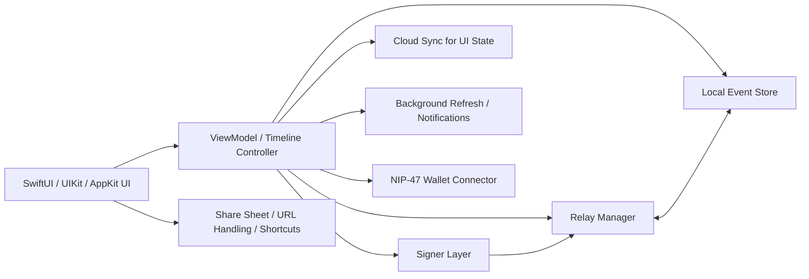
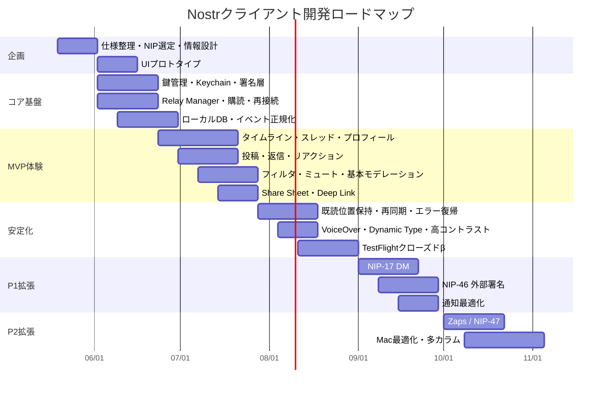

# TweetbotとIvoryの比較研究とNostrクライアント設計への示唆

## エグゼクティブサマリー

Tweetbot は Tapbots が 2011 年から育てた Twitter クライアントで、時系列タイムライン、広告なし、強力なフィルタ、ジェスチャー中心の操作、iCloud を使った既読位置同期などで長く「パワーユーザー向けの完成形」に近い評価を得ました。しかし 2023 年 1 月、Twitter 側のサードパーティークライアント遮断により利用不能となり、Tapbots 自身も公式 memorial ページで終了を明言しています。対して Ivory は、その設計思想と UI/UX の多くを引き継ぎつつ、Mastodon 向けに再構築された現行製品で、iPhone・iPad・Mac を中心に継続開発され、App Store 上では 2026 年時点でも更新が続いています。

両者を比べると、Tapbots の核は一貫しています。具体的には、ノイズの少ない時系列閲覧、タップで開くアクションドロワー、左右スワイプによる高速操作、タブやテーマの柔軟なカスタマイズ、そして「最後に読んだ位置を失わない」ことを強く重視する設計です。Tweetbot は Twitter API 制約のなかでそれを最大化した製品であり、Ivory は Mastodon 側のオープンさを活かして、投稿可視性、ハッシュタグ、サーバーフィルタ、ActivityPub 的な URL 解決、スパム対策、引用投稿、翻訳、複数カラムなどを段階的に拡張してきました。

ただし、Nostr クライアントへそのまま移植できるのは「見た目と操作パターン」のかなりの部分であって、「データモデルと同期モデル」は別物です。Nostr ではユーザーアイデンティティの中心が OAuth トークンではなく秘密鍵であり、データは単一サーバーではなく複数リレーに分散し、機能差はサーバー API バージョン差ではなく relay ごとの NIP 対応差として現れます。削除は削除“要求”にすぎず、DM は暗号化されてもメタデータ保護や forward secrecy に限界があり、検索やトレンドも relay 能力依存です。したがって、Nostr 版の「Tweetbot/Ivory ライク」なアプリは、UI よりもむしろ鍵管理、relay 管理、ローカルファースト同期、そして分散型モデレーションの設計が成否を分けます。

結論として、初期 MVP は Apple プラットフォーム先行で、ホームタイムライン、投稿・返信・リアクション、プロフィール、複数 relay、基本ミュート/ブロック/報告、ローカルキャッシュ、シェア拡張、鍵の安全な保管を優先すべきです。Zap は Nostr ネイティブらしさを出す重要機能ですが、初版では「閲覧と投稿の信頼性」を先に仕上げ、NIP-46 の外部署名や NIP-47 のウォレット連携は P1 で入れる方が現実的です。

## TweetbotとIvoryの比較

Tweetbot はすでに退役しているため、現時点で参照できる一次情報は Tapbots の memorial/support ページと当時のレビューに偏ります。一方、Ivory は公式製品サイト、Tapbots のサポート、App Store 現行ページ、更新履歴が現役の一次情報として揃っています。この非対称性を踏まえると、Tweetbot は「成熟した設計原則の集積」、Ivory は「その設計原則が ActivityPub 時代にどう変形されたか」を示す比較対象として見るのがいちばん実務的です。

### 機能比較表

| 観点 | Tweetbot | Ivory | 主な根拠 |
|---|---|---|---|
| 製品の現状 | 2023 年 1 月に Twitter 側遮断で終了。Tapbots 公式 memorial が終了経緯を説明。 | 2026 年時点で現役。App Store 更新履歴は 2.5.2 まで継続。 | 参考リンク |
| 配布プラットフォーム | 歴史的には iPhone / iPad / Mac。後期 iOS 版は iPhone/iPad 中心、Mac とは Handoff 連携。 | 公式サイトは iOS/iPadOS/macOS、App Store は iPhone/iPad/Mac/Apple Vision 互換も表示。 | 参考リンク |
| タイムライン思想 | 時系列、広告なし、Promoted Tweets なし。 | Mastodon 上で時系列を基本に、ホーム・ローカル・連合タイムラインを切替。 | 参考リンク |
| ナビゲーション | 下部 5 タブ。右 2 タブを長押しで差し替え。タップでアクションドロワー、左右スワイプで返信・いいね/RT・詳細。 | Tweetbot に近い構造。iPhone 下部タブ、iPad 左サイド、タイトル部で各タイムライン切替。投稿操作はアクションドロワーまたはインライン表示を選択可。 | 参考リンク |
| マルチアカウント | 早期から対応。クイックスイッチあり。 | 複数アカウント対応。タイトルバーの左右スワイプや長押しで切替。別アカウントから boost/favorite も可能。 | 参考リンク |
| リスト / 複数タイムライン | リストを作成・読取可能。任意のリストを「メインタイムライン」にできる。 | リストに加え、ローカル/連合タイムラインやハッシュタグリストを切替可能。 | 参考リンク |
| フィルタ | メディア/リンク/RT/引用のクイックフィルタ + 保存可能なカスタムフィルタ。 | 同様に強力。独自 mute/filter、regex、クイックフィルタ、カスタムルール、Potential Spam フィルタ。 | 参考リンク |
| 既読位置同期 | iCloud 同期。ユーザー評価でも端末またぎの既読位置保持が最大の強み。 | iCloud 同期あり。ただし Tapbots サポートは反映に最大 1〜2 分かかることがあると説明。 | 参考リンク |
| 通知 | Twitter API 制約で遅延。後期に Background Refresh ベースの follow/quote/user 通知を追加したが、約 10 分ごとの確認。 | プッシュ通知対応。アプリ側設定と OS 側設定が必要。重複通知や暗号化風通知は Mastodon 側の問題として案内。通知 UI は 2025 年にも改良が継続。 | 参考リンク |
| 投稿体験 | 下書き無制限、Topics で tweetstorm、Safari Extension、ウィジェット、Shortcuts、Handoff。 | 投稿可視性、CW、画像/GIF、投票、引用投稿、翻訳、Safari Extension、Share Sheet、Shortcuts、Widgets、PIP。 | 参考リンク |
| カスタマイズ | ライト/ダークを 2 本指スワイプで即切替。タブ差替、テーマ、アイコン、プロフィールメモ。 | 20+ アイコン、11 色テーマ、高/低コントラスト、表示・挙動設定、アクション表示方式切替。 | 参考リンク |
| 連携 | Open in Tweetbot、ウィジェット、Shortcuts、Handoff、Mac/iPad マルチウィンドウ。 | Open in Ivory、Share Sheet、Shortcuts、Read Later、Widgets、PIP、URL Scheme。 | 参考リンク |
| 収益化 | 月額/年額サブスク。7 日トライアル。未購読でも read-only モード。Family Sharing 可。 | 現行 App Store は月額/年額と iOS+Mac のユニバーサル年額を提示。無料トライアルあり。Family Sharing 表示あり。 | 参考リンク |
| プライバシー / セキュリティ | Twitter パスワードは保持せずトークン認証。分析・追跡なし。 | Mastodon パスワードは保持せずトークン認証。分析・追跡なし。App Store でも「データ収集なし」。 | 参考リンク |
| アクセシビリティ | 公式で大きく訴求は少ないが、日本語完全ローカライズは早期から実施。 | 公式サイトは VoiceOver、高コントラスト、可変テキストサイズ、Alt-Text reminder を明記。ただし App Store のアクセシビリティ欄は「未表示」。 | 参考リンク |
| パフォーマンス | MacStories 初期レビューは「速い」と高評価。日本語レビューでも快適性が主要価値。 | 公式サイトは blazing-fast / buttery-smooth を訴求。レビューも fluidity / reliability を評価。 | 参考リンク |
| 主な制約・既知の不満 | API 制約で DM は 30 日より古い履歴不可、グループ DM 不可、誰が Like/RT したか不可、通知遅延、最終的には API 自体が停止。 | 独自フィルタはあるが Mastodon の web フィルタ UI と同一ではない、タイムライン内検索はロード済み投稿限定、iCloud 同期が遅いことがある、通知重複は busy server で発生しうる。更新履歴からはドラフト消失、検索クラッシュ、縦動画投稿、WEB_DOMAIN サーバ対応などが継続的修正点。 | 参考リンク |

### 読み解き

比較すると、Tweetbot は「Twitter API の制約を UX で包み隠した」製品で、Ivory は「プロトコルが開いているぶん、機能拡張と統合がしやすい」製品です。とくに Ivory では、Read Later 連携、Share Sheet、Shortcuts、PIP、強いテーマ設定、Regex ミュート、URL scheme など、Apple ネイティブアプリとしての統合度がより前面化しています。これは Tapbots 公式サイトの訴求軸そのものです。

一方で、Ivory は当初レビューで「Tweetbot 的な安心感」が武器である反面、Mastodon/Fediverse に固有の可能性をまだ使い切れていないとも評されました。MacStories は 1.0 時点で、真の多カラムやカスタムタブの弱さ、複数インスタンスのローカルタイムラインの扱いの余地を指摘しています。その後の公式サイトでは iPad 最大 3 カラム、Mac 最大 6 カラムが前面に出され、App Store 更新履歴では hashtag lists、quote posts、translation、grouped notifications、spam filter などが加わっているため、Ivory は「Tweetbot の移植」から「Mastodon ネイティブな成熟」へかなり進んだと見るのが妥当です。

日本語ソースで見ると、Tweetbot は早い時期から UI・効果音・日本語化・マルチアカウントが高く評価され、後年も「時系列」「既読位置同期」「広告なし」「タブ差し替え」が使い続ける理由として強く挙げられています。これは機能数よりも「情報摂取のストレスを減らす」ことが Tapbots 製品の中核だったことを示しています。Nostr クライアントでも、この点は最優先で継承すべきです。

## Nostrクライアントに転用できる設計原則

Tweetbot/Ivory から Nostr へ持ち込めるものは多いですが、単純移植ではなく「UI を移植し、同期とデータ構造を置き換える」と考えるべきです。Nostr の基本は、各ユーザーが鍵ペアを持ち、イベントに署名し、複数 relay と REQ/CLOSE ベースで通信するというモデルです。連絡先リスト、relay list metadata、report、list、search、zap、remote signing などは個別 NIP として段階的に定義されています。

### そのまま使える設計

Tweetbot/Ivory 由来のうち、そのまま採用しやすいのは、時系列タイムライン、アクションドロワー、左右スワイプ、即時フィルタ切替、テーマ/アイコンの高い可変性、URL をアプリ内で開く拡張、Share Sheet / Shortcuts / Widgets のような Apple 統合です。これらはプロトコル非依存であり、むしろ Nostr のように relay 差がある世界では、ユーザーが「どこで何が起きているか」を把握しやすい UI として価値が上がります。

また、Tweetbot の「プロフィールメモ」は Nostr で再評価すべき機能です。Nostr は公開鍵ベースで人を覚える必要があり、複数の relay や表示名変更も起きやすいため、「この人をなぜ追っているか」を自分だけが保存できるローカルメモは非常に有効です。実装はローカル限定でもよいですし、必要なら NIP-78 の app-specific data を使って暗号化して持ち運ぶ設計も考えられます。これは Tweetbot の良いローカル UX を、Nostr の“持ち運べる私物データ”に接続する面白い拡張です。

### 仕様に合わせて作り変えるべきもの

Tweetbot/Ivory の「アカウント」は、Nostr では単なるログイン先ではなく秘密鍵そのものです。したがって、Nostr 版でのマルチアカウント UI は「複数プロフィール切替」ではなく、「複数鍵セット・複数 relay プロファイル切替」として設計し直す必要があります。さらに NIP-46 は、秘密鍵が触れるシステムをできるだけ減らすべきだという理由から remote signing を定義しており、モバイルクライアントは“鍵を内蔵する前提”より“外部署名器と連携できる”前提で設計した方が長期的に安全です。

同じく、Ivory/Tweetbot の iCloud 既読位置同期をそのまま protocol feature に見立てるのは危険です。Mastodon には markers API があり、少なくとも home / notifications の既読位置をサーバーに保存できますが、Nostr にはそれに相当する普遍的な標準既読位置 API はありません。したがって Nostr クライアントでは、各タイムラインのカーソルは原則ローカル管理とし、必要なら app 側のクラウド同期で UI 状態だけ共有する方が安全です。プロトコルにないものを無理に分散同期しようとすると、relay ごとの差分や遅延で既読位置が壊れやすくなります。

検索やトレンドも要注意です。Mastodon にはリスト、タイムライン、ハッシュタグ追跡、トレンド、サーバー側フィルタが公式 API としてありますが、Nostr では検索は NIP-50 の optional relay capability であり、relay 情報は NIP-11 や relay 側ドキュメントに依存します。つまり、Nostr クライアントの検索 UI は「全体検索」ではなく「この relay 群で使える検索」として能力検出付きで出すべきです。 Ivory/Tweetbot のように UI を綺麗に保つには、機能がない時に“無反応”ではなく“この relay は search 非対応”と説明する設計が重要です。

### Nostr固有に必須の機能

Nostr クライアントで最低限必要なのは、基本イベントの読書き、公開鍵アイデンティティ、relay 発見、連絡先とユーザーセット、削除・報告・センシティブ表示、DM、そして必要に応じた payment です。具体的には、NIP-01 の基本イベント/購読、NIP-02 の contact list、NIP-65 の relay list metadata、NIP-05 の DNS ベース識別子、NIP-09 の deletion、NIP-17 + NIP-44 + NIP-59 の DM/暗号化/gift-wrap、NIP-36 の content-warning、NIP-56 の report、NIP-51 の lists、NIP-57 の zaps が主要候補になります。Private relay や有料 relay を扱うなら NIP-42 も必要です。

Zap は「あると便利」ではなく、Nostr ではコミュニケーションの一部です。ただし、アプリ側が Lightning Wallet を直接抱える必要はありません。NIP-47 は remote lightning wallet への standardized access を定義しており、NIP-57 の zap event と組み合わせることで、クライアントは wallet 本体を持たずに支払い体験を提供できます。これは Tapbots 的な“クライアントに徹する”製品哲学とも相性がよいです。

この構成のポイントは、「サーバー API クライアント」ではなく「relay の上に載るローカルファーストの event browser / signer」として作ることです。NIP-01 は relay とクライアントの購読駆動モデルを定義しており、Apple 側では WebSocket 通信に `URLSessionWebSocketTask`、ローカル永続化には SQLite 系、バックグラウンド補助には `BGTaskScheduler` を組み合わせるのが自然です。

## MVPの優先機能と優先順位

MVP は「Nostr 全部入り」を目指さない方がよいです。Tapbots 製品の強みは機能網羅ではなく、読む・選ぶ・反応する・戻る、がとにかく気持ちよいことだからです。初期リリースでは、投稿網羅や communities、wallet、高度な split view よりも、まず“読める・見失わない・壊れない”を最優先に置くべきです。これは Tweetbot/Ivory が評価された理由とも一致します。

### 優先機能一覧

| 優先度 | 機能 | 理由 |
|---|---|---|
| P0 | 鍵の作成/インポート/バックアップ導線 | Nostr の入口そのもの。NIP-01 の鍵ペア前提を UI で安全に扱えないと以後の体験が成立しない。 |
| P0 | relay プリセット + 手動追加 + read/write 切替 | NIP-65 の relay list と現実の relay 多様性に対応するため。Tapbots 的 UX にするには接続先の見通しが必須。 |
| P0 | ホーム/プロフィール/スレッド/返信/リアクション/再投稿 | 最低限の“Twitter/Mastodon ライク”な読書き体験に必要。Nostr でも基本イベント閲覧と反応が中心。 |
| P0 | ローカルイベントキャッシュと既読位置保持 | Nostr は複数 relay・切断前提なので、Tweetbot/Ivory 的な「戻れる」体験はローカル DB が要。 |
| P0 | ミュート/ブロック/キーワードフィルタ/センシティブメディア制御 | 分散ネットワークでは server-side 一発解決が弱い。client-side moderation は初版から必須。 |
| P0 | URL 共有・Deep Link 受け・Share Sheet | Tweetbot/Ivory らしさを感じる導線で、実利用頻度も高い。Nostr でも外部から開く導線が重要。 |
| P1 | 複数 identity 切替と複数 relay プロファイル | Tapbots 的な power-user 層に不可欠。ただし初版は単一鍵でも可。 |
| P1 | NIP-17 DM | 重要だが、暗号/メタデータ/UI の複雑度が高いので core timeline の後。 |
| P1 | NIP-46 外部署名 | 鍵をアプリ本体に置きたくないユーザー向け。長期的な差別化要素。 |
| P1 | NIP-51 に基づく人リスト・ブックマーク・ミュートセット | Tweetbot の「リストをタイムラインとして使う」強みを Nostr 的に再現しやすい。 |
| P1 | 通知 | 分散ゆえ難しいが、mentions/replies までなら価値が高い。通知は初版で“過剰”に広げない方が運用しやすい。 |
| P2 | Zap と NIP-47 wallet connect | Nostr 文化では重要だが、初版のコア価値は読む/書く/整えること。金融導線は後追いでもよい。 |
| P2 | NIP-50 検索、NIP-72 communities、NIP-78 app data | relay 対応差や UI 複雑度が上がるため、機能検出・設定 UI が整ってから。 |

この優先順位で重要なのは、P0 が「中央集権 SNS の代替として最低限気持ち良く使えること」、P1 が「Nostr らしい安全性と拡張性」、P2 が「Nostr らしい文化性と上級機能」を担うことです。Tweetbot/Ivory に似せるほど、初版で“設定が多すぎる”危険も大きくなるため、P0 は徹底して絞るべきです。

## UI/UX提案と実装メモ

### UI/UX 提案

iPhone では Tweetbot/Ivory と同様、下部タブを主軸にした方がよいです。Apple の HIG はタブバーを app の主要セクション間ナビゲーションに使うことを勧めており、Tweetbot/Ivory の「Timeline / Mentions / Search / Profiles 系を瞬時に往復する」使い方とよく合います。Nostr クライアントでも、`Home`、`Mentions`、`Search`、`Notifications`、`Profile/More` の 5 タブ前後から始め、右端の 1〜2 個だけを入れ替え可能にすると、Tweetbot の“手癖”を継承しつつ新規ユーザーにもわかりやすいです。

iPad は別です。Apple は iPad では tab bar より split view / multi-column を活かす設計を推奨しており、Tweetbot 4 も Ivory も iPad では 2 列以上の情報密度を積極的に活かしてきました。Nostr 版でも、左にナビゲーション、中央に timeline、右に detail / profile / thread を出す 3 面構成を基本にし、Mac ではさらに window と column を増やす設計がよいです。これは Tapbots の美学にも合いますし、複数 relay 状況を把握するには 1 カラムより有利です。

アクセシビリティは “後付け” ではなく、初期設計に組み込む必要があります。Ivory の公式サイトが VoiceOver、高コントラスト、可変テキストサイズ、Alt-Text reminder を明示しているのは正しい方向ですし、Apple の VoiceOver ドキュメントや data-rich apps 向けガイダンスも、複雑な UI ほど読み上げ順と補助情報の設計が重要だと示しています。Nostr クライアントでは特に、relay 状態・署名状態・未読位置・フィルタ状態を視覚だけに頼らず、読み上げや accessibility custom content で説明できるようにすべきです。

### 実装メモ

Apple プラットフォームで Tapbots ライクな体験を狙うなら、UI は SwiftUI を中心にしつつ、スクロール最適化や複雑なコンテキストメニュー、マルチカラム、macOS 固有挙動では UIKit/AppKit を併用するハイブリッドが現実的です。通信は `URLSessionWebSocketTask` で relay と接続し、キャッシュは SQLite 系を使うのが素直です。GRDB は Swift の SQLite ツールキットとして成熟しており、ローカル DB を明示的に扱いたい Nostr クライアントと相性がよいです。もし protocol core を将来 Android/Web にも広げたいなら、rust-nostr 系 SDK と Swift bindings を使い、UI だけをネイティブにする構成も有力です。

ローカルデータ層は「event store」「profile cache」「relay status」「timeline index」「UI state」を分けるべきです。NostrDB は LMDB ベースの高速 local event database を掲げており、Nostr 向けのローカル検索・集約・参照速度を重視するなら魅力があります。ただし Apple ネイティブアプリの配布や保守では、まず GRDB/SQLite で素直に始め、速度のボトルネックが明確になった段階で Rust core や NostrDB に寄せる方が開発リスクは低いです。これは推奨であり、前者は実装容易性、後者は protocol 特化性能を優先する選択です。

セキュリティ設計で最重要なのは、Nostr は secp256k1 を使うのに対し、Apple の Secure Enclave / CryptoKit 公開 API は P-256 系が中心である点です。つまり、Nostr の秘密鍵を Secure Enclave で“そのまま署名鍵として扱う”設計はストレートには取りにくいです。現実的には、秘密鍵そのものは Keychain に暗号化保存し、生体認証で解錠するか、そもそも NIP-46 の remote signer を標準サポートしてアプリ本体に秘密鍵を置かない運用を用意すべきです。これは Nostr クライアント実装上の非常に大きな分岐点です。

DM や private data の扱いも誤解しやすい箇所です。NIP-17 は private DM の方式を定義し、NIP-44 は versioned encryption、NIP-59 は gift-wrap を定義していますが、NIP-44 自体が relay-based architecture では metadata hiding、forward secrecy、post-compromise secrecy に限界があると明言しています。したがって、プロダクト上は「暗号化 DM」ではなく「メタデータ保護に限界がある DM」と理解させる表現が必要です。ユーザーに過剰な安心感を与えないことは、むしろ Tapbots 的な誠実さに近いです。

バックグラウンド同期は、Mastodon や Twitter よりもさらに厄介です。Mastodon は streaming API を提供し、markers API もありますが、Nostr は relay ごとに接続・再接続・再購読が必要で、アプリ停止中の完全リアルタイム保証はできません。したがって iOS では `BGTaskScheduler` で補完 refresh を回し、起動時には relay ごとの last seen を元に catch-up、前景時は WebSocket 常時購読、通知は「必須の mentions/replies だけ」に絞るのが現実的です。全イベント完全同期を約束する文言は避けた方がよいです。

## リスクと開発ロードマップ

### 主な落とし穴

| 落とし穴 | なぜ起きるか | 推奨対策 |
|---|---|---|
| イベントの重複・順不同・抜け | 同じ event が複数 relay から届き、時刻や relay 到着順も揺れるため。NIP-01 は relay 購読モデルで、単一ソース前提ではない。 | event ID で厳密 dedupe、`created_at` と受信時刻を分離、relay ごとの catch-up cursor を持つ。 |
| 削除しても残る | NIP-09 は deletion request であり optional。全 relay/全 client が同じように扱う保証はない。 | UI 上で「削除要求」を明示し、ローカルでも tombstone 管理する。秘密情報は公開イベントに書かない。 |
| DM を“完全秘匿”と誤認する | NIP-44 自体が metadata hiding や forward secrecy の限界を明示。 | DM 画面に安全性説明を置く。重要用途では NIP-46 外部署名や別メッセージング併用を勧める。 |
| relay ごとに機能が違う | Search は NIP-50 optional、relay 情報は NIP-11、認証は NIP-42 など、能力が均一でない。 | capability detection を最初から UI に組み込み、“使えない”ではなく“relay 非対応”と表示する。 |
| 鍵紛失が即アカウント喪失になる | OAuth 再ログインの世界ではなく、鍵がアイデンティティ。 | 初回セットアップでバックアップ導線を必須級にする。 remote signer を後からでも接続可能にする。 |
| モデレーションが server 任せで足りない | Nostr は single moderator model ではない。Report も optional で client-side 判断が前提。 | mute/block/report/CW/relay mute/trusted reports を積む。フォロー関係ベースの trust moderation を導入する。 |

これらは単なる「実装バグ」ではなく、分散型 SNS の前提から来る構造的な難しさです。Tweetbot/Ivory は中央集権 API の不満を減らす名手でしたが、Nostr クライアントではさらに一歩踏み込み、「プロトコルの不確実さを見えやすく、怖くなくする UI」を設計する必要があります。言い換えると、Tapbots 的な滑らかさは Nostr では“隠す”より“説明する”方向にも使うべきです。

### 推奨ロードマップ

以下は **Apple プラットフォーム先行、iOS エンジニア 2 名 + protocol/infra 1 名 + デザイン 0.5〜1 名** を想定した現実的な目安です。日程そのものは提案ですが、順序は上の分析に基づいています。Tapbots 的な品質を出すには、機能よりも“スクロール、既読位置、切替、エラー復帰”の磨き込みに十分な期間を割くべきです。

リリース戦略としては、**まず iPhone を主戦場にして操作感を固め、次に iPad/Mac の“情報密度”を伸ばす** のがよいです。Tapbots 作品の価値は、初日から全部の機能があることではなく、触った瞬間に「このアプリは壊れにくく、考え抜かれている」と感じさせることでした。Nostr でもその期待値は同じで、むしろ分散プロトコルだからこそ、その品質差はさらに大きく見えます。

## 参考リンク

- https://tapbots.com/tweetbot/
- https://tapbots.com/ivory/
- https://apps.apple.com/jp/app/ivory-for-mastodon-by-tapbots/id6444602274
- https://apps.apple.com/jp/developer/tapbots/id293642940
- https://tapbots.com/support/tweetbot6/
- https://tapbots.com/support/tweetbot6/general/tweetbot_features
- https://tapbots.com/support/tweetbot6/general/icloud
- https://tapbots.com/support/tweetbot6/general/security
- https://tapbots.com/support/tweetbot6/general/notifications
- https://tapbots.com/support/tweetbot6/general/directmessages
- https://tapbots.com/support/tweetbot6/general/likesandretweets
- https://tapbots.com/support/tweetbot6/general/sub
- https://tapbots.com/support/tweetbot6/tips/timeline
- https://tapbots.com/support/tweetbot6/tips/compose
- https://tapbots.com/support/tweetbot6/tips/list
- https://tapbots.com/support/tweetbot6/tips/misc
- https://tapbots.com/support/tweetbot6/tips/safariextension
- https://tapbots.com/support/tweetbot6/tips/widgets
- https://tapbots.com/tweetbot/tips/
- https://tapbots.com/tweetbot/mac/tips/
- https://tapbots.com/support/ivory/general/filters
- https://tapbots.com/support/ivory/general/icloud
- https://tapbots.com/support/ivory/general/push_notifications
- https://tapbots.com/support/ivory/general/security
- https://tapbots.com/support/ivory/tips/misc
- https://tapbots.com/support/ivory/tips/safariextension
- https://tapbots.com/support/ivory/tips/timeline
- https://tapbots.com/support/ivory/tips/urlschemes
- https://www.macstories.net/news/tweetbot-for-iphone-review/
- https://www.macstories.net/reviews/tweetbot-4-review-bigger-bot/
- https://www.macstories.net/reviews/tweetbot-for-ipad-review/
- https://www.macstories.net/reviews/ivory-for-mastodon-review-tapbots-reborn/
- https://applech2.com/archives/20210818-tweetbot-6-for-ios-support-widgets.html
- https://applech2.com/archives/20220301-tweetbot-7-1-for-ios-background-notifications.html
- https://applech2.com/archives/20240220-ivory-for-mastodon-spam-filter.html
- https://touchlab.jp/2011/04/tapbots-tweetbot-iphone/
- https://mamesiba9171.com/?p=44
- https://nips.nostr.com/1
- https://nostr-nips.com/nip-02
- https://nips.nostr.com/5
- https://nips.nostr.com/9
- https://nips.nostr.com/11
- https://nips.nostr.com/17
- https://nips.nostr.com/36
- https://nips.nostr.com/42
- https://nips.nostr.com/44
- https://nips.nostr.com/46
- https://nips.nostr.com/47
- https://nips.nostr.com/50
- https://nips.nostr.com/51
- https://nips.nostr.com/56
- https://nips.nostr.com/57
- https://nips.nostr.com/59
- https://nips.nostr.com/65
- https://nips.nostr.com/72
- https://nips.nostr.com/78
- https://nostr-nips.com/nip-09
- https://nostr-nips.com/nip-51
- https://scrapbox.io/nostr/NIP-78
- https://docs.joinmastodon.org/methods/markers/
- https://docs.joinmastodon.org/entities/Marker/
- https://docs.joinmastodon.org/methods/streaming/
- https://developer.apple.com/design/human-interface-guidelines/tab-bars
- https://developer.apple.com/jp/design/human-interface-guidelines/tab-bars
- https://developer.apple.com/documentation/accessibility/voiceover
- https://developer.apple.com/documentation/uikit/uiaccessibility-protocol
- https://developer.apple.com/wwdc21/10121/
- https://developer.apple.com/la/videos/play/wwdc2022/10009/
- https://developer.apple.com/documentation/foundation/urlsessionwebsockettask
- https://developer.apple.com/documentation/backgroundtasks/bgtaskscheduler
- https://developer.apple.com/documentation/backgroundtasks/bgtaskscheduler/submit%28_%3A%29
- https://developer.apple.com/documentation/security/keychain-services
- https://developer.apple.com/documentation/cryptokit/secureenclave
- https://developer.apple.com/documentation/cryptokit/secureenclave/p256
- https://github.com/groue/GRDB.swift
- https://github.com/groue/GRDB.swift/blob/master/README.md
- https://github.com/damus-io/nostrdb
- https://github.com/rust-nostr
- https://github.com/rust-nostr/nostr
- https://github.com/rust-nostr/nostr-sdk-ffi
- https://github.com/nostr-jp/nips-ja/blob/main/01.md
- https://kde.hateblo.jp/entry/2020/06/28/001413
