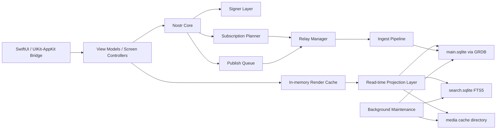
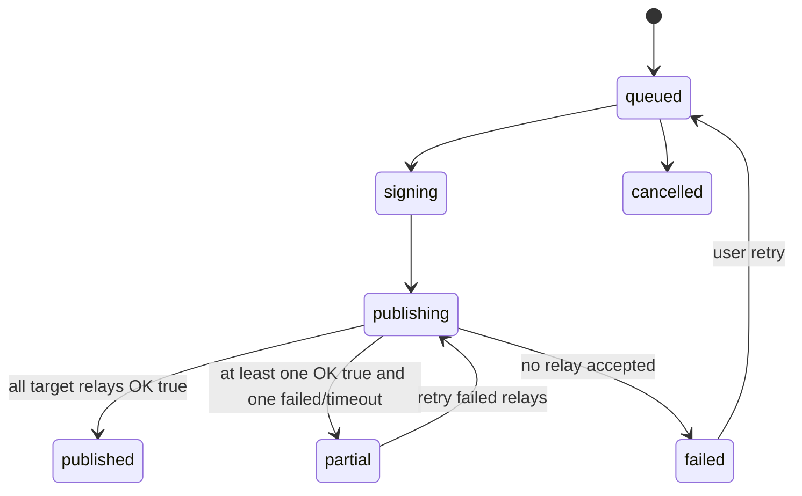

# Astrenza Nostr Client 開発指示書 v0.4

作成日: 2026-06-10  
最終更新日: 2026-06-14  
対象: Apple-first Nostr client / Tweetbot・Ivory 的UX / local-first event browser & signer  
想定実装: SwiftUI app shell + UIKit `UICollectionView` timeline core + SwiftUI cells via `UIHostingConfiguration` + GRDB + SQLite + URLSessionWebSocketTask。将来必要になった場合のみ Rust core / nostrdb sidecar を検討する。  
同梱DDL: `astrenza_local_db_schema_v0_2.sql`  
Migration-only: `astrenza_migration_v0_to_v0_2.sql`  
DB schema note: v0.4 はUI / Design System / Timeline reference fixture 方針の改訂であり、schema は v0.2 から変更しない。

---

## 0. この指示書の目的

この文書は、Astrenza を「Tweetbot / Ivory 的な操作密度・復帰性・ノイズ制御」を持つ Nostr クライアントとして実装するための開発指示書である。UIの見た目だけを真似るのではなく、Nostr の relay 分散、event 重複、削除要求、replaceable event、鍵管理、local-first 同期を前提に、実装者が迷わず設計・DB・同期・UI・テストへ落とせる粒度を目指す。

この文書では以下を固定する。

1. MVP の実装範囲
2. ローカルDBの責務と schema
3. Nostr event ingest / projection / feed materialization の処理順
4. Relay Manager / Subscription Planner / Publish Queue の責務
5. Tweetbot/Ivory 風UXを実現する read marker / scroll anchor / gap の扱い
6. セキュリティ・鍵管理・削除・DM・Push まわりの非機能要件
7. ベンチマーク・受け入れ基準・実装タスク分解
8. Swift 実装戦略、遅延 resolve、snapshot / E2E / fallback 判定
9. Design System v0、Timeline component tokens、Ivory reference fixture の扱い

### v0.2 で追加した重点

- 起動時スクロール復元を SwiftUI / UICollectionView の実装レベルまで具体化
- OGP / Media / @prefix / RT / Quoted RT / Reply-To の delayed resolve を通常系として定義
- Resolve job queue、component state、row layout contract、test fixture runtime を追加
- Screenshot snapshot / XCUITest E2E / performance benchmark / fallback判断基準を追記
- SwiftUI継続かUICollectionViewへfallbackするかを、E2Eと数値基準で判断するADR運用を追加

### v0.3 で追加・変更した重点

- 主Timeline実装方針を「SwiftUI prototype後のfallback判断」から **P0からUICollectionView必須** に変更
- アプリ全体はSwiftUI、Timeline本体はUIKit、Timeline rowはSwiftUIというハイブリッド構成を固定
- `UICollectionViewDiffableDataSource`、`CellRegistration`、`UIHostingConfiguration`、anchor保存/復元、`reconfigureItems`運用を実装契約化
- Splash / Launch Screen はネットワーク同期やDB復元を隠すために使わない方針を追加
- 起動時は static Launch Screen → Root shell即表示 → timeline areaだけ短時間の restore gate → local cached timeline → relay sync の順に固定
- UI/E2E/benchmarkに launch screen duration、restore gate duration、visible jump、read marker mutation の検証を追加

### v0.4 で追加・変更した重点

- 添付 Ivory Home TL screenshot 群を **Design System v0 の reference fixture** として扱う方針を追加
- Home TL row、OGP card、Media grid、CW / Sensitive、Reply / Repost / Quote context、Unread / New posts badge、Compose FAB、Bottom tab bar の情報設計を実装仕様へ分解
- 色・typography・spacing・radius・icon・action button・avatar・media・OGP card の baseline tokens を P0 で先行決定する方針を追加
- アイコンやアクションボタンは「構造・hit target・token名・baseline値を先行決定し、glyphの見え方・濃度・微調整は snapshot と実機レビューで token 単位に調整する」と明文化
- `DesignSystem` module、`TimelineRowLayoutContract`、component states、snapshot matrix、Figma/token/Swift実装の同期方針を追加
- raw color / raw spacing / ad-hoc icon size を release blocker に追加

---

## 1. 最上位の設計判断

### 1.1 Must decisions

以下は原則として変更しない。変更する場合は ADR を追加し、ベンチマークと移行計画を必須とする。

| ID | 決定 | 理由 |
|---|---|---|
| D-001 | 主ストアは GRDB + SQLite とする | Apple-first、Swift Concurrency、明示的SQL、migration、observation、WAL運用のバランスが最も良い |
| D-002 | ローカルDBは単なるキャッシュではなく UX の一次ストアとする | 起動即表示、既読位置復帰、オフライン閲覧、relay断片化吸収に必要 |
| D-003 | Raw event は immutable source、projection は rebuildable とする | NIP変更、parser改善、profile/list更新、削除要求再適用に耐えるため |
| D-004 | 完成済み `TimelinePost` を唯一の真実として永続化しない | profile更新・quote遅延到着・delete・mute解除・render変更で破綻しやすい |
| D-005 | `feed_items` / `timeline_entries` は軽量 index とする | 画面復帰・未読・gap制御に必要な最小情報だけ保持する |
| D-006 | Read marker と scroll anchor を分離する | 「どこまで読んだか」と「どこへ戻すか」は別。混同するとTLが跳ねる |
| D-007 | Relay は DB ではなく source として扱う | Nostr relay は保持範囲・機能・認証・制限が揺れるため |
| D-008 | 検索は `search.sqlite` sidecar、メディア実体は file cache とする | main DB肥大・FTS rebuild・media GC を独立化する |
| D-009 | nostrdb / LMDB は MVP の primary store にしない | iOS/macOS主ストアとしての運用負債、API安定性、migration/debugコストが高い |
| D-010 | DM は P1 以降、主系は NIP-17/44/59。NIP-04 は互換層のみ | 新規設計で旧DMを中核にしない |
| D-011 | Home / Mentions / Profile / Thread / List / Search などの主Timeline本体は P0 から `UICollectionView` で実装する | Tweetbot/Ivory級の読書位置保持は、visible cell、layout attributes、content offset、snapshot mutation を低レベルに制御できる実装を最初から選ぶべき |
| D-012 | Splash / Launch Screen は「待たせる画面」や「同期隠し」に使わない | Apple HIGに沿って起動直後の静的画面に限定し、ユーザーをネットワーク同期完了までブロックしない |
| D-013 | Design System v0 を P0 の最初に導入する | Timeline rowの高さ、遅延resolve、snapshot、Dynamic Type、theme、accessibilityを安定させるため |
| D-014 | アイコン・ボタン・余白・media/card寸法は token と baseline を先行決定し、画面単位のad-hoc調整は禁止する | 後から各画面で調整するとscroll anchor、snapshot、E2Eが不安定になる |
| D-015 | Ivory Home TL screenshot群は見た目のコピーではなくreference fixtureとして分解して使う | Nostr固有のidentity/relay/missing context/resolve stateに適合させる必要がある |

### 1.2 Product principles

実装判断で迷ったら、以下の順に優先する。

1. **Read position is sacred.** 既読位置とスクロール復帰を壊す変更は原則 reject。
2. **Timeline must not jump.** 新着・gap fill・profile update・mute change で表示中セルを勝手に動かさない。
3. **Design tokens are runtime contracts.** 色・文字・余白・アイコン・media/card寸法は見た目の好みではなく、スクロール位置保持とsnapshot再現性のための実行時契約として扱う。
4. **Do not hide launch with a splash.** 起動体験は static Launch Screen で一瞬だけ受け、Root shell とローカル状態を即出す。ネットワーク同期やOGP/media/profile解決の完了を待ってはいけない。
5. **Local-first, relay-aware.** ローカルにある範囲は即時表示し、relay差分は後から滑らかに反映する。
6. **Explain degraded states.** 「壊れた」ではなく「このrelayでは未取得」「検索非対応」「一部relay送信失敗」と説明する。
7. **Keys before features.** Zap、DM、Pushより先に鍵管理と投稿信頼性を固める。
8. **Projection can be wrong; raw events must be recoverable.** projectionの不具合は再構築で直せる構造にする。

---

## 2. MVP / P1 / P2 スコープ

### 2.1 MVP / P0

P0 は「読む・書く・戻る・壊れない」に絞る。

| 領域 | P0 要件 | 完了条件 |
|---|---|---|
| アカウント | 鍵生成、nsec/hex import、npub表示、read-only npub追加 | 初回オンボーディング後、Home取得まで到達できる |
| 鍵保護 | Keychain保存、生体認証 optional、nsecログ禁止、バックアップ注意喚起 | nsecがDB・ログ・クラッシュレポートに出ない |
| Relay | 初期relay preset、手動追加、read/write切替、NIP-11取得、NIP-65読取 | relayごとの接続/制限/エラーをUIで見られる |
| Home | kind:1 note、kind:6 repost、followeeの時系列表示 | cold launchでローカルHomeが即描画される |
| Profile | kind:0 profile、user notes、follow/unfollow | profileが未取得でもpubkey表示で破綻しない |
| Thread | root/parent/children hydrate、欠損placeholder | 欠けたparentをhydrate queueに積める |
| Compose | 投稿、返信、repost、reaction、delete request | relay別OK/失敗を保存し、再送できる |
| Local DB | raw events、tags、refs、heads、profiles、follows、feeds、read state | schema migration v1、再起動復帰、dedupe成功 |
| Timeline UX | read marker、scroll anchor、new posts buffer、gap row | 新着で表示中TLが跳ねない |
| Design System v0 | semantic color / typography / spacing / radius / icon / media / OGP / row layout tokens | Timeline rowがtoken経由で構築され、raw color・raw spacing・画面別icon sizeが残らない |
| Filter/Mute | pubkey/word/hashtag mute、local only mute | mute解除で復元できる。物理削除しない |
| Share/Deep Link | note/nevent/nprofile/naddr の基本open、share sheet受け | 外部URLから該当画面を開ける |
| Telemetry local | relay RTT、EOSE時間、ingest件数、publish成功率をローカル計測 | debug screenで確認可能 |

### 2.2 P1

| 領域 | P1 要件 |
|---|---|
| Lists | NIP-51 follow sets / mute sets / bookmark sets / relay sets |
| Notifications | mention/reply/repost/reaction のlocal materialization。Pushは粗いpayloadの補助サーバー検討後 |
| NIP-46 | remote signer / bunker support |
| NIP-49 | encrypted secret key export/import |
| Media | NIP-92 imeta表示、Blossom/NIP-B7 upload、file cache GC |
| Search | local FTS5 sidecar、loaded posts search、profile search |
| iPad/Mac | 3 column / multi-window / keyboard shortcuts |
| NIP-77 | Negentropy sync 評価・限定導入 |

### 2.3 P2

| 領域 | P2 要件 |
|---|---|
| DM | NIP-17/44/59 DM。安全性説明とmetadata限界の文言込み |
| Zap | NIP-57 + NIP-47 wallet connect |
| App state sync | NIP-78 encrypted app-specific data または iCloud private sync |
| Advanced moderation | trusted reports、relay mute、kind mute、temporary regex mute |
| nostrdb sidecar | 100万event級ベンチで必要性が示された場合のみ |

---

## 3. アーキテクチャ



### 3.1 Module responsibilities

| Module | 責務 | 禁止事項 |
|---|---|---|
| AppShell | account selection、routing、theme、deep link dispatch | Nostr event を直接parseしない |
| SignerLayer | local keychain signing、NIP-46 signing、NIP-49 export/import | secret keyをDBやlogに渡さない |
| RelayManager | WebSocket接続、NIP-11、AUTH、REQ/EVENT/CLOSE、OK/EOSE/CLOSED処理 | 画面単位で勝手にrelayへREQを張らない |
| SubscriptionPlanner | intent別購読計画、relay選定、filter chunking、cursor更新 | 「全relay総当たり」をdefaultにしない |
| IngestPipeline | verify、dedupe、raw save、tags/refs、heads、projection更新 | UI modelを直接生成して永続化しない |
| FeedEngine | feed_items materialization、gap/read/anchor制御 | 表示中TLを勝手に再ソートしない |
| ProjectionLayer | render model batch build、profile/stat/media解決 | heavy queryをobservation対象にしない |
| PublishQueue | local-first send、relay別receipt、retry/backoff | 送信成功を単一boolで潰さない |
| MediaService | cache、upload、thumbnail、blurhash、alt text | media binaryをmain DBに入れない |
| SearchService | FTS sidecar、index rebuild、loaded search | relay検索をlocal検索のように見せない |
| Maintenance | pruning、checkpoint、incremental vacuum、optimize、media GC | foreground scrolling中に重い保守処理を走らせない |

### 3.2 Dependency rule

依存方向は必ず以下にする。

```text
UI -> ViewModel -> Domain Service -> Store/Relay/Signer
Store -> どこにも依存しない
RelayManager -> IngestPipeline へeventを渡すだけ
IngestPipeline -> UIを知らない
ProjectionLayer -> RelayManagerを知らない
```

UI から relay へ直接 `REQ` を投げる実装は禁止。画面は「intent」を発行し、SubscriptionPlanner が relay / filters / cursors を決める。

---

## 4. ローカルデータ保持方針

### 4.1 main.sqlite

`main.sqlite` は UX の一次ストアである。以下を置く。

- `accounts`
- `relays`, `account_relays`, `relay_health_samples`
- `events`, `event_tags`, `event_refs`, `event_relays`
- `latest_replaceable_events`
- `profiles`, `follows`, `author_relays`
- `user_lists`, `user_list_items`, `mute_rules`
- `notes`, `note_relations`, `reposts`, `reactions`, `event_stats`
- `feeds`, `feed_items`, `feed_render_hints`, `feed_read_state`, `feed_gaps`
- `sync_cursors`, `missing_events`
- `notifications`
- `drafts`, `publish_queue`, `publish_receipts`
- `media_assets`, `link_previews`, `nip05_cache`
- `event_tombstones`, `retention_pins`, `maintenance_jobs`

### 4.2 search.sqlite

FTS5用 sidecar。壊れても main.sqlite から再構築可能にする。

対象:

- kind:1 本文
- kind:0 `name` / `display_name` / `about`
- link preview `title` / `description`
- local profile note

禁止:

- FTS sidecar を source of truth にしない
- FTS rebuild 中に main DB write path を止めない

### 4.3 media cache directory

media実体、thumbnail、transcode結果、blurhash素材を置く。DBにはmetadataとpathだけ保存する。

ディレクトリ例:

```text
Application Support/Astrenza/
  main.sqlite
  main.sqlite-wal
  main.sqlite-shm
  search.sqlite
  media/
    blobs/sha256-prefix/...
    thumbs/...
    temp-upload/...
```

### 4.4 secure storage

Nostr secret key は main.sqlite に保存しない。

許可:

- Keychain item reference
- NIP-46 remote signer connection metadata
- read-only npub account

禁止:

- `nsec` をDB・ログ・analytics・crash reportへ保存
- secret key を Swift struct の debugDescription に出す
- secret key を pasteboard に残し続ける

---

## 5. SQLite / GRDB 運用指示

### 5.1 DB作成時 PRAGMA

DB作成時に以下を適用する。

```sql
PRAGMA foreign_keys = ON;
PRAGMA journal_mode = WAL;
PRAGMA synchronous = NORMAL;
PRAGMA auto_vacuum = INCREMENTAL;
PRAGMA busy_timeout = 5000;
```

`auto_vacuum` は DB 作成後に後付けしづらいため、初期migrationで必ず設定する。

### 5.2 接続管理

- foreground app では `DatabasePool` を使う。
- write transaction は短くする。
- observation は軽量queryに限定する。
- render model構築は ID list を取得してから batch projection する。
- long-running read transaction を作らない。

### 5.3 Maintenance

| タイミング | 処理 |
|---|---|
| DB open直後 | `PRAGMA optimize=0x10002;` |
| 日次 / idle | `PRAGMA optimize;` |
| schema/index変更後 | `PRAGMA optimize;` |
| background移行前 | WAL checkpoint。ただしUI操作中は避ける |
| pruning後 | `PRAGMA incremental_vacuum(N);` |
| 充電中・十分な空き容量・非対話時 | 必要な場合のみ `VACUUM INTO` |

---

## 6. DB schema 指示

完全DDLは同梱の `astrenza_local_db_schema_v0_2.sql` を正とする。ここでは設計上の意図だけを記す。

### 6.1 ID形式

内部保存は 64文字 lowercase hex `TEXT` に統一する。`npub` / `note` / `nevent` / `naddr` は presentation / import / export 層で変換する。

理由:

- SQL debugging が容易
- NIP filter の値と一致しやすい
- Swift側の型安全wrapperで後から `BLOB(32)` へ移行可能

Swift側では必ず型を分ける。

```swift
struct EventID: Hashable, Codable { let hex: String }
struct Pubkey: Hashable, Codable { let hex: String }
struct RelayURL: Hashable, Codable { let normalized: String }
struct FeedID: Hashable, Codable { let rawValue: Int64 }
```

`String` をそのまま全層に流す実装は禁止。

### 6.2 Raw event store

`events` は immutable source。受信した valid event は原則保存する。`deleted_by_event_id` や `local_hidden_reason` は raw event の存在を消さず、表示上の状態として保持する。

必須index:

```sql
CREATE INDEX idx_events_kind_created ON events(kind, created_at DESC, id ASC);
CREATE INDEX idx_events_pubkey_kind_created ON events(pubkey, kind, created_at DESC, id ASC);
CREATE INDEX idx_events_created ON events(created_at DESC, id ASC);
```

### 6.3 Tags / refs

`event_tags` は raw tags の忠実な展開、`event_refs` は高速参照用の正規化 projection とする。

- `event_tags`: parser改善時に再検証できるよう rawを残す
- `event_refs`: `#e`, `#p`, `#a`, `#q`, `#t`, URL, media などを解決しやすくする

### 6.4 Heads

`latest_replaceable_events` は replaceable / addressable の両方を扱う。

キー:

```text
replaceable: (pubkey, kind, d_tag = '')
addressable: (pubkey, kind, d_tag = <d tag>)
```

同一 `created_at` の競合は `event_id` 辞書順の小さい方を採用する。

Upsert rule:

```sql
INSERT INTO latest_replaceable_events
  (pubkey, kind, d_tag, event_id, created_at, updated_at_ms)
VALUES
  (:pubkey, :kind, :d_tag, :event_id, :created_at, :now_ms)
ON CONFLICT(pubkey, kind, d_tag) DO UPDATE SET
  event_id = excluded.event_id,
  created_at = excluded.created_at,
  updated_at_ms = excluded.updated_at_ms
WHERE
  excluded.created_at > latest_replaceable_events.created_at
  OR (
    excluded.created_at = latest_replaceable_events.created_at
    AND excluded.event_id < latest_replaceable_events.event_id
  );
```

### 6.5 Feed materialization

`feed_items` は完成済み表示rowではない。最小限の情報だけ持つ。

- `source_event_id`: feed item を発生させたevent
- `subject_event_id`: 表示主体。repostなら対象note。未取得ならNULL可
- `reason`: author / reply / repost / quote / mention / reaction / zap
- `sort_at`: timeline上の時刻
- `tie_break_id`: 同一時刻の安定ソート用
- `hidden_reason`: mute/delete/local filter適用結果
- `pending_new`: 表示中TLの上に積まれた新着

`feed_render_hints` は軽量cache。壊れたら再構築する。

### 6.6 Read state

`feed_read_state` は絶対に `feed_items` の付随状態として扱わない。ユーザー状態として独立保持する。

- `marker_sort_at`, `marker_event_id`: 既読境界
- `scroll_anchor_event_id`, `scroll_anchor_offset_px`: 復元位置
- `last_visible_top_id`, `last_visible_bottom_id`: 復帰・差分挿入の安定化

read marker は次の場合のみ進める。

1. ユーザーが実際に当該itemを表示した
2. ユーザーが「ここまで既読」を実行した
3. 明示的な「すべて既読」操作

sync完了、EOSE到達、アプリ起動だけで read marker を進めてはいけない。

### 6.7 Delayed resolve / render hints

OGP、Media、`@prefix`、RT、Quoted RT、Reply-To は、すべて「後続で解決結果が到着する通常系」として扱う。DBには完成済み表示rowではなく、以下の軽量状態を保存する。

| 対象 | source of truth | 永続projection | UI初期表示 | 後続resolve |
|---|---|---|---|---|
| OGP | note content内URL | `link_previews`, `resolve_jobs`, `feed_render_hints.flags` | URL-only または固定高preview skeleton | title/image/description到着でcard更新 |
| Media | `imeta`, URL, file metadata | `media_assets`, `resolve_jobs`, `feed_render_hints.flags` | aspect比placeholder | thumbnail/full image到着で差し替え |
| `@prefix` | `p` tag, npub/nprofile, kind:0 | `profiles`, `latest_replaceable_events` | 短縮npub / default avatar | display name/avatar/NIP-05を差し替え |
| RT | kind:6 `e` tag | `reposts`, `missing_events`, `feed_render_hints.repost_target_event_id` | repost header + unavailable target skeleton | target event到着で本文表示 |
| Quoted RT | `q` tag | `note_relations`, `missing_events`, `feed_render_hints.quote_target_event_id` | compact quote skeleton | quote card更新 |
| Reply-To | NIP-10 `root`/`reply` marker | `notes`, `note_relations`, `missing_events`, `feed_render_hints.parent_event_id` | 1行固定reply header | parent/root到着でheaderのみ更新 |

追加で以下のテーブルを持つ。DDLは同梱schemaを正とする。

- `resolve_jobs`: OGP/media/profile/repost/quote/reply parent を後続解決する永続job queue。アプリクラッシュ後も再試行する。
- `timeline_row_layout_cache`: 可視化済みrowの高さ・layout contractを保存する任意cache。壊れたら破棄可能。
- `timeline_snapshot_diagnostics`: UI test / benchmark用にanchor delta、visible IDs、resolve eventを記録するdebug-only table。release buildでは作成してよいが、ユーザー向け同期対象にしない。

`link_previews.state` と `media_assets.download_state` は `pending` / `resolving` / `ready` / `failed` / `blocked` / `expired` を区別する。`failed` は表示失敗ではなく「fallback表示へ落ちる」という状態であり、note自体を非表示にしてはいけない。


---

## 7. Nostr event ingest pipeline

### 7.1 受信時の処理順

すべての受信eventは以下の順に処理する。DB更新は原則1 event 1 transaction。ただし高頻度受信時は小バッチ化してよい。

```swift
func ingest(rawJSON: String, relay: RelayURL, subscriptionID: String) async {
    let event = try parseEvent(rawJSON)
    try verifyIDAndSignature(event)
    try validateTimestampPolicy(event)

    try db.write { db in
        let isNew = upsertEvent(db, event)
        upsertEventRelay(db, event.id, relay, subscriptionID)

        guard isNew else { return }

        insertEventTags(db, event)
        insertEventRefs(db, event)

        if event.isReplaceableOrAddressable {
            upsertLatestHead(db, event)
        }

        projectByKind(db, event)
        applyDeletionOrExpiration(db, event)
        applyMuteVisibility(db, event)
        updateFeeds(db, event)
        enqueueHydrationIfNeeded(db, event)
        updateStatsAndNotifications(db, event)
    }
}
```

### 7.2 Validation policy

| 条件 | P0処理 |
|---|---|
| event id不一致 | drop。debug counter増加 |
| signature不正 | drop。debug counter増加 |
| `created_at` が極端な未来 | store invalid または drop。UIには出さない |
| `kind` 範囲外 | drop |
| JSON parse失敗 | drop、relay healthに invalid sample |
| duplicate | `seen_count` と `event_relays` だけ更新 |

極端な未来の閾値は初期値 10分。設定で調整可能にする。

### 7.3 Projection by kind

| kind | 処理 |
|---:|---|
| 0 | `profiles` 更新。metadata parse失敗時はrawのみ保存 |
| 1 | `notes`, `note_relations`, Home/Profile/List/Thread feed materialization |
| 3 | `follow_lists`, `follows`, `author_relays` fallback 更新、Home source再計画 |
| 5 | deletion request適用。対象author一致時のみhide/tombstone |
| 6 | `reposts`, `feed_items` reason=`repost`、target hydrate |
| 7 | `reactions`, `event_stats`, notification materialization |
| 10000 | mute list projection |
| 10001 | pin/bookmark/list projection |
| 10002 | relay list metadata projection |
| 30000-39999 | addressable list/data projection |
| その他 | raw保存、known parserがあればprojection、なければ無視 |

### 7.4 Deletion handling

削除要求は物理削除ではない。

処理:

1. kind:5 eventの `e` / `a` tag を読む
2. 対象eventが既存なら `target.pubkey == deletion.pubkey` を確認
3. 一致する場合のみ `events.deleted_by_event_id`, `deleted_at` を更新
4. `feed_items.hidden_reason = 'deleted'`
5. `event_tombstones` に記録
6. 検索indexからは除外または tombstone 状態へ更新

対象eventが未取得の場合は deletion tombstone を先に保存し、後から対象eventが来た時に適用する。

### 7.5 Expiration handling

`expiration` tag があるeventは `events.expires_at` に保存する。期限超過後は以下を実行する。

- feed item非表示
- notification対象から除外
- FTS検索対象から除外
- raw eventは短期保持後 prune 可能

---

## 8. Feed Engine 指示

### 8.1 Feed types

| type | params_json | 主なデータ源 |
|---|---|---|
| home | `{}` | 自分のfollow set、followee write relays |
| notifications | `{}` | `#p: my_pubkey`、reactions/reposts/zaps |
| profile | `{ "pubkey": "..." }` | author filter |
| thread | `{ "root": "..." }` | root/parent/children |
| list | `{ "kind": 30000, "d": "..." }` | NIP-51 list items |
| hashtag | `{ "tag": "nostr" }` | `#t` refs |
| search | `{ "query": "..." }` | local FTS / relay search |
| relay | `{ "relay": "wss://..." }` | relay-local exploratory feed |

### 8.2 Home insertion rules

#### note

Home feedへ入れる条件:

- author が current follow set に含まれる
- mute/blocked されていない
- `include_replies` 設定に合う
- deleted/expired ではない
- created_atが未来すぎない

```sql
INSERT OR IGNORE INTO feed_items (
  feed_id, item_key, source_event_id, subject_event_id,
  reason, actor_pubkey, sort_at, tie_break_id,
  pending_new, inserted_at_ms, updated_at_ms
) VALUES (
  :feed_id, 'note:' || :event_id, :event_id, :event_id,
  'author', :author_pubkey, :created_at, :event_id,
  :pending_new, :now_ms, :now_ms
);
```

#### repost

```sql
INSERT OR IGNORE INTO feed_items (
  feed_id, item_key, source_event_id, subject_event_id,
  reason, actor_pubkey, sort_at, tie_break_id,
  pending_new, inserted_at_ms, updated_at_ms
) VALUES (
  :feed_id, 'repost:' || :repost_event_id, :repost_event_id, :target_event_id,
  'repost', :reposter_pubkey, :created_at, :repost_event_id,
  :pending_new, :now_ms, :now_ms
);
```

対象noteが未取得なら `missing_events` に積む。UIは placeholder を出す。

### 8.3 Reply display policy

初期値:

```text
include_replies = 0
```

設定:

| 値 | 意味 |
|---:|---|
| 0 | top-level note / repost中心。replyはHomeに出さない |
| 1 | followee同士の会話だけ出す |
| 2 | followeeの全replyを出す |

Thread画面ではこの設定に関係なく root/parent/children を表示する。

### 8.4 Pending new items

ユーザーがHomeを表示中に新着が届いた場合:

1. DBには `feed_items.pending_new = 1` で入れる
2. UIのvisible rangeには即挿入しない
3. 上部に `N new posts` banner を表示
4. ユーザーがbannerを押したら pendingを解除し、上へscroll
5. ユーザーが一番上にいる場合のみ自動挿入してよい

### 8.5 Gap model

Gapは正常系である。relay差、limit、backfill失敗、network timeoutで必ず発生する。

Gap rowの状態:

| state | UI |
|---|---|
| open | “Load missing posts” |
| filling | spinner |
| filled | row消去 |
| exhausted | “No more posts from selected relays” を必要に応じて表示 |
| failed | retry button + relay detail |

Gap fill時は visible anchor を固定し、古い方向に追加しても表示中セルを動かさない。

### 8.6 Render query principle

UIはまず `feed_items` のID listだけ取得する。

```sql
SELECT item_key, source_event_id, subject_event_id, reason, actor_pubkey, sort_at, tie_break_id
FROM feed_items
WHERE feed_id = :feed_id
  AND hidden_reason IS NULL
  AND pending_new = 0
ORDER BY sort_at DESC, tie_break_id ASC
LIMIT :limit OFFSET :offset;
```

その後、ProjectionLayerが batch で必要な `events`, `profiles`, `event_stats`, `media_assets` を解決する。重いJOINを常時observationしない。

---

## 9. Relay Manager / Sync Engine 指示

### 9.1 Relay roles

Relayには単なる接続先以上の役割を持たせる。

| role | 意味 |
|---|---|
| account read | 自分宛mention等を読む |
| account write | 自分のeventをpublishする |
| author write | あるauthorのeventを読む候補 |
| tagged user read | 投稿時にtagged userへ届ける候補 |
| search relay | NIP-50対応relay |
| media relay/server hint | NIP-B7/NIP-96関連の補助 |

NIP-65 kind:10002 を最優先し、なければ follow tag relay hint、observed relay、default relayの順でfallbackする。

### 9.2 Subscription scopes

`sync_cursors.scope` は以下のように定義する。

```text
home:hot
home:backfill:<chunk_hash>
mentions
profile:<pubkey>
thread:<root_event_id>
metadata:<pubkey>
relaylist:<pubkey>
list:<kind>:<pubkey>:<d>
search:<query_hash>
```

`filter_hash` は canonical JSON の sha256。relayごと・scopeごと・filterごとにcursorを持つ。

### 9.3 Home sync algorithm

起動時:

1. DBからHomeを即描画
2. scroll anchorへ復元
3. account relayに接続
4. 自分の kind:3 / kind:10000 / kind:10002 を取得
5. followeeを relayごと・chunkごとに分割
6. hot range: `since = newest_seen - overlap` で取得
7. EOSE後にcursor更新
8. backfillはユーザーscrollまたはidle時に実行

Filter例:

```json
["REQ", "home-hot-1", {
  "authors": ["<followee_pubkey_1>", "<followee_pubkey_2>"],
  "kinds": [1, 6],
  "since": 1710000000,
  "limit": 500
}]
```

### 9.4 Backpressure

RelayごとにNIP-11の制約を保存し、購読を hot/warm/cold に分ける。

| priority | 用途 | 維持 |
|---|---|---|
| hot | 表示中Home、現在thread、mentions | foreground中維持 |
| warm | profile prefetch、visible周辺hydrate | idle/余裕時 |
| cold | search、global、古いbackfill | 明示操作時のみ |

制約:

- 1 relay 1 WebSocket
- subscription数はrelayの `max_subscriptions` を尊重
- `limit` はrelayの `max_limit` を超えない
- AUTH requiredなら NIP-42 path へ送る
- payment requiredはUIで説明し、勝手にretryし続けない

### 9.5 Reconnect policy

| 失敗 | 対応 |
|---|---|
| network close | exponential backoff + jitter |
| auth-required | challenge署名後再REQ |
| rate-limited | relayごとcooldown |
| restricted write | publish receiptに保存し、別relay継続 |
| unsupported filter | plannerがfilterを分割/縮退 |
| timeout before EOSE | cursor更新しない。gap open |

---

## 10. Publish Queue 指示

### 10.1 投稿は local-first

送信ボタン押下後:

1. Compose stateをevent candidateへ変換
2. SignerLayerで署名
3. `events`へ保存
4. `publish_queue`へ保存
5. 自分のHome/Profileへ optimistic item として表示
6. RelayManagerがtarget relaysへ送信
7. `publish_receipts` に relay別OKを保存
8. 全成功・部分成功・失敗をUIへ反映

### 10.2 Relay selection for publish

送信先:

1. author write relays
2. tagged users read relays
3. reply/quote target の relay hints
4. manual pinned relays
5. fallback default relays

重複は normalized URL で排除する。

### 10.3 State machine



### 10.4 Delete request

削除操作は「削除要求をpublishする」ことであり、完全削除ではない。

UI文言:

```text
この操作は削除要求をリレーへ送信します。すべてのリレーや他のクライアントから完全に消えることは保証できません。
```

---

## 11. Lists / Mutes / Filters 指示

### 11.1 Mute as visibility

Muteは物理削除ではなく visibility で処理する。

- `mute_rules` に保存
- `feed_items.hidden_reason` を更新
- FTS検索では既定で除外
- mute解除で復元

### 11.2 Public/private list

NIP-51 listは public item が tags、private item が encrypted content に入る。実装では `user_list_items.is_private` を持つ。

P0:

- local mute
- kind:10000 mute public item
- private itemは復号できる場合のみ反映

P1:

- bookmark sets
- follow sets
- relay sets
- private list edit/publish

### 11.3 Filter engine

フィルターは3層で扱う。

| 層 | 用途 | 例 |
|---|---|---|
| ingest-time | 明らかなspam/invalidの隔離 | invalid sig, future date |
| materialization-time | feed_items hidden/collapsed | muted pubkey, muted hashtag |
| render-time | 一時UI filter | media only, links only, no reposts |

保存フィルターは render-time から始め、必要に応じて materialization-time へ昇格する。

---

## 12. Thread / Hydration 指示

### 12.1 Thread parser

NIP-10 marker対応を基本とし、古い positional e-tag もfallbackで読む。

投影:

- `notes.root_event_id`
- `notes.reply_to_event_id`
- `notes.quote_event_id`
- `note_relations`

### 12.2 Missing event queue

以下は欠ける前提でUIを作る。

- reply root
- reply parent
- repost target
- quote target
- reaction target
- profile metadata

`missing_events` には relay hints を保存し、取得順は以下。

1. tag内 relay hint
2. target author write relay
3. observed relay
4. account read relays
5. default public relays

失敗しても画面はplaceholderで成立させる。

---

## 13. Notifications 指示

### 13.1 P0/P1 boundary

P0では notification feed のDB設計と local materialization までを入れる。Push は P1 で補助サーバー・プライバシー設計込みで判断する。

### 13.2 Notification materialization

対象:

- kind:1 reply/mention/quote
- kind:6 repost
- kind:7 reaction
- NIP-57 zap receipt は P2

重複防止:

```text
notification_key = <type>:<event_id>:<target_event_id?>
```

mute/filterは notification 生成前に適用する。ただし debug mode では「フィルターで隠された通知」を確認できるようにする。

---

## 14. Media 指示

詳細な OGP / Media delayed resolve contract は §26 を正とする。


### 14.1 P0

- URL抽出
- image/video link preview placeholder
- media cache metadata保存
- alt text warning

### 14.2 P1

- NIP-92 `imeta` parse/render
- Blossom/NIP-B7 upload
- thumbnail generation
- blurhash
- upload retry queue

### 14.3 Upload policy

MVPでは upload 完了前の event publish は禁止。理由は Nostr event が送信後に編集困難なため。

P1以降に optimistic media upload を入れる場合:

- draftに media local asset を紐づける
- upload完了後に event生成
- 失敗時は draftへ戻す

---

## 15. Security / Privacy 指示

### 15.1 Key management

P0必須:

- Keychain保存
- nsec import後、クリップボードclear導線
- nsec export時に強い確認
- backup未実施アカウントには非侵襲な警告
- logs redaction

P1:

- NIP-49 export/import
- NIP-46 remote signer

### 15.2 DM

P0ではDMを入れない。P1/P2で入れる場合:

- 主系は NIP-17 + NIP-44 + NIP-59
- NIP-04 は legacy import/read/send optional
- UIにmetadata保護限界を説明
- Push payloadに本文を入れない

### 15.3 Relay privacy

設定画面に以下を表示する。

- どのrelayへ接続しているか
- read/write の役割
- どのrelayへ投稿を送ったか
- どのrelayからeventを取得したか
- AUTH/payment/restricted 状態

### 15.4 Analytics / observability

初期は local diagnostics を優先。外部送信する場合は opt-in。

禁止:

- pubkey/event id/relay URLを無加工で第三者analyticsへ送る
- DM metadataを送る
- secret materialを送る

---

## 16. UI/UX 指示

Timeline実装、起動時scroll restore、delayed resolveによるrow更新制御は §24〜§28 を正とする。


### 16.1 iPhone navigation

P0 tabs:

1. Home
2. Mentions / Notifications
3. Search / Explore
4. Lists / Filters
5. Profile / Settings

右側2タブは将来customizableにする。P0では固定でよいが、内部モデルは差し替え可能にする。

### 16.2 Timeline cell

必須表示:

- avatar/name/npub fallback
- relative time + absolute time accessible label
- relay/source debug info optional
- content
- media placeholder
- reply/repost/reaction counts local/approx区別
- repost reason
- missing target placeholder
- deleted/expired placeholder
- partial publish state

### 16.3 Gestures

P0:

- tap: detail/thread
- long press: action drawer
- swipe right: reply
- swipe left: thread/detail or quick actions
- pull to refresh: hot sync
- tap status bar / top: scroll top, but read markerは進めない

P1:

- account quick switch
- theme toggle gesture
- keyboard shortcuts
- multi-column drag/drop

### 16.4 Timeline position behavior

Timeline位置保持は Astrenza の最重要品質である。実装者は「`scrollTo(id:)` すればよい」と解釈してはいけない。保存すべきものは row index や絶対 `contentOffset` ではなく、**安定した feed item ID と、そのrow topがviewport topからどれだけ離れていたか**である。

#### 保存する anchor

Swift側の保存モデルは以下を標準とする。

```swift
struct TimelineScrollAnchor: Codable, Equatable, Sendable {
    var accountID: Int64
    var feedID: Int64
    var timelineKey: String

    // source of truth
    var anchorItemKey: String
    var anchorEventID: EventID?
    var anchorSortAt: Int64
    var anchorTieBreakID: String

    // visual restore hint
    var anchorTopDeltaFromViewportTop: Double
    var viewportHeight: Double
    var viewportWidth: Double
    var contentInsetTop: Double
    var contentInsetBottom: Double

    // fallback
    var lastVisibleTopItemKey: String?
    var lastVisibleBottomItemKey: String?
    var markerEventID: EventID?
    var markerSortAt: Int64?

    var savedAtMS: Int64
    var schemaVersion: Int
}
```

`anchorTopDeltaFromViewportTop` は、anchor row の `frame.minY - viewportTop`。row上部が画面外へ35pt食い込んでいれば `-35`。この値は `feed_read_state.scroll_anchor_offset_px` に保存する。

#### 保存タイミング

アプリ終了時保存だけは禁止。以下で保存する。

| トリガー | 保存方法 |
|---|---|
| visible range変化 | 300〜700ms debounce |
| drag/deceleration終了 | debounceを待たず保存 |
| detail/profile/threadへ遷移直前 | 即保存 |
| feed/account切替 | 即保存 |
| scenePhase inactive/background | 即保存 |
| memory pressure / termination notice相当 | 可能なら即保存 |

UIKit実装では `scrollViewDidScroll` で軽量captureし、`scrollViewDidEndDragging` / `scrollViewDidEndDecelerating` で確定保存する。SwiftUI実装では `onScrollTargetVisibilityChange` と `onScrollGeometryChange` を併用し、最上部に最も近いvisible IDをanchor候補にする。

#### 起動時復元順序

起動時は relay接続より先にローカルDBだけで復元windowを作る。

```text
1. account_id と selected feed を復元する
2. feed_read_state を読む
3. scroll_anchor_event_id / anchorItemKey を解決する
4. anchor の前後 window を DB から読む
5. UI dataset に window を入れる
6. 初回 layout 完了後 anchor へ scroll する
7. anchorTopDeltaFromViewportTop を反映して微調整する
8. first interactive scroll を許可する
9. その後に Relay hot sync を開始する
```

復元用SQLの考え方:

```sql
-- anchor item
SELECT item_key, sort_at, tie_break_id
FROM feed_items
WHERE feed_id = :feed_id
  AND item_key = :anchor_item_key
  AND hidden_reason IS NULL
LIMIT 1;
```

```sql
-- newer side. UIで最終的にDESCへ並べ直す。
SELECT *
FROM feed_items
WHERE feed_id = :feed_id
  AND hidden_reason IS NULL
  AND (
    sort_at > :anchor_sort_at
    OR (sort_at = :anchor_sort_at AND tie_break_id < :anchor_tie_break_id)
  )
ORDER BY sort_at ASC, tie_break_id DESC
LIMIT :newer_count;
```

```sql
-- anchor + older side
SELECT *
FROM feed_items
WHERE feed_id = :feed_id
  AND hidden_reason IS NULL
  AND (
    sort_at < :anchor_sort_at
    OR (sort_at = :anchor_sort_at AND tie_break_id >= :anchor_tie_break_id)
  )
ORDER BY sort_at DESC, tie_break_id ASC
LIMIT :older_count;
```

標準値は `newer_count = 80`, `older_count = 160`。低メモリ端末では `40/100` に落としてよい。

#### fallback順位

復元は次の順で行う。

```text
1. anchorItemKey が visible feed_item として存在する
2. scroll_anchor_event_id が visible feed_item として存在する
3. anchor が prune 済みだが tombstone / retention record から sort_at 近傍が分かる
4. marker_event_id が visible feed_item として存在する
5. marker_sort_at 近傍の最初の item
6. last_visible_top_id / last_visible_bottom_id のどちらか
7. newest item
8. feed empty state
```

fallbackで復元した場合も read marker を進めない。`feed_read_state` には `restore_fallback_reason` を `client_state_json` または diagnostics に記録する。

#### 新着

表示中より上の新着は `feed_items.pending_new = 1` として保存し、UI datasetへは入れない。ユーザーが `New Posts` bannerを押す、または明示的に最上部へ移動するまで visible snapshot に挿入しない。

```text
DB persistence: 即時OK
Visible dataset mutation: ユーザー操作まで禁止
Unread count: read marker基準で計算
```

#### Profile / media / link preview update

後着metadataでrow高さを変えない。少なくとも復元完了から最初の2秒、または最初のユーザー操作まで、可視rowの大きな高さ変化は禁止する。

- avatarは固定frame。
- display nameは最大1行、長い名前はtruncate。
- 本文内 `@prefix` のdisplay name置換は文字幅が増えすぎる場合は短縮npubのまま。
- mediaは最初からaspect ratio placeholderを置く。`imeta` がなければ固定16:9またはcompact placeholder。
- OGP cardは URL-only から突然大型cardへ伸ばさず、初回から固定高placeholderかcompact cardにする。
- quote cardは最大行数と最大高さを固定する。
- reply parentはHomeでは1行固定headerまで。親本文展開はthread detailで行う。

#### Mute update

表示中セルがmute対象になっても即removeしない。まず collapsed placeholder にする。次回feed reload時にhidden化してよい。これにより visible range が詰まって飛ぶのを防ぐ。

### 16.5 Timeline 実装戦略: P0からUICollectionViewを使う

#### 決定

主Timeline surfaceは **P0から `UICollectionView` で実装する**。SwiftUI `ScrollView + LazyVStack` は、本番Timelineのprototype/fallback候補ではなく、以下の限定用途に留める。

- settingsやrelay listなど、row数が少なく、位置復元がproduct valueでない画面
- design spike / row visual preview / snapshot fixture
- macOS/iPadの非Timeline補助pane

本番Timelineに該当するもの:

```text
Home timeline
Mentions / Notifications timeline
Profile event list
Thread detail event list
List timeline
Hashtag/search result timeline, if it behaves like a timeline
Custom relay-set timeline
```

本番Timelineに該当しないもの:

```text
Compose
Settings
Account management
Relay settings
Profile header
Onboarding
Static help / diagnostics screens
```

理由:

```text
Astrenzaの中核価値は「Rowをきれいに描くこと」ではなく、読んでいる場所を失わないこと。
NostrではOGP/Media/Profile/RT/Quote/Reply-Toが後続resolveされ、relay ingestも非同期に続く。
この環境ではvisible cell、layout attributes、contentOffset、snapshot mutation、prefetchを直接制御できるUICollectionViewを最初から採用する。
```

SwiftUIは捨てない。アプリshellとrow contentはSwiftUIで書く。

```text
SwiftUI:
  App shell / tab / navigation / settings / compose / detail chrome / row view

UIKit:
  Timeline scroll engine / diffable snapshot / visible range / anchor restore / prefetch

Bridge:
  UIViewControllerRepresentable + UIHostingConfiguration
```

#### 標準構成

```text
AstrenzaApp
└─ SwiftUI RootShell
   ├─ RootTabView / NavigationSplitView
   ├─ ComposeView
   ├─ SettingsView
   ├─ ProfileHeaderView
   └─ TimelineSurface
      └─ TimelineCollectionViewRepresentable
         └─ TimelineCollectionViewController
            ├─ UICollectionView
            ├─ UICollectionViewDiffableDataSource<TimelineSection, TimelineEntryID>
            ├─ UICollectionView.CellRegistration<UICollectionViewCell, TimelineEntryID>
            ├─ UIHostingConfiguration { TimelineRowView(viewState:) }
            ├─ TimelineSnapshotCoordinator
            ├─ TimelinePositionRecorder
            ├─ TimelineVisibleRangeTracker
            ├─ TimelinePrefetchCoordinator
            ├─ TimelineResolveApplyCoordinator
            └─ TimelineDiagnosticsRecorder
```

#### SwiftUI bridge

```swift
struct TimelineSurface: UIViewControllerRepresentable {
    let timelineKey: TimelineKey
    let accountID: AccountID
    let dependencies: TimelineDependencies

    func makeUIViewController(context: Context) -> TimelineCollectionViewController {
        TimelineCollectionViewController(
            timelineKey: timelineKey,
            accountID: accountID,
            dependencies: dependencies
        )
    }

    func updateUIViewController(
        _ controller: TimelineCollectionViewController,
        context: Context
    ) {
        controller.updateEnvironment(context.environment)
    }
}
```

`TimelineSurface` はSwiftUI側に `entries: [TimelineRowModel]` を渡さない。SwiftUI state更新でTimeline全体を再評価しないため、ID list、banner count、debug stateだけを橋渡しする。

#### Controller skeleton

```swift
@MainActor
final class TimelineCollectionViewController: UIViewController {
    enum Section: Hashable { case main }

    private let timelineKey: TimelineKey
    private let accountID: AccountID
    private let repository: TimelineRepository
    private let projector: TimelineProjector
    private let rowModelStore: TimelineRowModelStore

    private var collectionView: UICollectionView!
    private var dataSource: UICollectionViewDiffableDataSource<Section, TimelineEntryID>!

    private lazy var positionRecorder = TimelinePositionRecorder(
        accountID: accountID,
        timelineKey: timelineKey,
        repository: repository
    )

    private lazy var snapshotCoordinator = TimelineSnapshotCoordinator(
        dataSource: dataSource,
        collectionView: collectionView,
        positionRecorder: positionRecorder
    )

    private lazy var resolveApplyCoordinator = TimelineResolveApplyCoordinator(
        dataSource: dataSource,
        rowModelStore: rowModelStore,
        snapshotCoordinator: snapshotCoordinator
    )

    private lazy var prefetchCoordinator = TimelinePrefetchCoordinator(
        repository: repository,
        projector: projector,
        mediaLoader: dependencies.mediaLoader
    )

    override func viewDidLoad() {
        super.viewDidLoad()
        configureCollectionView()
        configureDataSource()
        Task { await restoreInitialWindowAndStartSync() }
    }
}
```

#### Collection layout

P0は単一sectionのvertical listでよい。`UICollectionViewCompositionalLayout` を使い、estimated heightを許可するが、visible rowの高さ変化は `TimelineRowLayoutContract` で抑制する。

```swift
private func makeLayout() -> UICollectionViewLayout {
    var config = UICollectionLayoutListConfiguration(appearance: .plain)
    config.showsSeparators = false
    config.backgroundColor = .systemBackground

    return UICollectionViewCompositionalLayout.list(using: config)
}
```

セルごとの厳密な高さ制御が必要になった場合は、list configurationからcustom `NSCollectionLayoutSection` へ移行する。移行してもDataSource/Anchor/Resolveの契約は変えない。

#### Diffable snapshotには軽量IDだけ入れる

Snapshot itemは `TimelineEntryID` のみ。巨大なrow modelやprofile/media/preview状態をsnapshot itemに含めてはいけない。

```swift
struct TimelineEntryID: Hashable, Codable, Sendable, RawRepresentable {
    let rawValue: String      // feed_items.item_key / timeline_entries.entry_id
    let eventID: EventID?
    let sortAt: Int64
    let tieBreakID: String
}
```

```swift
var snapshot = NSDiffableDataSourceSnapshot<Section, TimelineEntryID>()
snapshot.appendSections([.main])
snapshot.appendItems(entryIDs, toSection: .main)
dataSource.apply(snapshot, animatingDifferences: false)
```

理由:

```text
Row modelをsnapshot itemにすると、profile解決・OGP解決・media解決のたびにidentityが揺れる。
Timeline identityは「どのfeed itemか」であり、「今どう表示されるか」ではない。
```

#### CellRegistration + UIHostingConfiguration

```swift
private func configureDataSource() {
    let registration = UICollectionView.CellRegistration<UICollectionViewCell, TimelineEntryID> {
        [weak self] cell, indexPath, entryID in
        guard let self else { return }

        let viewState = self.rowModelStore.viewState(for: entryID)

        cell.contentConfiguration = UIHostingConfiguration {
            TimelineRowView(
                viewState: viewState,
                actions: TimelineRowActions(
                    openDetail: { [weak self] in self?.openDetail(entryID) },
                    reply: { [weak self] in self?.reply(to: entryID) },
                    repost: { [weak self] in self?.repost(entryID) },
                    react: { [weak self] in self?.react(entryID) }
                )
            )
            .accessibilityIdentifier("timeline.entry.\(entryID.rawValue)")
        }
        .margins(.all, 0)

        cell.accessibilityIdentifier = "timeline.cell.\(entryID.rawValue)"
    }

    dataSource = UICollectionViewDiffableDataSource<Section, TimelineEntryID>(
        collectionView: collectionView
    ) { collectionView, indexPath, entryID in
        collectionView.dequeueConfiguredReusableCell(
            using: registration,
            for: indexPath,
            item: entryID
        )
    }
}
```

#### Delayed resolve は原則 `reconfigureItems`

OGP、Media、`@prefix`、RT target、Quote target、Reply-To parent/rootが後から解決しても、feed item identityは変えない。既存cellを保ったまま表示だけ更新する。

```swift
func applyResolvedState(to entryIDs: [TimelineEntryID], reason: ResolveApplyReason) {
    var snapshot = dataSource.snapshot()
    let visibleOrExisting = entryIDs.filter { snapshot.indexOfItem($0) != nil }
    guard !visibleOrExisting.isEmpty else { return }

    rowModelStore.invalidate(entryIDs: visibleOrExisting, reason: reason)
    snapshot.reconfigureItems(visibleOrExisting)

    snapshotCoordinator.applyPreservingPosition(
        snapshot,
        reason: .reconfigure(reason)
    )
}
```

使い分け:

| 更新 | 方法 | 備考 |
|---|---|---|
| profile/avatar/name解決 | `reconfigureItems` | row高さを変えない |
| OGP metadata到着 | `reconfigureItems` | card placeholder高さ内で更新 |
| media thumbnail到着 | `reconfigureItems` | decodeはmain thread禁止 |
| RT/Quote/Reply target到着 | `reconfigureItems` | placeholderをresolved cardへ置換 |
| muteでvisible row対象 | `reconfigureItems` | 即removeせずcollapsed placeholder |
| user actionでNew Posts挿入 | snapshot insert | anchor保存・復元必須 |
| older page/gap fill | snapshot append/insert | anchor保存・復元必須 |
| pruning後のreload | snapshot reload | fallback anchor必須 |

`reloadItems` は、cellを作り直す必要がある場合だけ使う。`deleteItems` / `insertItems` を delayed resolve に使ってはいけない。

#### Snapshot mutation contract

すべてのsnapshot mutationは `TimelineSnapshotCoordinator` を通す。controllerやview modelから直接 `dataSource.apply` を呼ばない。

```swift
enum TimelineSnapshotReason: Equatable {
    case initialRestore
    case userInsertedPendingNew
    case olderPageLoaded
    case gapFilled
    case reconfigure(ResolveApplyReason)
    case filterChanged
    case accountSwitched
    case timelineSwitched
    case debugReload
}
```

```swift
@MainActor
final class TimelineSnapshotCoordinator {
    func applyPreservingPosition(
        _ snapshot: NSDiffableDataSourceSnapshot<TimelineSection, TimelineEntryID>,
        reason: TimelineSnapshotReason,
        animated: Bool = false
    ) {
        let anchor = positionRecorder.capture(collectionView: collectionView)

        UIView.performWithoutAnimation {
            dataSource.apply(snapshot, animatingDifferences: animated) { [weak self] in
                guard let self else { return }
                if let anchor {
                    self.positionRecorder.restore(anchor, in: self.collectionView)
                }
                self.diagnostics.recordSnapshotMutation(
                    reason: reason,
                    anchorBefore: anchor,
                    anchorAfter: self.positionRecorder.capture(collectionView: self.collectionView)
                )
            }
        }
    }
}
```

#### Anchor capture / restore

永続保存は `indexPath` ではなくstable IDで行う。`indexPath` はruntime hintとしてのみ使う。

```swift
struct TimelineVisualAnchor: Codable, Equatable, Sendable {
    var accountID: AccountID
    var feedID: FeedID
    var timelineKey: TimelineKey

    var anchorItemKey: String
    var anchorEventID: EventID?
    var anchorSortAt: Int64
    var anchorTieBreakID: String

    var cellTopDeltaFromViewportTop: Double
    var viewportHeight: Double
    var viewportWidth: Double
    var contentInsetTop: Double
    var contentInsetBottom: Double

    var lastVisibleTopItemKey: String?
    var lastVisibleBottomItemKey: String?
    var markerEventID: EventID?
    var markerSortAt: Int64?

    var capturedAtMS: Int64
    var schemaVersion: Int
}
```

```swift
func capture(collectionView: UICollectionView) -> TimelineVisualAnchor? {
    let viewportTop = collectionView.contentOffset.y + collectionView.adjustedContentInset.top

    let visible = collectionView.indexPathsForVisibleItems
        .compactMap { indexPath -> (IndexPath, UICollectionViewLayoutAttributes)? in
            guard let attrs = collectionView.layoutAttributesForItem(at: indexPath) else { return nil }
            return (indexPath, attrs)
        }
        .sorted { $0.1.frame.minY < $1.1.frame.minY }

    guard let chosen = visible.first(where: { $0.1.frame.maxY > viewportTop }) else {
        return nil
    }
    guard let entryID = dataSource.itemIdentifier(for: chosen.0) else {
        return nil
    }

    return TimelineVisualAnchor(
        accountID: accountID,
        feedID: feedID,
        timelineKey: timelineKey,
        anchorItemKey: entryID.rawValue,
        anchorEventID: entryID.eventID,
        anchorSortAt: entryID.sortAt,
        anchorTieBreakID: entryID.tieBreakID,
        cellTopDeltaFromViewportTop: chosen.1.frame.minY - viewportTop,
        viewportHeight: collectionView.bounds.height,
        viewportWidth: collectionView.bounds.width,
        contentInsetTop: collectionView.adjustedContentInset.top,
        contentInsetBottom: collectionView.adjustedContentInset.bottom,
        lastVisibleTopItemKey: visible.first.flatMap { dataSource.itemIdentifier(for: $0.0)?.rawValue },
        lastVisibleBottomItemKey: visible.last.flatMap { dataSource.itemIdentifier(for: $0.0)?.rawValue },
        markerEventID: currentReadMarker.eventID,
        markerSortAt: currentReadMarker.sortAt,
        capturedAtMS: clock.nowMS,
        schemaVersion: 1
    )
}
```

```swift
func restore(_ anchor: TimelineVisualAnchor, in collectionView: UICollectionView) {
    guard let entryID = TimelineEntryID(rawValue: anchor.anchorItemKey),
          let indexPath = dataSource.indexPath(for: entryID) else {
        restoreFallback(anchor, in: collectionView)
        return
    }

    collectionView.layoutIfNeeded()

    guard let attrs = collectionView.layoutAttributesForItem(at: indexPath) else {
        collectionView.scrollToItem(at: indexPath, at: .top, animated: false)
        collectionView.layoutIfNeeded()
        restore(anchor, in: collectionView)
        return
    }

    let targetY = attrs.frame.minY
        - anchor.cellTopDeltaFromViewportTop
        - collectionView.adjustedContentInset.top

    let minY = -collectionView.adjustedContentInset.top
    let maxY = max(
        minY,
        collectionView.contentSize.height
            - collectionView.bounds.height
            + collectionView.adjustedContentInset.bottom
    )

    collectionView.setContentOffset(
        CGPoint(x: 0, y: min(max(targetY, minY), maxY)),
        animated: false
    )
}
```

#### 起動時 restore sequence

起動時にrelay接続を先に始めない。順序は固定。

```text
1. Root shellを表示する
2. 前回account / selected timelineを読む
3. feed_read_stateを読む
4. main.sqliteからanchor周辺windowを読む
5. CollectionView snapshotをinitialRestoreとして適用する
6. layout完了後にanchorへsetContentOffsetする
7. timeline restore gateを外し、first interactive scrollを許可する
8. hot sync / relay connection / delayed resolveを開始する
```

`restoreInitialWindowAndStartSync`:

```swift
func restoreInitialWindowAndStartSync() async {
    diagnostics.mark(.timelineRestoreStarted)
    restoreGate.show(reason: .initialAnchorRestore)

    let anchor = await repository.fetchScrollAnchor(accountID: accountID, timelineKey: timelineKey)
    let window = await repository.fetchInitialWindow(accountID: accountID, timelineKey: timelineKey, anchor: anchor)

    rowModelStore.prime(entryIDs: window.entryIDs)
    await MainActor.run {
        var snapshot = NSDiffableDataSourceSnapshot<Section, TimelineEntryID>()
        snapshot.appendSections([.main])
        snapshot.appendItems(window.entryIDs, toSection: .main)
        dataSource.apply(snapshot, animatingDifferences: false) { [weak self] in
            guard let self else { return }
            if let resolvedAnchor = window.resolvedAnchor {
                self.positionRecorder.restore(resolvedAnchor, in: self.collectionView)
            }
            self.restoreGate.hide()
            self.diagnostics.mark(.firstInteractiveScrollAllowed)
            Task { await self.startHotSyncAfterRestore() }
        }
    }
}
```

#### Pending newはvisible snapshotへ入れない

relayから新着が届いたらDBへ保存し、`pendingNewCount`だけ更新する。visible snapshotはユーザー操作まで変えない。

```swift
func ingestDidMaterializeNewItems(_ ids: [TimelineEntryID]) {
    repository.markPendingNew(ids)
    bannerState.pendingNewCount += ids.count
    // Do not mutate visible snapshot here.
}

func userTappedNewPostsBanner() async {
    let ids = await repository.fetchPendingNewIDs(timelineKey: timelineKey)
    var snapshot = dataSource.snapshot()
    snapshot.insertItems(ids, beforeItem: snapshot.itemIdentifiers.first)
    snapshotCoordinator.applyPreservingPosition(snapshot, reason: .userInsertedPendingNew)
    await repository.clearPendingNew(ids)
}
```

#### Prefetch

`UICollectionViewDataSourcePrefetching` では以下だけ行う。

- row model batch projection
- profile/cache lookup
- media thumbnail preflight
- OGP cache lookup
- older page/gap fill request scheduling

禁止:

- prefetch callback内でrelayへ無制限REQを発行する
- prefetch callback内でmain thread image decodeを行う
- prefetch結果でvisible snapshotを直接mutationする

```swift
func collectionView(_ collectionView: UICollectionView, prefetchItemsAt indexPaths: [IndexPath]) {
    let ids = indexPaths.compactMap { dataSource.itemIdentifier(for: $0) }
    prefetchCoordinator.prefetch(entryIDs: ids)
}
```

#### SwiftUI `List` / `LazyVStack` 使用禁止範囲

以下には `List` / `LazyVStack` を使わない。

```text
Home
Mentions
Profile timeline
Thread event list
List/custom timeline
Search result timeline with restoration
```

理由:

```text
Astrenzaはanchor delta、visible item、snapshot mutation、delayed resolveをE2Eで保証する。
実装方式を複数持つと品質保証が分散し、fallbackではなく二重実装になる。
```

### 16.6 Launch Screen / Restore Gate 指示

#### 結論

Splash screenで「隠す」設計にはしない。iOSのLaunch Screenはシステムがアプリ開始直後に一瞬表示する静的画面として使い、ネットワーク同期、relay接続、OGP/media/profile resolve、FTS rebuild、DB maintenanceの完了を待つために延長してはいけない。

許可するのは **timeline restore gate** だけである。これはアプリ全体のsplashではなく、Timeline area内の短時間の保護レイヤーで、初期window取得・snapshot適用・anchor復元の間に「一瞬トップが見えてから前回位置へジャンプする」事故を防ぐために使う。

```text
Good:
  static Launch Screen -> Root shell -> timeline restore gate <= short budget -> cached timeline -> hot sync

Bad:
  branded splash -> DB/network/relay sync/OGP/media完了待ち -> timeline表示
```

#### Launch Screen仕様

Launch Screenは以下を満たす。

- first screenに近い静的外観にする。大きなロゴ広告や長いテキストを置かない。
- progress indicatorを置かない。
- relay接続状態やDB状態を表示しない。
- 可能ならRoot shellの背景色、tab/sidebarの骨格、空のtimeline chromeに近づける。
- 起動直後にRoot shellへ置き換える。Launch Screen表示時間をアプリ側で意図的に延ばさない。

#### Root shell first policy

アプリ起動後は、以下を待たずにRoot shellを出す。

```text
Do not wait for:
- relay connection
- NIP-11 fetch
- NIP-65 refresh
- hot sync EOSE
- OGP resolve
- media thumbnail decode/download
- profile kind:0 refresh
- search.sqlite availability
- pruning/checkpoint/optimize
```

待ってよいもの:

```text
- active accountの特定
- selected timeline keyの特定
- feed_read_state読取
- local initial window query
- collection view initial snapshot apply
- anchor setContentOffset
```

#### Timeline restore gate

`TimelineRestoreGate` はtimeline本体だけを覆う。tab bar、navigation title、account switcher、settings導線はできる限り先に表示する。

```swift
enum TimelineRestoreGateState: Equatable {
    case hidden
    case restoringAnchor(startedAtMS: Int64)
    case emptyLocalCache
    case failedRecoverably(message: String)
}
```

表示ルール:

```text
- cached windowあり + anchorあり: restore完了までtimeline areaを覆う
- cached windowあり + anchorなし: gateなし、または1 frameだけ
- cached windowなし: splashではなくempty/skeleton stateを表示
- local DB error: recovery UIを表示
- network sync中: gateしない。banner/status chipで示す
```

`collectionView.alpha = 0` で初期snapshotとanchor復元を隠し、復元後に100ms以下でfade inしてよい。ただし、これはtimeline area限定で、app全体を隠してはいけない。

```swift
func performInitialRestoreWithGate(_ operation: @MainActor () async -> Void) async {
    restoreGate.show(reason: .initialAnchorRestore)
    collectionView.alpha = 0

    await operation()

    positionRecorder.captureAndPersistIfNeeded(collectionView)
    UIView.animate(withDuration: 0.10) {
        self.collectionView.alpha = 1
    } completion: { _ in
        self.restoreGate.hide()
        self.diagnostics.mark(.firstInteractiveScrollAllowed)
    }
}
```

#### Restore gate budgets

| Metric | Target | Hard limit | Action on failure |
|---|---:|---:|---|
| system Launch Screen visible after process start | OS管理 | アプリ側で延長禁止 | branded splashを入れない |
| Root shell first paint | < 300ms p50 | < 700ms p95 | shellを軽量化 |
| local initial window query | < 120ms p50 | < 300ms p95 | index/window query改善 |
| initial snapshot apply + layout | < 80ms p50 | < 200ms p95 | row preprojection/cache改善 |
| anchor setContentOffset | < 16ms p50 | < 50ms p95 | layout/anchor計算改善 |
| timeline restore gate duration | < 250ms p50 | < 500ms p95 | 500ms超ならskeletonへ切替 |
| network waited before first interactive scroll | 0ms | 0ms | release blocker |

500msを超えてrestoreできない場合、splash継続ではなく、Root shell + skeleton/empty +「Restoring position…」の軽いinline状態へ切り替える。ユーザーが操作可能な範囲を最大化する。

#### Read markerとの関係

Launch Screen、Root shell表示、restore gate表示/非表示、relay sync開始、EOSE到達ではread markerを進めない。read marker更新はvisible dwell判定またはユーザー操作だけで行う。

```text
Launch/restore events must not call advanceReadMarker().
```

#### Diagnostics

以下を `timeline_snapshot_diagnostics` またはdebug logへ記録する。

```text
launch_screen_replaced_at_ms
root_shell_first_paint_ms
timeline_restore_started_at_ms
timeline_restore_gate_duration_ms
local_initial_window_query_ms
initial_snapshot_apply_ms
anchor_restore_ms
first_interactive_scroll_ms
network_waited_before_interactive_scroll_ms
restored_anchor_item_key
fallback_restore_reason
visible_anchor_delta_after_first_sync
```

#### Tests

追加するE2E:

```text
UI-000 launch_does_not_wait_for_network
UI-001 launch_restore_cached_anchor_no_visible_jump
UI-002 launch_empty_cache_no_splash_hang
UI-003 launch_db_slow_switches_to_inline_skeleton
```

Acceptance:

```text
- airplane modeでもRoot shellが表示される
- relay全停止でもLaunch Screen後にアプリが操作可能
- cached anchorありの場合、前回表示セルが初回表示時点で±2pt以内に復元される
- 起動直後に一瞬newest/topを見せてからanchorへジャンプしない
- restore gateはネットワーク同期完了を待たない
- 起動・restore・syncだけではread markerが進まない
```

### 16.7 Delayed Resolve Implementation Contract

OGP、Media、`@prefix`、RT、Quoted RT、Reply-To はすべて次の状態機械を使う。

```swift
enum ResolveState<Value: Equatable>: Equatable {
    case absent
    case pending(ResolveRequestID)
    case resolving(ResolveRequestID)
    case resolved(Value)
    case failed(ResolveFailure)
    case blocked(VisibilityReason)
    case unavailable(UnavailableReason)
}
```

row modelは以下を標準とする。

```swift
struct TimelineEntryViewState: Identifiable, Equatable {
    let id: TimelineEntryID
    let sourceEventID: EventID
    let subjectEventID: EventID?
    let sortKey: TimelineSortKey
    let reason: FeedItemReason

    var author: ResolveState<ResolvedProfile>
    var body: ResolvedBodyText
    var media: [ResolveState<ResolvedMedia>]
    var linkPreview: ResolveState<ResolvedLinkPreview>
    var repost: ResolveState<ResolvedRepost>?
    var quote: ResolveState<ResolvedQuote>?
    var replyContext: ResolveState<ResolvedReplyContext>?
    var stats: ResolveState<ResolvedStats>
    var visibility: TimelineVisibilityState
    var publishState: PublishState?

    var layoutContract: TimelineRowLayoutContract
}
```

`layoutContract` は UI品質の契約であり、projection結果から決定する。

```swift
struct TimelineRowLayoutContract: Equatable, Codable, Sendable {
    var rowKind: TimelineRowKind
    var canChangeHeightAfterFirstDisplay: Bool
    var reservedMediaAspectRatio: Double?
    var reservedMediaHeight: Double?
    var linkPreviewMode: LinkPreviewMode
    var quoteMode: QuoteCardMode
    var replyHeaderMode: ReplyHeaderMode
    var bodyMentionRendering: MentionRenderingMode
    var maxBodyLinesInCollapsedMode: Int?
    var maxQuoteLines: Int
    var allowsInlineParentPreviewInHome: Bool
}
```

原則:

```text
visibleになったrowは大きく高さを変えない。
高さを変えるrich化はdetail/thread画面で行う。
Home timelineでは豊かさより位置安定を優先する。
```

#### OGP

- URL抽出はnote projection時に行う。
- `link_previews` に `pending` を作るか、`resolve_jobs(type='ogp')` を作る。
- UI初期表示は URL-only または固定高compact preview。
- OGP取得失敗、timeout、robots/blocked、HTML不正はすべてfallback通常系。
- OGP到着で visible row の高さが変わる場合は、そのrowではcard拡張を保留し、次回reloadまたはdetailで反映する。

#### Media

- `imeta` の `dim` / `blurhash` / `alt` があれば projection時に `media_assets` と layout contractを作る。
- `imeta` がない画像URLは、URL拡張子・cache metadata・HEAD結果から推定する。
- aspect比不明なら固定 `16:9` または `1:1 compact` placeholder。
- thumbnail/full imageの到着で高さを変えない。
- sensitive/blocked media は fixed placeholder + tap-to-reveal。

#### `@prefix` / profile resolution

- 本文内mentionは `p` tag index、npub/nprofile、nostr: URLを正規化する。
- profile未取得時は短縮npubを表示する。
- display name解決後も、本文のline wrapが増える場合は短縮表示を維持する。
- avatar/nameはrow header側だけ差し替え、body中の文字列置換はlayout contractに従う。

#### RT

- kind:6 は `item_key = repost:<repost_event_id>` としてfeedに入れる。
- target欠損でもrowを消さない。
- target到着後も `item_key` は変えない。
- targetがdeleted/mutedなら compact unavailable state にする。
- target noteを別の通常note rowとして重複挿入しない。

#### Quoted RT

- `q` tagはquote relationであり、reply treeへ混ぜない。
- quote target欠損時は compact quote skeleton。
- target到着時はcard本文を最大2〜3行にclampし、mediaはthumbnailのみ。
- 大型quote展開はdetail/thread画面で行う。

#### Reply-To

- Home timelineでは parent/root本文をinline展開しない。
- 表示は `Replying to @name` の1行固定headerまで。
- parent/root到着後は header のname/avatar/availabilityだけ更新する。
- thread detailでは parent/root/children をhydrateしてrich表示してよい。

### 16.8 Resolver job queue

Resolverは UI から直接ネットワークを叩かない。`ResolveCoordinator` がDB-backed job queueを読む。

```swift
actor ResolveCoordinator {
    func enqueue(_ request: ResolveRequest) async
    func runNextBatch(scope: ResolveScope) async
    func markResolved(_ requestID: ResolveRequestID, result: ResolveResult) async
    func markFailed(_ requestID: ResolveRequestID, error: ResolveFailure) async
}
```

job priority:

```text
P0 visible rows
P1 near viewport ±100 rows
P2 opened thread/profile context
P3 notifications
P4 background cache warming
```

resolve対象ごとの標準timeout:

| job | timeout | retry |
|---|---:|---:|
| profile kind:0 | 3s per relay batch | exponential, max 5 |
| repost target | 5s | relay hints優先, max 5 |
| quote target | 5s | relay hints優先, max 5 |
| reply parent/root | 5s | root/parent hint優先, max 5 |
| OGP | 4s | max 2, cache TTL尊重 |
| media metadata | 4s | max 3 |
| image bytes | URLSession policy | progressive / cache |

resolve結果は必ずDBへ保存し、UIはGRDB observationまたは explicit notification で軽量ID差分だけを受ける。

### 16.9 Accessibility identifiers for automation

E2E安定化のため、以下の `accessibilityIdentifier` を必須にする。

```text
timeline.root.<feed_id>
timeline.entry.<item_key>
timeline.entry.<item_key>.anchorProbe
timeline.entry.<item_key>.linkPreview
timeline.entry.<item_key>.media.<index>
timeline.entry.<item_key>.quote
timeline.entry.<item_key>.repostTarget
timeline.entry.<item_key>.replyHeader
timeline.banner.pendingNew
test.resolve.ogp
test.resolve.media
test.resolve.profile
test.resolve.repostTarget
test.resolve.quoteTarget
test.resolve.replyParent
test.captureAnchor
```

Debug/Test buildでは、画面外またはhidden debug panelに resolve trigger を置き、XCUITestから段階的にresolveを発火できるようにする。本番buildでは無効化する。

### 16.10 Display fallback と implementation fallback

fallbackは2種類に分ける。

#### 表示fallback

| 対象 | fallback |
|---|---|
| OGP failed | URL-only / compact failed card |
| Media failed | fixed placeholder + retry / tap-to-open |
| Profile missing | default avatar + shortened npub |
| RT target missing | “Reposted note unavailable” placeholder |
| Quote missing | compact quote placeholder |
| Reply parent missing | “Replying to unknown” fixed header |
| Deleted target | deleted placeholder |
| Muted target | collapsed muted placeholder while visible |

#### 実装fallback

v0.3以降、主Timelineにおける「SwiftUIからUICollectionViewへのfallback」は廃止する。主Timelineは最初からUICollectionViewで実装する。

残すfallbackは以下だけである。

```text
- 表示fallback: 欠損・失敗・blocked・deleted・muted時のrow表示代替
- Layout fallback: rich cardをcompact/fixed-height表示へ落とす
- Data fallback: anchor item欠損時にmarker_sort_at / lastVisibleTop / newestへ落とす
- Platform fallback: MacのみNSCollectionView/AppKit最適化を検討する
```

UICollectionView実装でも以下に該当する場合は、SwiftUIへ戻すのではなく、layout contract / row model / snapshot coordinatorを修正する。

```text
- delayed resolve後にvisible anchorが±1セル以上ずれる
- pending_newをsnapshotへ入れない設計でもvisible rangeが跳ねる
- row height変動抑制後もE2Eがflakeする
- 100k datasetで read position restore p95 > 500ms が継続する
- `@prefix` / OGP / quote の後着更新でbody line wrap補正が制御不能
```

### 16.11 Delayed resolve E2E acceptance matrix

| Scenario | Given | When | Then |
|---|---|---|---|
| OGP resolves while anchor visible | URL-only note visible | OGP metadata到着 | same `item_key`, anchor delta <= 2pt, URL card重複なし |
| Media resolves while anchor visible | aspect placeholder visible | thumbnail/full image到着 | row height unchanged, anchor delta <= 2pt |
| Profile resolves while anchor visible | npub fallback visible | kind:0到着 | body line count増加なし、avatar/name更新、anchor維持 |
| RT target resolves | repost target missing | target event到着 | `repost:<id>`維持、target skeleton差し替え、通常note重複なし |
| Quote target resolves | q target missing | target event到着 | quote card更新、reply treeへ混入なし、anchor維持 |
| Reply parent resolves | reply header skeleton | parent/root到着 | 1行header更新のみ、read marker不変 |

### 16.12 Test Fixture Runtime

UI/E2Eは本物のrelayやWebを使わない。以下のfixture runtimeを作る。

```text
TestFixtureRuntime
  ├─ FakeRelay
  │   ├─ emit(event)
  │   ├─ emitEOSE(subscriptionID)
  │   ├─ delay(eventID, until: manualTrigger)
  │   └─ simulateOK / CLOSED / AUTH / NOTICE
  ├─ URLProtocolStub
  │   ├─ return OGP metadata
  │   ├─ timeout
  │   ├─ malformed HTML
  │   └─ blocked URL
  ├─ FakeMediaLoader
  │   ├─ aspect known
  │   ├─ aspect unknown
  │   ├─ thumbnail success
  │   ├─ full image success
  │   └─ failure
  └─ DebugResolveControlPanel
      ├─ resolve.ogp
      ├─ resolve.media
      ├─ resolve.profile
      ├─ resolve.repost
      ├─ resolve.quote
      └─ resolve.parent
```

fixtureは `Tests/Fixtures/NostrEvents/*.json`、`Tests/Fixtures/Timelines/*.json`、`Tests/Fixtures/OGP/*.html`、`Tests/Fixtures/Media/*` に配置する。fixture名は scenario名と一致させる。


### 16.13 Explainability UI

Nostr特有の不確実性は隠さない。

| 状態 | 表示例 |
|---|---|
| relay search非対応 | “このリレーは検索に対応していません” |
| 一部relay送信失敗 | “2/5 relays accepted. Retry failed relays.” |
| thread欠損 | “返信元を取得中。relayに存在しない可能性があります” |
| 削除 | “削除要求を受信しました” |
| paid/auth relay | “このリレーは認証/支払いが必要です” |


### 16.14 Design System v0 / Ivory Home TL reference fixture

添付された Ivory Home TL screenshot 群は、Astrenza の Design System v0 を作るための **reference fixture** として扱う。目的はIvoryを丸写しすることではない。採用するのは、Home TLを読むための情報設計、row density、component state、media/cardの安定した寸法、actionの薄い存在感、そして「後続resolveが来ても読書位置を壊さない」layout disciplineである。

Reference fixtureとして扱う画像:

```text
Home Timeline.png
Home Timeline with Content Warning.jpeg
Home Timeline with Hashtag.jpeg
Home Timeline with Reply.jpeg
Home Timeline with Single Media.png
Home Timeline with Media Gallery (2 pics).png
Home Timeline with Media Gallery. (3 pics, sensitive).png
Home Timeline with Media Gallery. (4 pics, sensitive).jpeg
Home Timeline with github OGP.png
Home Timeline with pixiv OGP.jpeg
```

抽出するUI要素:

| Fixture要素 | AstrenzaでのComponent | Nostr固有の置換・注意 |
|---|---|---|
| `Home ▼` top title | `FeedSelectorButton` | Home / Mentions / Lists / Relay Set / Hashtag / Search / Custom filter を切替 |
| 左上account avatar | `CurrentAccountButton` | 複数鍵・signer・read-only accountの誤操作防止に使う |
| 検索icon | `TimelineSearchButton` | local search / relay search能力検出 / loaded posts search を切替 |
| display name + handle | `TimelineAuthorBlock` | NIP-05があれば `@name@domain`、なければ短縮npub。display name単独で識別しない |
| reply / repost / quote / lock風icons | `TimelineStatusBadges` | NIP-10 reply、kind:6 repost、q tag quote、protected/private状態を意味別に出す。Mastodonのvisibility iconをそのまま流用しない |
| action icon row | `TimelineActionBar` | reply / repost / reaction / share / more を標準。Zap/bookmark/raw eventはmenuへ逃がす |
| CW pill | `ContentWarningPill` | NIP-36 content-warning、client-side sensitive、trusted reportsに対応 |
| Sensitive overlay | `SensitiveMediaOverlay` | media枠は維持し、blur/neutral gradient + centered labelでrow高さを安定させる |
| OGP card | `LinkPreviewCard` | URL検出時点でplaceholder枠を確保。resolve後はreconfigureし、巨大化させない |
| Media grid | `MediaGrid` | 1/2/3/4枚、sensitive、unknown aspect、failed、blockedを通常系として持つ |
| context chip | `RepostContextChip` / `ReplyContextHeader` | Homeでは1行またはpill。親本文の展開はThread detailで行う |
| purple badge/pill | `NewPostsBadge` / `ScrollPositionPill` | pending_new数、未読位置、debug時のposition indicatorに使う |
| bottom tab bar | `MainTabBar` | Home / Notifications / Profile / Explore / More を基本。RelaysはP0ではExplore/More配下 |
| purple compose FAB | `ComposeFAB` | tab bar / action bar / media fullscreenを隠さない。scroll中の挙動を定義する |

#### 16.14.1 Design System v0の目的

Design System v0 はブランド完成版ではない。P0では以下を保証するための実装契約である。

```text
- Timeline rowの高さを予測可能にする
- OGP / Media / @prefix / RT / Quoted RT / Reply-To の後続resolveでrow identityを変えない
- snapshot screenshot testを安定させる
- Dynamic Type / high contrast / dark / black themeで破綻しない
- UICollectionView anchor restoreの前提となるlayout contractを固定する
- 開発者がraw color / raw spacing / ad-hoc icon sizeを使わない
```

P0で作るmodule:

```text
Packages/DesignSystem/
  Sources/DesignSystem/
    Tokens/
      DSColor.swift
      DSTypography.swift
      DSSpacing.swift
      DSRadius.swift
      DSIcon.swift
      DSControlSize.swift
      DSMediaMetrics.swift
    Theme/
      AppTheme.swift
      ThemeStore.swift
      ThemeEnvironment.swift
    Timeline/
      TimelineDensity.swift
      TimelineRowLayoutContract.swift
      TimelineRowMetrics.swift
      TimelineRowSkeleton.swift
    Components/
      AvatarView.swift
      TimelineAuthorBlock.swift
      TimelineActionBar.swift
      ContentWarningPill.swift
      SensitiveMediaOverlay.swift
      MediaGrid.swift
      LinkPreviewCard.swift
      RepostContextChip.swift
      ReplyContextHeader.swift
      QuoteCardView.swift
      NewPostsBadge.swift
      ComposeFAB.swift
```

#### 16.14.2 先行決定するもの / 見ながら調整するもの

アイコンサイズやアクションボタンサイズは、完全に「見ながら決める」にしない。P0開始時点で **semantic token名、baseline値、hit target、row構造、snapshot対象** を先行決定する。そのうえで、実機レビュー・Figma・snapshot・E2E結果を見ながら **token値だけ** を調整する。

| 分類 | 方針 | 例 |
|---|---|---|
| 先行決定する | 構造、token名、baseline値、最小hit target、row layout contract、component state | avatar size、action button hitbox、media grid mode、OGP max height、separator位置 |
| 見ながら調整する | glyphの見た目、stroke weight、opacity、accent濃度、densityごとの微差、OGP image/text比率 | action icon visual size 20→21pt、secondary text alpha、card radius 12→14pt |
| 禁止する | 画面ごとの個別サイズ指定、PRごとの目視だけの調整、row heightを変える後付けUI | `.font(.system(size: 13))` の散在、`padding(7)` の散在、特定Rowだけicon 18pt |

変更規則:

```text
- token追加/変更は DesignSystem CHANGELOG に記録する
- Timeline row高さに影響するtoken変更は snapshot + E2E anchor delta testを必須にする
- raw `Color`, raw `CGFloat`, raw SF Symbol size はTimeline component内で禁止する
- screenshot比較で調整する場合も、変更単位はtokenに限定する
- P0 beta前に baseline tokens を freeze し、以後はADRまたはDesign token migration扱いにする
```

判断基準:

```text
読みやすさ > 位置保持 > 操作しやすさ > 見た目の華やかさ
```

Appleプラットフォームでは、ボタンのhit regionは最低44x44ptを基本とする。視覚上のglyphは20〜28pt程度でもよいが、実際のtap areaは44x44pt以上を確保する。

#### 16.14.3 Baseline size tokens

以下はP0 baselineである。数字は最終ブランド値ではなく、実装開始時の契約値である。変更はtoken単位で行う。

| Token | Compact | Comfortable / Default | Spacious | 指示 |
|---|---:|---:|---:|---|
| `timeline.row.horizontalPadding` | 12pt | 16pt | 20pt | 画面端からavatarまで |
| `timeline.row.verticalPaddingTop` | 8pt | 12pt | 16pt | row上側余白 |
| `timeline.row.verticalPaddingBottom` | 8pt | 10pt | 14pt | action bar後の余白 |
| `timeline.avatar.size` | 40pt | 44pt | 48pt | Home row author avatar |
| `timeline.avatarToContentGap` | 10pt | 12pt | 14pt | avatar右から本文列 |
| `timeline.authorName.font` | Dynamic body semibold | Dynamic body semibold | Dynamic body semibold | size固定ではなくText Styleで指定 |
| `timeline.handle.font` | Dynamic subheadline | Dynamic subheadline | Dynamic subheadline | secondary color |
| `timeline.body.font` | Dynamic body | Dynamic body | Dynamic body | 本文基準 |
| `timeline.meta.font` | Dynamic caption | Dynamic caption | Dynamic caption | timestamp, counts |
| `timeline.statusIcon.visual` | 16pt | 16pt | 18pt | reply/protected等の右上状態icon |
| `timeline.action.icon.visual` | 20pt | 22pt | 22pt | glyphの視覚サイズ |
| `timeline.action.button.targetWidth` | >=44pt | max(44pt, contentWidth/5) | max(44pt, contentWidth/5) | invisible hitbox込み |
| `timeline.action.button.targetHeight` | 44pt | 44pt | 48pt | action rowのtap target |
| `timeline.actionBar.height` | 36pt visual / 44pt hit | 36pt visual / 44pt hit | 40pt visual / 48pt hit | 視覚高さとhitboxを分ける |
| `timeline.separator.leading` | avatar column end | avatar column end | avatar column end | separatorはavatar下を横切らずcontent column基準 |
| `topBar.accountAvatar.visual` | 32pt | 36pt | 36pt | hit targetは44pt |
| `topBar.searchIcon.visual` | 26pt | 28pt | 28pt | hit targetは44pt |
| `bottomTab.icon.visual` | 24pt | 26pt | 28pt | tab slot全体がtarget |
| `bottomTab.label.font` | caption2 | caption2 | caption | selected dotはaccent token |
| `composeFAB.diameter` | 52pt | 56pt | 60pt | scroll中はmin 48ptまで縮小可 |
| `composeFAB.icon.visual` | 26pt | 28pt | 30pt | symbolはbold寄り |
| `contextChip.height` | 26pt | 28pt | 30pt | repost/reply context pill |
| `contextChip.avatar` | 18pt | 20pt | 22pt | chip内avatar |
| `contentWarningPill.height` | 26pt | 28pt | 30pt | icon + uppercase label |
| `contentWarningPill.icon` | 15pt | 16pt | 17pt | warning symbol |
| `card.cornerRadius` | 12pt | 14pt | 16pt | OGP / quote / media outer radius |
| `media.gridDivider` | 1pt | 1pt | 1pt | 2/3/4枚gridの内側divider |

補足:

```text
- icon visual size と button target size を混同しない。
- TimelineActionBar は、見た目は薄く小さく、tap targetは十分大きくする。
- Dynamic Typeではvisual icon sizeよりhit target維持を優先する。
- snapshotは default density を基準にし、compact/spaciousはnightly matrixで確認する。
```

#### 16.14.4 Timeline row layout contract

Timeline rowの基本骨格:

```text
TimelineRow
  HStack(alignment: top)
    AvatarColumn(width: row.horizontalPadding + avatar.size)
      AvatarView
    ContentColumn
      HeaderLine
        DisplayName
        Handle / NIP-05 / npub fallback
        Spacer
        StatusBadges
        Timestamp
      Optional ContextChip / ReplyHeader
      BodyText
      Optional ContentWarningPill
      Optional MediaGrid
      Optional LinkPreviewCard
      Optional QuoteCard
      ActionBar
      Separator
```

Nostr置換:

```text
Mastodon @user@server:
  NIP-05 verified -> @name@domain
  missing NIP-05 -> npub1abc…xyz
  display name alone is never the identity

Mastodon boost/reply/visibility:
  kind:6 repost -> RepostContextChip
  NIP-10 root/reply -> ReplyContextHeader
  q tag quote -> QuoteCard
  protected/private-ish states -> explicit Nostr-specific label only when meaningful
```

Row identity:

```text
- Row identity MUST be `TimelineEntryID` / `feed_items.item_key`
- Delayed resolve MUST NOT delete/reinsert the row
- OGP / media / profile / repost target / quote target / reply parent は reconfigure を基本にする
- visible rowで大きな高さ増加が必要な場合は Home では折りたたみ、detailで展開する
```

#### 16.14.5 OGP / LinkPreviewCard contract

Ivory screenshotの GitHub / pixiv OGP card は採用する。ただしHomeでは高さを制御する。

```text
LinkPreviewCard states:
  urlOnly
  pending
  resolvedImage
  resolvedNoImage
  failed
  blocked
```

Baseline:

| Token | Value | 指示 |
|---|---:|---|
| `linkPreview.width` | contentColumnWidth | avatar列を含めない |
| `linkPreview.cornerRadius` | 14pt | Design token経由 |
| `linkPreview.imageAspectRatio` | 1.91:1 default | OGP imageあり。metadataがあればそれを使うがmaxHeightを守る |
| `linkPreview.imageMaxHeight` | 180pt | Home inline上限 |
| `linkPreview.textAreaMinHeight` | 92pt | pending時にも確保 |
| `linkPreview.textAreaMaxHeight` | 118pt | title/description clamp |
| `linkPreview.totalMaxHeight` | 306pt | Home inline上限 |
| `linkPreview.domainFont` | caption semibold | accent color |
| `linkPreview.titleLines` | 2 | それ以上はdetail |
| `linkPreview.descriptionLines` | 2 | それ以上はdetail |

Rules:

```text
- URL検出時点で `pending` card領域を予約する
- OGP resolve後に image/text比率が変わっても totalMaxHeight を超えない
- failed時はURL-onlyまたはcompact failed cardへ落とす。note自体は消さない
- NSFW/blocked domainはblocked cardにする。URL文字列だけはユーザー設定次第
```

#### 16.14.6 MediaGrid contract

MediaはNostrで通常系である。`imeta` があればaspect ratioを即決し、なければfallback placeholderを使う。

| Count | Layout | Baseline height rule | 指示 |
|---:|---|---|---|
| 1 | single rounded media | `min(width / aspectRatio, 420pt)`、unknownは16:9 | portraitはcapし、detailでfull表示 |
| 2 | 2 columns | `min(width * 0.62, 240pt)` | 左右同幅、内側divider 1pt |
| 3 | large left + stacked right または 3-grid | `min(width * 0.66, 260pt)` | fixtureで決定。P0は実装容易なuniform gridでも可 |
| 4 | 2x2 grid | `min(width * 0.66, 260pt)` | sensitiveでも同じ枠を維持 |

Sensitive:

```text
- media枠は維持する
- thumbnailがあればblur、なければneutral gradient
- centered `SENSITIVE` pillを表示
- tapで一時表示、long pressで常時許可/作者mute/report
- sensitive解除でrow identityを変えない
```

Failure:

```text
- 画像取得失敗 -> failed placeholder + retry
- dimensions不明 -> fixed 16:9 placeholder
- blocked -> blocked placeholder
- pruned local file -> thumbnail/remote再取得。rowは消さない
```

#### 16.14.7 Context chips / Reply / Repost / Quote

Homeでは文脈を軽く出し、重いcontextはdetailへ逃がす。

```text
ReplyContextHeader:
  height: 24〜28pt
  mode: oneLine
  text: Replying to @user / Replying to unavailable note
  parent body inline preview: Homeでは禁止、Thread detailで表示

RepostContextChip:
  height: 28pt
  avatar: 20pt
  icon: 18pt
  maxWidth: contentWidth * 0.72
  target pending/resolved/unavailable を持つ

QuoteCard:
  compact card
  quoteMaxLines: 3
  media in quote: thumbnail only
  target missing: placeholder
  nested quote: depth 1まで
```

NIP relation:

```text
NIP-10 root/reply -> ReplyContextHeader / Thread detail
kind:6 repost -> RepostContextChip + subject event
q tag quote -> QuoteCard
```

#### 16.14.8 Action bar contract

Home row actionは常時出すが、存在感は薄くする。

Standard order:

```text
reply | repost | reaction | share | more
```

P0ではZap、bookmark、raw event、copy ID、mute、report、relay diagnosticsは `more` menu に置く。P1以降でZapを常時iconにする場合も、5スロット構造とhit targetを壊さない。

Action button baseline:

```swift
public struct TimelineActionMetrics: Equatable, Sendable {
    public var iconVisualSize: CGFloat      // default 22
    public var targetWidth: CGFloat         // max(44, contentWidth / 5)
    public var targetHeight: CGFloat        // default 44
    public var countMinWidth: CGFloat       // default 16
    public var interItemSpacing: CGFloat    // default 0; slot layoutで制御
    public var opacityNormal: Double        // theme token
    public var opacityHighlighted: Double   // theme token
}
```

Implementation rules:

```text
- glyphは22pt前後、tap targetは44x44pt以上
- countが付いてもbutton高さは変えない
- count表示で隣のslotを押し出さない
- icon tapとrow tapのgesture conflictをUI testで確認する
- More menuは`UIContextMenuInteraction` / SwiftUI context menu相当を使い、raw event viewerやmute/reportを収容する
- action icon tintはsecondary textより少し強い程度。accentはactive/selectedだけ
```

Accessibility:

```text
- 各buttonにaccessibilityLabelを付ける
- countはaccessibilityValueへ入れる
- destructive actionはmenuの下部へ置き、確認を挟む
```

#### 16.14.9 Top bar / Bottom tab / Compose FAB

Top bar:

```text
height: system navigation compatible
left: current account avatar visual 36pt / target 44pt
center: FeedSelectorButton "Home ▼"
right: search icon visual 28pt / target 44pt
```

Feed selector menu:

```text
Home
Mentions
Lists
Relay Sets
Hashtags
Search Results
Custom Filters
```

Bottom tab:

```text
Home
Notifications
Profile
Explore
More
```

Rules:

```text
- tabは主要セクション移動だけに使う
- selected stateはicon + label + accent dot
- unread badgeはtab icon付近に置き、timeline上のnew posts pillとは別state
- tab barはkeyboard表示時やmodal除き、主要画面で安易に隠さない
```

Compose FAB:

```text
diameter: 56pt default
icon: 28pt
position: trailing 16pt, bottom = tabBarTop + 16pt
scrolling: optional scale/fade to 48pt minimum
media fullscreen / compose / modal: hidden
long press: New note / Drafts / Media note / account selection
```

FABがaction barを覆う場合:

```text
- FAB側を避ける。row contentを押し上げない
- scroll中にFABを一時縮小またはfadeする
- E2Eで下部row actionがtap可能なことを確認する
```

#### 16.14.10 Color / Typography / Theme tokens

P0 theme:

```text
System
Light
Dark
Black / OLED
High Contrast
```

Semantic colors:

```swift
public enum DSColorToken: String, Codable, Sendable {
    case appBackground
    case timelineBackground
    case rowBackground
    case rowPressedBackground
    case textPrimary
    case textSecondary
    case textTertiary
    case accent
    case separator
    case cardBackground
    case placeholder
    case warning
    case destructive
    case repost
    case reply
    case quote
}
```

Typography:

```swift
public enum DSTextStyle: String, Codable, Sendable {
    case timelineAuthor
    case timelineHandle
    case timelineBody
    case timelineMeta
    case timelineAction
    case quoteBody
    case replyContext
    case linkDomain
    case linkTitle
    case linkDescription
}
```

Rules:

```text
- fixed point font sizeを直接指定しない。Dynamic TypeのText Styleを基準にする
- line clampはcomponent contractで決める
- display nameは1行。長い名前はtruncation
- bodyはHomeでは原則展開可能。ただしquote/card/reply contextは制限する
- themeはsemantic tokenを差し替えるだけで成立させる
```

#### 16.14.11 Swift implementation sketch

```swift
public enum TimelineDensity: String, Codable, CaseIterable, Sendable {
    case compact
    case comfortable
    case spacious
}

public struct TimelineRowMetrics: Equatable, Sendable {
    public var horizontalPadding: CGFloat
    public var verticalPaddingTop: CGFloat
    public var verticalPaddingBottom: CGFloat
    public var avatarSize: CGFloat
    public var avatarToContentGap: CGFloat
    public var actionIconVisualSize: CGFloat
    public var actionTargetHeight: CGFloat
    public var cardCornerRadius: CGFloat
    public var mediaGridDivider: CGFloat
}

public struct TimelineRowLayoutContract: Equatable, Codable, Sendable {
    public var density: TimelineDensity
    public var bodyMaxLinesInHome: Int?
    public var quoteMaxLinesInHome: Int
    public var linkTitleMaxLines: Int
    public var linkDescriptionMaxLines: Int
    public var replyContextMaxLines: Int
    public var reservesMediaHeight: Bool
    public var unknownMediaPlaceholderMode: UnknownMediaPlaceholderMode
    public var linkPreviewMode: LinkPreviewMode
    public var quoteCardMode: QuoteCardMode
    public var replyContextMode: ReplyContextMode
    public var canIncreaseHeightAfterFirstDisplay: Bool
}

public enum ResolveViewState<Value: Equatable>: Equatable {
    case absent
    case pending
    case resolving
    case resolved(Value)
    case failed(DisplayableError)
    case blocked(VisibilityReason)
    case unavailable
}
```

`TimelineRowView` は `TimelineRowViewState` と `TimelineRowLayoutContract` だけを受け取り、画面側で個別にpadding/icon sizeを渡さない。

```swift
struct TimelineRowView: View {
    let viewState: TimelineEntryViewState
    let contract: TimelineRowLayoutContract
    let metrics: TimelineRowMetrics

    var body: some View {
        HStack(alignment: .top, spacing: metrics.avatarToContentGap) {
            AvatarView(state: viewState.author.avatar)
                .frame(width: metrics.avatarSize, height: metrics.avatarSize)

            VStack(alignment: .leading, spacing: DSSpacing.xs) {
                TimelineAuthorBlock(viewState: viewState.author)
                if let context = viewState.context { ContextHeaderView(context) }
                TimelineBodyText(viewState.body)
                AttachmentStack(viewState: viewState, contract: contract)
                TimelineActionBar(viewState: viewState.actions, metrics: metrics)
            }
        }
        .padding(.horizontal, metrics.horizontalPadding)
        .padding(.top, metrics.verticalPaddingTop)
        .padding(.bottom, metrics.verticalPaddingBottom)
    }
}
```

#### 16.14.12 Snapshot / fixture mapping

Fixture screenshotとsnapshot testを対応させる。

```text
Home Timeline.png
  -> TimelineRow_textOnly_defaultDensity_dark

Home Timeline with Content Warning.jpeg
  -> TimelineRow_contentWarning_collapsed

Home Timeline with Hashtag.jpeg
  -> TimelineRow_hashtag_accentText

Home Timeline with Reply.jpeg
  -> TimelineRow_replyContext_oneLine

Home Timeline with Single Media.png
  -> TimelineRow_singleMedia_loaded

Home Timeline with Media Gallery (2 pics).png
  -> TimelineRow_mediaGrid_twoLoaded

Home Timeline with Media Gallery. (3 pics, sensitive).png
  -> TimelineRow_mediaGrid_threeSensitive

Home Timeline with Media Gallery. (4 pics, sensitive).jpeg
  -> TimelineRow_mediaGrid_fourSensitive

Home Timeline with github OGP.png
  -> TimelineRow_linkPreview_githubResolved

Home Timeline with pixiv OGP.jpeg
  -> TimelineRow_linkPreview_pixivResolved
```

Snapshot matrixに追加する。

```text
DesignSystemSnapshotTests/
  Tokens/
    color_dark_black_highContrast
    typography_dynamicType_body_xxl
    icon_actionBar_visualAndHitbox
  Components/
    contentWarningPill
    sensitiveMediaOverlay
    linkPreviewCard_pending_resolved_failed
    mediaGrid_1_2_3_4_sensitive
    contextChip_repost_reply
    composeFAB_default_scrolling
  TimelineRowReference/
    textOnly
    contentWarning
    hashtag
    replyContext
    singleMedia
    mediaGrid2
    mediaGrid3Sensitive
    mediaGrid4Sensitive
    githubOGP
    pixivOGP
```

E2Eに追加する。

```text
UI-DS-001 action_buttons_have_44pt_hit_targets
UI-DS-002 compose_fab_does_not_cover_bottom_row_actions
UI-DS-003 link_preview_resolve_uses_reserved_height
UI-DS-004 media_grid_sensitive_toggle_preserves_anchor
UI-DS-005 dynamic_type_large_keeps_row_accessible
```

Acceptance:

```text
- Timeline row内にraw Color / raw CGFloat / ad-hoc `.font(.system(size:))` がない
- icon visual size と hit target size が分離されている
- 主要action buttonのhit targetが44x44pt以上
- delayed resolveでrow identityが変わらない
- OGP/Media/Sensitive/CW/Reply/Repost/Quoteのreference snapshotが存在する
- default density dark themeでIvory reference fixtureと同等の情報密度を持つ
- Dynamic Type large / high contrast / black themeで主要componentが破綻しない
```

---

---

## 17. Performance budgets / benchmark

### 17.1 Target budgets

初期目標。実機計測で調整する。

| 指標 | p50 | p95 |
|---|---:|---:|
| cold launch cached first paint | < 600ms | < 1200ms |
| first interactive scroll | < 900ms | < 1800ms |
| read position restore | < 200ms | < 500ms |
| feed page query 50 items | < 30ms | < 80ms |
| render projection 50 items | < 80ms | < 180ms |
| ingest valid event transaction | < 5ms | < 20ms |
| publish local optimistic insert | < 120ms | < 250ms |
| scroll dropped frames during ingest | 0 major hitch | < 1 visible hitch / 1000 events |

### 17.2 Dataset sizes

必ず以下3段階で測る。

1. 10,000 events
2. 100,000 events
3. 1,000,000 events

各段階で以下を記録する。

- main DB size
- WAL size
- search DB size
- media cache size
- cold launch
- first interactive scroll
- ingest throughput
- hydrate latency
- FTS latency
- checkpoint time
- incremental vacuum time
- migration time
- memory pressure
- battery/CPU

### 17.3 Benchmark scenarios

| Scenario | 内容 |
|---|---|
| launch_home_cached | network offでHome復帰 |
| launch_home_syncing | 起動直後にrelay sync開始 |
| scroll_under_ingest | 1000 events/min受信中にscroll |
| thread_hydrate_missing | parent/root欠損threadを開く |
| publish_partial_success | 5 relays中2 relays失敗 |
| prune_then_restore | pruning後にread marker復帰 |
| fts_rebuild | search.sqlite全再構築 |
| migration_v1_to_v2 | large DB migration |

### 17.4 Delayed resolve performance budgets

Resolveは「豊かな表示」ではなく「位置を動かさずに表示を改善する」ための処理である。以下を別計測する。

| 指標 | p50 | p95 | 失敗時の判断 |
|---|---:|---:|---|
| visible row resolve projection | < 30ms | < 80ms | projection batch化 / render cache導入 |
| OGP metadata apply to visible row | < 50ms | < 120ms | card固定高化 / visible反映保留 |
| media thumbnail apply | < 16ms | < 50ms | main thread decode禁止 / placeholder維持 |
| profile resolve apply 50 rows | < 50ms | < 120ms | headerのみ更新 / body mention置換抑制 |
| repost/quote target apply | < 50ms | < 150ms | target card compact化 |
| reply parent header apply | < 30ms | < 80ms | Homeではheaderのみ |
| anchor delta after resolve | <= 1pt | <= 2pt | SwiftUI継続不可の候補 |
| read marker mutation after resolve | 0 | 0 | バグ。release blocker |

### 17.5 UICollectionView Timeline conformance benchmark

Timeline実装方式は v0.3 で `UICollectionView` に固定する。以後のbenchmarkは「SwiftUI継続判断」ではなく、`UICollectionView`実装がAstrenzaの位置保持契約を満たしているかを測る。

| Dataset | Ingest | Scenario | 合格条件 | 失敗時の対応 |
|---|---|---|---|---|
| 10k | none | launch restore | read position restore p95 < 500ms、anchor delta p95 <= 2pt | window query / row model cache改善 |
| 100k | 1000 events/min | scroll_under_ingest | major hitchなし、visible anchor維持 | ingest batching / snapshot frequency制限 |
| 100k | manual delayed resolve | OGP/Media/Profile/RT/Quote/Reply | anchor delta p95 <= 2pt、read marker mutation 0 | layout contract compact化 / reconfigureItems運用修正 |
| 100k | delayed resolve + pending_new | visible middle scroll | pending_newはbannerのみ、snapshot不変 | Feed Engine / SnapshotCoordinator修正 |
| 1M | none | cold restore | p95 < 800ms暫定、first interactive scroll < 1s | DB/window/projector再設計 |
| 1M | 1000 events/min | background ingest -> foreground restore | restore gate p95 <= 500ms、network wait 0ms | restore query / WAL/checkpoint運用修正 |

Benchmark outputは `Benchmarks/Results/YYYYMMDD-device-os.json` に保存し、PRには要約を貼る。失敗時スクリーンショット、anchor diagnostics、restore gate diagnosticsも保存する。

追加で必須のlaunch metrics:

```text
root_shell_first_paint_ms
timeline_restore_gate_duration_ms
local_initial_window_query_ms
initial_snapshot_apply_ms
anchor_restore_ms
first_interactive_scroll_ms
network_waited_before_interactive_scroll_ms
```

## 18. Testing 指示

Testingは、プロトコル正しさ、DB projection、表示契約、スクロール位置不変性、性能を分離して組む。スクリーンショットだけを合否判定にしない。原則は以下。

```text
Unit test: resolve graph / parser / state machine が正しいか
Store test: DB migration / projection / pruning / read state が正しいか
Snapshot test: pending/resolved/failed/blocked の見た目が壊れていないか
E2E test: 後続resolve・sync・ingest後もscroll/read marker/row identityが壊れないか
Benchmark: UICollectionView timeline が位置保持・起動復元・delayed resolve契約を満たしているか判断できる数値を出す
```

### 18.1 Test target構成

Xcode scheme / test plan は以下に分ける。

| Target / Plan | 実行頻度 | 内容 |
|---|---|---|
| `AstrenzaCoreTests` | PRごと | NIP parser、event validation、resolver state machine、relay planner |
| `AstrenzaStoreTests` | PRごと | GRDB migration、ingest transaction、projection、feed ordering、read state |
| `AstrenzaProjectionTests` | PRごと | `TimelineEntryViewState` 生成、render hints、delayed resolve transition |
| `AstrenzaSnapshotTests` | PRごと小セット / nightly全量 | Timeline row / detail / error state の画像・recursiveDescription snapshot |
| `AstrenzaUITests` | PR代表 / nightly全量 | 起動復元、delayed resolve、pending_new、publish partial success |
| `AstrenzaRelayIntegrationTests` | nightly / release前 | strfry / nostr-rs-relay / fake auth relay |
| `AstrenzaBenchmarks` | nightly / release前 | 10k/100k/1M dataset、scroll_under_ingest、resolve delta |

### 18.2 Unit tests

必須fixture:

- valid event id/signature
- invalid signature
- duplicate event from multiple relays
- replaceable same timestamp lower id wins
- addressable d tag conflict
- deletion target author match/mismatch
- expiration tag
- NIP-10 marker root/reply
- old positional e-tags
- `q` tag is quote, not reply parent
- NIP-51 public/private list parse
- NIP-65 read/write relay parse
- URL / nostr: URL / npub / nprofile extraction
- `imeta` parse including dim/blurhash/alt

Resolver unit tests:

```swift
@Test func ogpTimeoutFallsBackToURLOnly() async throws
@Test func mediaWithoutImetaGetsFixedPlaceholder() async throws
@Test func mentionProfileResolveDoesNotChangeBodyWhenLineWrapWouldIncrease() async throws
@Test func repostTargetDeletedBecomesUnavailable() async throws
@Test func quoteTagDoesNotCreateReplyRelation() async throws
@Test func replyParentResolveUpdatesHeaderOnly() async throws
```

禁止:

- UI testで初めてparser不具合が分かる状態。
- resolverがUI objectを直接参照する実装。
- network live requestに依存するunit test。

### 18.3 Store tests

- migration fresh install
- migration with existing DB
- migration idempotency
- foreign key/cascade behavior
- feed_items ordering stability
- pending_new does not affect visible window query
- read marker count query
- scroll anchor fallback query
- pruning retains pinned events
- pruning retains anchor neighborhood
- tombstone prevents reappearance
- publish queue crash recovery
- FTS rebuild from main.sqlite
- resolve_jobs retry/backoff/crash recovery
- link_previews state transition
- media_assets GC does not remove visible media placeholder metadata

Store testは SQLite in-memory だけでなく、一部は一時ファイルDB + WALで行う。WAL/checkpoint/pruningに関わるテストは実ファイル必須。

### 18.4 Projection integration tests

DB fixtureをseedし、`TimelineEntryViewState` を生成して検証する。

```swift
@Test func quotedRepostResolvesWithoutChangingEntryIdentity() async throws {
    let db = try TestDatabase.seed([
        .note(id: "main", content: "see this", q: "quoteTarget"),
        .feedItem(itemKey: "note:main", sourceEventID: "main")
    ])

    var row = try await projector.rowModel(itemKey: "note:main")
    #expect(row.quote?.isPending == true)
    #expect(row.id.rawValue == "note:main")

    try await db.ingest(.note(id: "quoteTarget", content: "quoted text"))

    row = try await projector.rowModel(itemKey: "note:main")
    #expect(row.quote?.isResolved == true)
    #expect(row.id.rawValue == "note:main")
}
```

必須ケース:

| Case | Assert |
|---|---|
| OGP pending -> resolved | `item_key`不変、link card 1個だけ |
| OGP failed | URL-only fallback、note visible |
| Media imeta present | placeholder aspect ratioが最初から決まる |
| Media imeta absent | fixed placeholder contract |
| Profile kind:0後着 | header更新、body mention mode契約通り |
| RT target後着 | `repost:<id>`不変、通常note重複なし |
| Quote target後着 | reply relationを作らない |
| Reply parent/root後着 | Home row height contract変化なし |
| target deleted | unavailable/deleted state |
| target muted | visible中はcollapsed state |

### 18.5 Snapshot screenshot tests

Snapshotは row単体の表示契約を固定する。`swift-snapshot-testing` を test targetにのみ追加する。基準snapshotは simulator / OS / locale / Dynamic Type を固定して記録する。

標準matrix:

```text
TimelineRowSnapshotTests/
  OGP/
    url_only
    ogp_pending
    ogp_resolved_image
    ogp_resolved_no_image
    ogp_failed
  Media/
    image_pending_aspect_known
    image_pending_aspect_unknown
    image_loaded
    video_thumbnail
    sensitive_blocked
  ProfilePrefix/
    npub_fallback
    display_name_resolved
    long_display_name
    avatar_loaded
  Repost/
    target_pending
    target_resolved
    target_deleted
    target_muted
  Quote/
    quote_pending
    quote_resolved
    quote_deleted
    nested_quote_limited
  ReplyTo/
    parent_pending
    parent_resolved
    root_missing
  Accessibility/
    dynamic_type_xxl
    high_contrast
    voiceover_recursive_description
```

例:

```swift
@MainActor
@Test func quotePendingSnapshot() {
    let view = TimelineRow(viewState: .fixture(.quotePending))
        .frame(width: 390)
    assertSnapshot(of: view, as: .image(layout: .fixed(width: 390, height: 220)))
    assertSnapshot(of: view, as: .recursiveDescription)
}
```

Snapshotで見るもの:

- placeholderが出る
- loading spinnerがrow heightを暴れさせない
- failed時にセルが消えない
- quote/repost/reply headerが重複しない
- 長いdisplay nameで本文が潰れない
- Dynamic Typeでも最低限成立する

Snapshotで見ないもの:

- read marker更新
- DB projection正しさ
- relay同期正しさ
- anchor delta

### 18.6 E2E / UI automation tests

Launch / restore E2Eを最小セットに含める。Splashで隠していないこと、restore gateがnetworkを待っていないことをUI testで検証する。

```text
UI-000 launch_does_not_wait_for_network
UI-001 launch_restore_cached_anchor_no_visible_jump
UI-002 launch_empty_cache_no_splash_hang
UI-003 launch_db_slow_switches_to_inline_skeleton
```

Assertions:

```text
- Root shell exists while FakeRelay is offline
- first interactive scroll is allowed before EOSE
- timeline_restore_gate_duration_ms <= 500ms p95
- network_waited_before_interactive_scroll_ms == 0
- read marker unchanged after launch/restore/sync
- no transient top/newest cell is visible before anchor cell
```


E2Eは XCUITest で実施する。スクリーンショットは合否の主役ではなく、失敗時の証跡として添付する。

共通assert:

```text
- anchor item_key が変わらない
- anchor cell frame.minY delta <= 2pt
- visible top/bottom item が想定範囲内
- read marker が進まない
- duplicate row が出ない
- row disappearance がない
- fallback表示がtap可能/説明可能
```

E2E例:

```swift
func testDelayedQuoteResolutionDoesNotMoveScrollPosition() {
    let app = XCUIApplication()
    app.launchArguments = [
        "--uitest",
        "--fixture=delayed_quote_resolution",
        "--resolver-delays=manual"
    ]
    app.launch()

    let anchor = app.cells["timeline.entry.note:anchor"]
    XCTAssertTrue(anchor.waitForExistence(timeout: 2))
    let before = anchor.frame
    attachScreenshot(app, name: "before-quote-resolve")

    app.buttons["test.resolve.quote"].tap()

    XCTAssertTrue(anchor.waitForExistence(timeout: 2))
    let after = anchor.frame
    attachScreenshot(app, name: "after-quote-resolve")

    XCTAssertLessThan(abs(after.minY - before.minY), 2.0)
    XCTAssertEqual(app.staticTexts["debug.readMarkerChanged"].label, "false")
}
```

必須E2E:

| ID | Scenario |
|---|---|
| UI-001 | cold launch restores anchor before relay sync |
| UI-002 | hot sync receives 100 new notes; visible timeline does not move |
| UI-003 | OGP resolves while anchor visible |
| UI-004 | media thumbnail/full image resolves while anchor visible |
| UI-005 | profile kind:0 resolves while anchor visible |
| UI-006 | repost target resolves while anchor visible |
| UI-007 | quote target resolves while anchor visible |
| UI-008 | reply parent/root resolves while anchor visible |
| UI-009 | visible row becomes muted; collapsed placeholder prevents jump |
| UI-010 | anchor event pruned; fallback to marker_sort_at near position |
| UI-011 | publish partial failure; optimistic row remains stable |
| UI-012 | account switch preserves per-account feed anchor |
| UI-013 | Dynamic Type XXL delayed resolve does not break row identity |
| UI-014 | dark/light/high contrast snapshots match expected contract |

### 18.7 Relay integration tests

最低2種類のrelay実装で回す。

- strfry
- nostr-rs-relay

ケース:

- REQ/EVENT/EOSE/OK/CLOSED
- AUTH required
- rate-limited
- restricted write
- max_limit handling
- reconnect and cursor resume
- duplicate delivery
- NIP-65 write/read relay hints
- target hydrate from relay hint
- relay missing target -> unavailable fallback

relay integrationはUI testとは分離する。UI testは FakeRelay を標準とし、live relayの遅延や外部状態を混ぜない。

### 18.8 Test Fixture Runtime details

`--uitest --fixture=<name>` 起動時は以下を差し替える。

```swift
struct AppEnvironment {
    var relayClient: RelayClientProtocol
    var ogpClient: OGPClientProtocol
    var mediaLoader: MediaLoaderProtocol
    var clock: ClockProtocol
    var databaseFactory: DatabaseFactory
    var diagnostics: DiagnosticsSink
}
```

fixture manifest例:

```json
{
  "name": "delayed_quote_resolution",
  "seedEvents": ["home_anchor.json", "quote_source_missing_target.json"],
  "feed": "home",
  "anchorItemKey": "note:anchor",
  "manualTriggers": {
    "quote": ["quote_target.json"]
  },
  "assertions": {
    "anchorDeltaMaxPt": 2,
    "readMarkerMustNotChange": true,
    "noDuplicateItemKeys": true
  }
}
```

### 18.9 CI policy

PRごと:

- core unit tests全量
- store tests全量
- projection tests全量
- snapshot small set
- E2E representative: launch restore、quote resolve、media resolve、pending_new

Nightly:

- delayed resolve matrix全量
- Dynamic Type matrix
- dark/light/high contrast
- Japanese/English locale
- iPhone SE / standard / Pro Max / iPad
- scroll_under_ingest
- 10k / 100k local DB restore
- relay integration tests

Release前:

- 1M events benchmark
- slow network
- missing relay
- malformed OGP
- media timeout
- profile churn
- deleted/muted target
- migration from previous public schema
- crash recovery during ingest/publish/resolve

### 18.10 Failure triage

UI/E2E失敗時は、以下をartifactとして保存する。

```text
- before/after screenshot
- visible item keys before/after
- anchor item key and frame before/after
- read marker before/after
- feed_items diff
- resolve_jobs diff
- timeline_snapshot_diagnostics rows
- OS/device/simulator/runtime version
```

flake判定:

```text
同一PRで3回中1回以上、anchor delta > 2pt が出る場合は flake ではなく不合格。
SwiftUI layout timing に起因することが確認された場合は UICollectionView fallback ADR を作成する。
```


### 18.11 Design System regression tests

Design System v0はUI品質だけでなく、scroll anchor / snapshot / delayed resolve の土台なので、以下をPRまたはnightlyで検証する。

PR必須:

```text
- DesignSystem token compile test
- TimelineRow default dark snapshot
- 変更componentのpending/resolved/failed/blocked snapshot
- action button hit target unit/UI test
- raw color / raw spacing lint
```

Nightly:

```text
- Light / Dark / Black / High Contrast
- Compact / Comfortable / Spacious
- Dynamic Type normal / large / accessibility
- Japanese / English
- iPhone small / Pro Max / iPad width
- Ivory reference fixture mapping snapshots
```

Lint policy:

```text
Timeline component配下では以下を検出したらfailする。
- `Color.` の直接使用。ただしDesignSystem内部は除く
- `.padding(<number>)` の直接使用。ただしDesignSystem内部は除く
- `.font(.system(size:` の直接使用
- SF Symbol sizeをcomponent内で個別指定
- action buttonで44x44pt未満のhit target
```


## 19. Observability / diagnostics

### 19.1 Local debug counters

`DiagnosticsStore` で以下を収集する。

- events received / valid / invalid / duplicate
- events per relay
- EOSE latency per relay/scope
- OK true/false per relay
- CLOSED/NOTICE prefixes
- reconnect count
- publish queue length
- missing_events pending count
- feed_gaps open count
- DB write latency p50/p95
- feed query latency p50/p95
- WAL size
- main DB size
- FTS DB size
- media cache size
- resolve_jobs pending/resolving/failed count by type
- OGP/media/profile/repost/quote/reply resolve latency p50/p95
- anchor delta after snapshot mutation p50/p95/max
- anchor delta after delayed resolve p50/p95/max
- read marker unexpected mutation count
- UICollectionView timeline implementation mode and restore gate diagnostics

### 19.2 Debug screens

P0で内部debug画面を作る。

- Relay status
- Subscriptions
- Sync cursors
- Open gaps
- Publish queue
- Missing events
- DB sizes
- Recent errors
- Resolve jobs
- Timeline anchor diagnostics
- Snapshot mutation log
- Last E2E fixture state in debug builds

外部analytics導入前に、まずこの画面で問題を再現可能にする。

---

## 20. Roadmap / implementation epics

実装は「Nostr coreを作ってからUI」ではなく、**ローカルDB・feed復帰・fake relay・test harnessを早期に縦通し**する順で進める。Tweetbot/Ivory品質の成否は、機能数ではなく、起動復帰・スクロール安定・relay失敗時説明・遅延resolveで決まる。

### Epic 0: Design System v0 / Ivory reference fixture

Tasks:

- `Packages/DesignSystem` を作成
- semantic color / typography / spacing / radius / icon / control size tokenを定義
- `TimelineDensity`、`TimelineRowMetrics`、`TimelineRowLayoutContract` を実装
- `TimelineAuthorBlock`、`TimelineActionBar`、`ContentWarningPill`、`SensitiveMediaOverlay`、`MediaGrid`、`LinkPreviewCard`、`RepostContextChip`、`ReplyContextHeader`、`QuoteCardView`、`ComposeFAB` をP0 componentとして作成
- Ivory Home TL screenshot群をreference fixtureとしてsnapshot mappingへ登録
- raw color / raw spacing / ad-hoc icon size を検出するlintを導入
- Figma tokens / Swift tokens / snapshot fixtures の対応表を作成

DoD:

- Timeline rowがDesignSystem tokenだけで描画される
- action buttonのvisual icon sizeとhit target sizeが分離されている
- 主要action button hit targetが44x44pt以上
- OGP / Media / CW / Sensitive / Reply / Repost / Quote のsnapshot fixtureが存在する
- Design token変更がsnapshot/E2Eに接続されている

### Epic 1: Project skeleton / module boundaries

Deliverables:

- Swift package/module分割
- `AppEnvironment` dependency injection
- GRDB setup / migration v1
- typed IDs: `EventID`, `Pubkey`, `RelayURL`, `TimelineEntryID`, `FeedID`
- logging redaction
- debug build flags / `--uitest` launch argument parser
- `ClockProtocol`, `RelayClientProtocol`, `MediaLoaderProtocol`, `OGPClientProtocol`

Acceptance:

- fresh installでDB作成
- migration test pass
- secret redaction test pass
- fake environmentでアプリ起動可能

Tests:

- `AstrenzaCoreTests` basic ID validation
- migration fresh install
- launch argument parsing

### Epic 2: Nostr core and signer

Deliverables:

- Event model
- canonical serialization
- id calculation
- signature verify/sign
- Keychain storage
- read-only npub account
- import/export UI skeleton
- NIP-49 export/import placeholder ADR

Acceptance:

- NIP-01 fixture sign/verify pass
- invalid fixture rejected
- secret never appears in logs / DB / crash breadcrumbs
- read-only account can browse without signer

Tests:

- valid/invalid signature fixtures
- canonical JSON/id fixtures
- log redaction test
- keychain wrapper mocked tests

### Epic 3: Relay Manager / Subscription Planner

Deliverables:

- WebSocket connection via `URLSessionWebSocketTask`
- send EVENT/REQ/CLOSE/AUTH
- receive EVENT/OK/EOSE/CLOSED/NOTICE
- NIP-11 fetch/cache
- relay health samples
- NIP-65 relay hints
- subscription scopes: home, mentions, profile, thread, metadata
- backpressure using max_limit/max_subscriptions

Acceptance:

- fake relayからevents取得
- EOSE recorded
- reconnect works
- NIP-11制限でREQ分割
- NIP-65 read/write relay hintがdebug UIに出る

Tests:

- FakeRelay unit/integration
- strfry / nostr-rs-relay nightly
- reconnect and cursor resume
- auth required path

### Epic 4: Local event store / ingest pipeline

Deliverables:

- `events`, `event_tags`, `event_refs`, `event_relays`
- ingest transaction
- duplicate handling
- deletion/expiration basics
- replaceable/addressable heads
- `feed_render_hints` base
- tombstone / retention pins

Acceptance:

- duplicate delivery does not duplicate events
- tags/refs query works
- deletion hides target only when author matches
- replaceable same timestamp lower id wins
- projection rebuild command works in debug

Tests:

- parser fixtures
- duplicate multi-relay ingest
- deletion match/mismatch
- migration with existing DB
- projection rebuild smoke

### Epic 5: Profiles / follows / relay hints

Deliverables:

- kind:0 projection
- kind:3 projection
- kind:10002 projection
- profile fallback display
- author relay selection
- local profile notes

Acceptance:

- follow list update rebuilds Home source plan
- NIP-65 write/read relay hints visible
- missing profile renders shortened npub
- profile update does not force row identity change

Tests:

- profile parse / malformed JSON
- follow list replacement
- NIP-65 source priority
- `@prefix` profile resolve projection test

### Epic 6: Home feed and read state

Deliverables:

- feeds/feed_items/feed_read_state
- Home materialization
- anchor save/restore
- pending new banner
- gap model
- UICollectionView timeline surface integrated from P0

Acceptance:

- cold launch cached Home visible before relay sync
- anchor restores before first hot sync
- new events do not jump visible timeline
- read marker only advances by user visibility/action
- 10k dataset read restore p95 < 500ms

Tests:

- store read state tests
- UI-001 launch restore
- UI-002 pending_new no jump
- pruning retains anchor neighborhood

### Epic 7: UICollectionView Timeline engine

Deliverables:

- `TimelineCollectionViewRepresentable`
- `TimelineCollectionViewController`
- `UICollectionViewDiffableDataSource<Section, TimelineEntryID>`
- `CellRegistration` + `UIHostingConfiguration` based row rendering
- `TimelineScrollAnchor` capture/restore implementation
- `TimelineSnapshotCoordinator.applyPreservingPosition`
- `TimelineResolveApplyCoordinator` using `reconfigureItems`
- `TimelineRestoreGate` for launch-time anchor restoration
- anchor / restore gate diagnostics output

Acceptance:

- Home timeline is implemented with UICollectionView from P0
- delayed resolve representative casesで anchor delta p95 <= 2pt
- 100k dataset + 1000 events/min で major hitchなし
- CIでlayout timing起因のflakeが許容範囲
- launch does not wait for network; restore gate p95 <= 500ms

Tests:

- UI-003〜UI-008 representative
- benchmark `scroll_under_ingest`
- benchmark `resolve_anchor_delta`
- snapshot mutation diagnostics

### Epic 8: Delayed Resolve Coordinator

Deliverables:

- `resolve_jobs` table
- `ResolveCoordinator` actor
- OGP resolver via `URLProtocolStub`対応
- Media resolver / cache metadata
- Profile resolver
- Repost/Quote/Reply target hydrate
- `TimelineRowLayoutContract`
- `TimelineEntryViewState` projection

Acceptance:

- OGP/Media/Profile/RT/Quote/Reply-To が pending/resolved/failed/blocked/unavailable を表現できる
- visible rowの後続resolveでrow identityが変わらない
- failed resolveでnote自体は消えない
- resolve job crash recovery pass

Tests:

- resolver unit matrix
- projection integration matrix
- snapshot pending/resolved/failed/blocked
- UI delayed resolve matrix small set

### Epic 9: Thread/profile UI

Deliverables:

- profile screen
- thread screen
- missing event hydrate queue
- root/parent/children layout
- Home reply header fixed-mode
- quote/repost placeholders

Acceptance:

- missing parent does not break thread
- hydrate resolves placeholder when event arrives
- quote is not inserted into reply tree
- Homeではparent本文をinline展開しない

Tests:

- NIP-10 marker tests
- old positional e-tag tests
- quote vs reply projection
- UI-008 reply parent resolve

### Epic 10: Compose / publish

Deliverables:

- compose screen
- event builder
- publish queue
- relay receipts
- optimistic local insert
- retry UI
- delete request UI/warning

Acceptance:

- partial success visible
- app crash during publish recovers queue
- delete request warns user that deletion is not guaranteed
- optimistic row remains stable across relay receipts

Tests:

- publish queue state machine
- relay OK true/false
- crash recovery
- UI-011 partial publish

### Epic 11: Mute / filter / list basics

Deliverables:

- mute_rules
- word/pubkey/hashtag mute
- active filter UI
- basic NIP-51 parse
- visible row collapsed placeholder
- local-only mute

Acceptance:

- muted events hidden/collapsed
- mute解除で復元
- visible mute update does not jump timeline
- private mute items are not accidentally published

Tests:

- mute projection
- active filter query
- UI-009 visible muted row collapse
- NIP-51 public/private parse

### Epic 12: Media and OGP P1 foundation

Deliverables:

- NIP-92 `imeta` display
- media file cache
- fixed placeholder policy
- link preview cache
- OGP resolver with timeout/failure fallback
- Blossom/NIP-B7 upload design spike

Acceptance:

- image/video placeholder does not change height after load
- OGP failure is URL-only fallback
- media cache GC does not break visible row metadata
- alt text UI placeholder ready

Tests:

- Media snapshot matrix
- OGP snapshot matrix
- media timeout E2E
- cache GC store test

### Epic 13: Test harness / CI / benchmark

Deliverables:

- TestFixtureRuntime
- FakeRelay
- URLProtocolStub for OGP
- FakeMediaLoader
- DebugResolveControlPanel
- Xcode test plans
- snapshot baseline management
- benchmark seed generator 10k/100k/1M
- failure artifact export

Acceptance:

- PR test plan runs representative UI tests
- nightly plan runs delayed resolve matrix
- benchmark output JSON produced
- failing UI test attaches before/after screenshot and anchor diagnostics

Tests:

- test harness self-tests
- fixture manifest validation
- CI dry-run

### Epic 14: Observability / diagnostics / hardening beta

Deliverables:

- diagnostics screen
- relay status screen
- resolve jobs screen
- anchor diagnostics screen
- DB maintenance jobs
- pruning/checkpoint/optimize jobs
- accessibility pass
- TestFlight beta checklist

Acceptance:

- 100k event datasetでperformance budgetsを大きく外さない
- read position restore / delayed resolve / publish partial failure がdebug可能
- Dynamic Type / VoiceOver / high contrast basic pass
- TestFlight候補として既読復帰・投稿・relay失敗が説明可能

Tests:

- benchmark 10k/100k
- a11y snapshot/recursiveDescription
- WAL/checkpoint maintenance tests
- release DoD dry-run

### Epic 15: P1 expansion planning

Deliverables:

- NIP-46 remote signer ADR/prototype
- NIP-49 export/import implementation plan
- NIP-51 full lists plan
- Notifications architecture
- NIP-77 evaluation plan
- iPad/Mac multi-column plan

Acceptance:

- P0が安定するまでP1 feature flag behind
- security review completed for signer/export
- notification privacy wording drafted

---

## 21. Definition of Done

### 21.1 PR DoD

各PRのDoD:

- unit tests追加
- migration影響があれば migration test
- debug logにsecret/pubkey過剰露出がない
- UI変更はDynamic Type確認
- feed/order/read stateに関わる変更は scroll anchor test
- delayed resolveに関わる変更は projection test + snapshot test
- visible rowの高さを変えうる変更は E2E anchor delta test
- relay/protocol変更は fixture または integration test
- performance hot path変更は簡易計測結果をPRに記載
- accessibility identifierの追加/変更をUI test側と同期
- snapshot baseline更新時は理由をPR本文に記載
- Timeline UI変更はDesignSystem token経由で行い、raw color / raw spacing / ad-hoc icon size を残さない
- icon / action button size変更は、visual size と hit target size の両方をPR本文に記載する

### 21.2 Timeline / resolve PR DoD

Timeline、row、projection、resolverに触るPRは以下を追加で満たす。

```text
- row identity (`item_key`) がresolve前後で変わらない
- read marker が起動・sync・resolveだけでは進まない
- pending_new が visible snapshot に自動挿入されない
- visible rowの後着resolveで anchor delta <= 2pt
- failed resolve が note非表示ではなくfallback表示へ落ちる
- OGP/Media/Profile/RT/Quote/Reply-To の該当snapshotを更新または追加
```

### 21.3 Release DoD

Release DoD:

- fresh install / upgrade migration pass
- network off launch pass
- cold launch restores last anchor before relay sync
- 主要relay 3つ以上でHome取得
- publish partial failure UI確認
- deletion non-guarantee文言確認
- key backup warning確認
- app background/foregroundでWAL破損なし
- delayed resolve E2E small matrix pass
- Dynamic Type / high contrast / VoiceOver smoke pass
- 10k/100k benchmark完了
- UICollectionView timeline implementation ADRが最新
- DesignSystem token baselineが最新で、Ivory reference fixture snapshotがCIで確認済み
- Timeline action button hit target audit pass
- failure artifact exportがCIで確認済み

### 21.4 Release blocker

以下はrelease blockerとする。

- 起動するだけでread markerが進む
- Launch Screen / splash / restore gate がnetwork syncやEOSEを待つ
- 起動時に一瞬newest/topを見せてから前回anchorへジャンプする
- relay syncまたはresolveでvisible timelineが±1セル以上飛ぶ
- nsec/secretがDB/log/crash reportに出る
- publish成功/失敗がUIとDBで矛盾する
- deletion/muteが物理削除扱いになり、解除/再構築できない
- migration失敗時にDB復旧導線がない
- delayed resolve失敗でnote自体が消える
- Timeline row内にraw color / raw spacing / ad-hoc icon sizeが残っている
- action buttonのhit targetが44x44pt未満
- OGP / Media / Quote / Reply の後続resolveでrow高さが無制限に増える

---

## 22. Risk register

| Risk | Impact | Probability | Mitigation |
|---|---:|---:|---|
| Timeline jump | High | Medium | read state分離、pending_new、anchor tests |
| Relay fragmentation causes missing posts | High | High | NIP-65, relay hints, gap UI, hydrate queue |
| Key leakage | Critical | Low-Med | Keychain, redaction, no DB secret, NIP-46 |
| DB grows too large | High | Medium | retention pins, pruning, media file cache, FTS sidecar |
| Heavy observation hurts scroll | High | Medium | observe ID list only, batch projection |
| Partial publish confusion | Medium | High | relay receipts, clear UI, retry |
| DM overpromises privacy | High | Medium | delay DM, clear safety copy, NIP-17/44/59 only |
| NIP changes | Medium | High | raw event immutable, projection rebuildable |
| nostrdb migration temptation | Medium | Medium | benchmark gate, sidecar only first |
| Delayed resolve changes row height | High | High | fixed placeholders, layout contract, snapshot/E2E matrix |
| UICollectionView bridge complexity | Medium | Medium | controller責務分離、snapshot coordinator一本化、UIHostingConfigurationでrowをSwiftUI化 |
| Splash misuse hides slow restore | High | Medium | Launch Screen static化、restore gate budget、network wait 0ms E2E |
| Snapshot tests become noisy | Medium | Medium | small PR set + nightly full set, fixed simulator/locale/Dynamic Type |
| Test fixture diverges from real relay behavior | Medium | Medium | strfry/nostr-rs-relay nightly integration, fixture review |


| R-009 | Design tokenを決めずに画面ごとに調整し、snapshotとscroll anchorが不安定になる | P0でDesignSystem v0を導入し、raw color/spacing/icon size lintを入れる |
| R-010 | Ivory referenceを見た目コピーとして解釈し、Nostr固有のidentity/relay/missing context表現が不足する | reference fixtureをcomponent contractへ分解し、NIP-05/npub/relay/debug/missing stateを別途設計する |

---

## 23. Open questions

以下は実装開始前に決める。ただし未決でもP0基盤は進められる。

1. SQLCipherをMVPから入れるか、Keychain + iOS data protection で始めるか
2. iCloud app-state syncをP1で入れるか、完全local onlyで始めるか
3. Push通知用補助サーバーを持つか
4. 初期relay presetの選定基準
5. Blossom uploadを自前推奨にするか、ユーザー設定に任せるか
6. P0でreaction/repost countをどこまで出すか
7. Mac版を同時開発するか、iPhone beta後にするか
8. telemetryを完全localにするか、opt-in remote diagnosticsを入れるか
9. OGP cardをHomeで固定高compactに限定するか、ユーザー設定でrich展開を許すか
10. 本文内 `@prefix` をdisplay nameへ置換する条件をどこまで厳しくするか
11. Restore gate のhard limitを500msで固定するか、古い端末のみ700msまで許容するか

---

## 24. 実装者への短い合言葉

```text
Raw events are immutable.
Projections are rebuildable.
Timeline entries are UX state.
Read markers are sacred.
Relays are sources, not the database.
Resolve must enrich, never jump.
```

---

## 25. 参考資料

この指示書は、以下の調査資料・前回設計案・Nostr/SQLite/GRDB/Apple testing stack の公式情報を統合して作成した。

- `astrenza_local_db_report.md`
- `tweetbot_ivory_nostr_client_report.md`
- `tweetbot_ivory_nostr_client_research.md`
- NIP-01 Basic protocol flow
- NIP-02 Follow list
- NIP-09 Deletion request
- NIP-10 Text note / thread markers
- NIP-11 Relay information document
- NIP-17 / 44 / 59 private messages
- NIP-42 Relay AUTH
- NIP-51 Lists
- NIP-65 Relay list metadata
- NIP-77 Negentropy
- NIP-92 media metadata
- NIP-B7 Blossom
- GRDB.swift documentation
- SQLite WAL / FTS5 / PRAGMA optimize documentation
- Apple Human Interface Guidelines: Buttons / Accessibility / Tab Bars
- Ivory Home TL screenshot reference set uploaded in this project
- Apple Human Interface Guidelines: Launching / Launch Screen guidance
- Apple UIKit UICollectionView / DiffableDataSource / reconfigureItems documentation
- Apple SwiftUI UIHostingConfiguration documentation
- Apple XCTest / XCUITest documentation
- Apple XCTest / XCUITest / XCUIScreenshot / Xcode Test Plans documentation
- Point-Free swift-snapshot-testing README

