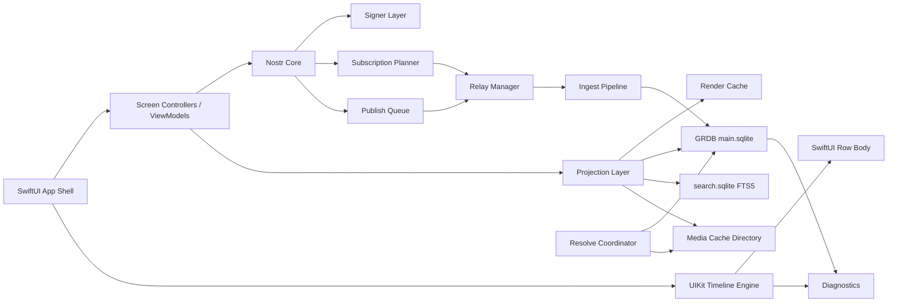
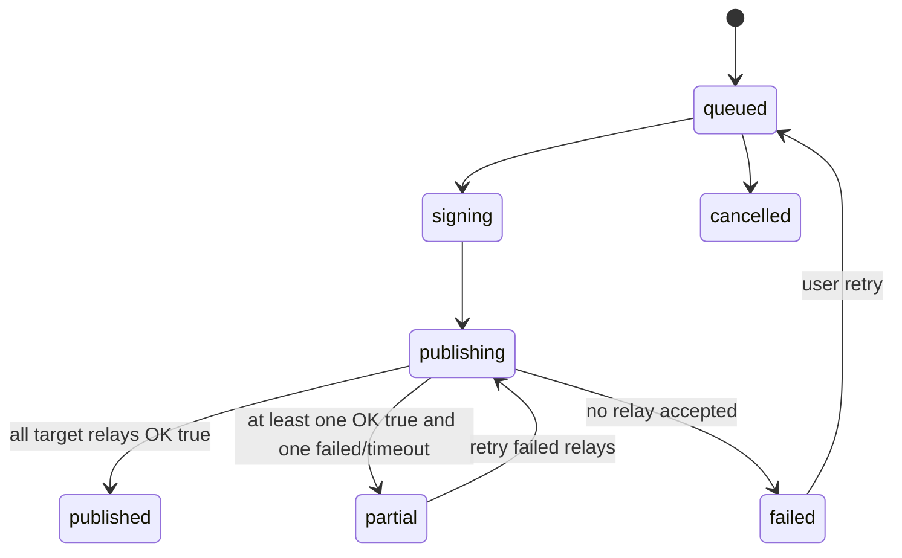

# Astrenza Nostr Client 開発仕様書 v1.0

作成日: 2026-06-25  
状態: **Astrenza-first 再策定版 / greenfield timeline implementation spec**  
対象: Apple-first Nostr client / local-first event browser / signer / timeline reader  
想定実装: SwiftUI app shell + UIKit `UICollectionView` timeline engine + SwiftUI row body via `UIHostingConfiguration` + GRDB + SQLite + URLSessionWebSocketTask  
DB基準: `astrenza_local_db_schema_v0_2.sql` を現時点の正とする。v1.0では原則schema変更しない。  
Legacy方針: 既存SwiftUI Timelineはproduction延命せず、比較fixture・失敗例・テスト意図の抽出元として凍結する。

---

## 0. この文書の位置づけ

この仕様書は、Astrenzaをゼロから再定義するための開発仕様である。既存v0.4の文章を継ぎ足すのではなく、Astrenza固有のプロダクト原則、Nostr固有の状態、local-first DB、relay-aware同期、読書位置保持、Design System、テスト契約を上位から再構成する。

AstrenzaはIvory cloneではない。IvoryやTweetbot的な密度、復帰性、読みやすさは参考にするが、仕様のsource of truthではない。source of truthは以下である。

```text
Astrenza source of truth:
- Nostr raw event model
- local-first database
- relay-aware sync and publish
- immutable raw events / rebuildable projections
- read marker and scroll anchor separation
- delayed resolve that enriches without jumping
- explicit degraded states
- Apple-first performance and accessibility
```

この仕様書で「必須」と書かれた内容を変更する場合は、ADR、テスト変更、移行計画、ベンチマーク結果を必須とする。

---

## 1. Product definition

### 1.1 Astrenzaとは何か

Astrenzaは、Nostr relay群を直接読むApple-firstクライアントである。ローカルDBを単なるcacheではなくUXの一次ストアとして扱い、ユーザーが前回読んでいた場所、未読境界、投稿の送信状態、取得済みevent、欠損context、relayごとの成功/失敗を明示的に保持する。

Astrenzaが提供する体験は次の通り。

```text
- 起動した瞬間に、前回読んでいたHomeへ戻れる
- relayが遅い/欠ける/認証が必要でも、画面は壊れない
- OGP、media、profile、quote、reply parentが後から来てもtimelineが跳ねない
- 投稿はlocal-firstで見えるが、relay別receiptで実際の送信状態を説明する
- Nostr identityをdisplay nameだけで曖昧にしない
- 削除、mute、missing、blocked、failedを隠さず、説明可能なUIにする
```

### 1.2 Astrenzaではないもの

Astrenzaは次のものではない。

```text
- Ivoryの見た目を再現するクライアント
- Twitter/Xの完全コピー
- relayを単一の信頼できるDBとして扱うアプリ
- 起動時にネットワーク同期完了まで待つアプリ
- snapshotが通らないUI調整を目視で積み重ねるプロジェクト
- DM、Zap、PushをP0から全部入れるfeature-firstプロジェクト
```

### 1.3 Product principles

実装判断で迷った場合は、以下の順に優先する。

1. **Read position is sacred.** 読んでいた場所を壊す変更はrejectする。
2. **Timeline must not jump.** 新着、gap fill、profile更新、OGP解決、media解決、mute更新で表示中cellを勝手に動かさない。
3. **Local first, relay aware.** ローカルにあるものを即表示し、relay差分は後から反映する。
4. **Raw events are immutable.** raw eventをsource of truthとし、projectionは再構築可能にする。
5. **Design tokens are runtime contracts.** 色、余白、typography、icon、media/card寸法は好みではなく、layout安定の契約である。
6. **Resolve must enrich, never jump.** 後続resolveは情報を増やすが、row identityとvisible anchorを壊さない。
7. **Explain degraded states.** 欠損や失敗を「壊れたUI」にしない。ユーザーに理由を説明する。
8. **Keys before features.** Zap、DM、Pushより先に鍵管理、投稿信頼性、ログredactionを固める。

---

## 2. Legacy recovery policy

### 2.1 結論

既存プロジェクトは完全破棄しない。ただしHome Timeline UIはproduction延命しない。

```text
Keep / salvage:
- AstrenzaCore
- GRDB / SQLite schema direction
- NostrEventStore direction
- projection tests
- relay planner and diagnostics logic
- media resolver service
- Maestro flows as acceptance-test intent
- mock data and screenshots as fixture sources

Freeze / rewrite:
- SwiftUI ScrollView/LazyVStack based Home Timeline
- old TimelineFeedView / TimelinePostRow / TimelineAttachments responsibilities
- startup splash that hides DB/relay readiness
- ad-hoc raw font / spacing / radius / color usage
- action button implementation without 44pt hit target contract
- giant view files that mix media grid, loader, fullscreen viewer, OGP, blurhash, and gestures

New production implementation:
- DesignSystem module
- TimelineCollectionViewController
- DiffableDataSource snapshots with item IDs only
- UIHostingConfiguration row body
- TimelineSnapshotCoordinator
- TimelinePositionRecorder
- TimelineResolveApplyCoordinator
- DB-backed ResolveCoordinator
- snapshot and E2E tests as release blockers
```

### 2.2 Migration stance

既存ZIPは `legacy-swiftui-timeline-prototype` としてtag/branch保存する。新しい実装branchでは、旧Timelineへ新機能を足さない。旧コードは次の用途だけに限定する。

```text
- 失敗した構造の確認
- fixture抽出
- Maestro intent抽出
- projection/store testの継承
- 既存DB方針の再利用
```

### 2.3 Ivory screenshot policy

Ivory screenshotはAstrenza仕様の親ではない。Design reference fixtureとして扱う。

```text
Use Ivory references for:
- timeline density
- information hierarchy
- action row subtlety
- media/card discipline
- component states
- snapshot comparison inspiration

Do not use Ivory references for:
- Nostr identity model
- relay state
- missing context state
- deletion semantics
- publish receipts
- exact visual copying
- component names that imply Mastodon-only behavior
```

Astrenzaの仕様本文では、Ivoryは「Reference fixtures」章に閉じ込める。最上位の判断はAstrenza Product Principlesで決める。

---

## 3. Scope

### 3.1 P0 / MVP

P0は「読む、書く、戻る、壊れない」に限定する。

| 領域 | P0要件 | 完了条件 |
|---|---|---|
| Account | 鍵生成、nsec/hex import、npub表示、read-only npub追加 | onboarding後にHome取得へ進める |
| Key security | Keychain保存、生体認証optional、nsecログ禁止、バックアップ注意喚起 | nsec/secretがDB/log/crash reportに出ない |
| Relay | 初期relay preset、手動追加、read/write切替、NIP-11、NIP-65読取 | relayごとの接続、制限、エラーを見られる |
| Home | kind:1 note、kind:6 repost、followee timeline | cold launchでローカルHomeを即表示 |
| Profile | kind:0 profile、user notes、follow/unfollow | profile未取得でもnpub fallbackで成立 |
| Thread | root/parent/children hydrate、欠損placeholder | 欠けたcontextをhydrate queueに積める |
| Compose | note、reply、repost、reaction、delete request | relay別OK/失敗を保存し再送できる |
| Local DB | raw events、tags、refs、heads、profiles、follows、feeds、read state | migration、dedupe、再起動復帰が通る |
| Timeline UX | read marker、scroll anchor、pending new、gap row | 新着/resolveで表示中TLが跳ねない |
| Design System | semantic color、typography、spacing、radius、icon、media/card、row contract | raw color/spacing/icon sizeをTimelineに残さない |
| Mute/Filter | pubkey、word、hashtag mute、local-only mute | mute解除で復元可能。物理削除しない |
| Share/Deep Link | note/nevent/nprofile/naddr open、share sheet受け | 外部URLから対象画面を開ける |
| Local diagnostics | relay RTT、EOSE、ingest、publish、anchor delta | debug screenで確認できる |

### 3.2 P1

```text
- NIP-51 full lists: follow sets, mute sets, bookmarks, relay sets
- Notifications feed local materialization
- NIP-46 remote signer / bunker
- NIP-49 encrypted secret key export/import
- NIP-92 imeta render
- Blossom / NIP-B7 upload
- local FTS5 search sidecar
- iPad / Mac multi-column and keyboard shortcuts
- NIP-77 Negentropy limited evaluation
```

### 3.3 P2

```text
- NIP-17/44/59 DM with clear metadata warnings
- NIP-57 Zap + NIP-47 wallet connect
- NIP-78 or iCloud private app-state sync
- Advanced moderation: relay mute, kind mute, trusted reports, temporary regex
- nostrdb sidecar only if 1M+ event benchmark proves the need
```

### 3.4 P0から除外するもの

```text
- DM as primary feature
- Zap as always-visible action
- Push notification service
- global relay search pretending to be complete search
- fully customizable tab system
- production Mac-specific NSCollectionView implementation
- SQLCipher unless security decision says otherwise
```

---

## 4. Architecture

### 4.1 High-level architecture



### 4.2 Module responsibilities

| Module | 責務 | 禁止事項 |
|---|---|---|
| AppShell | account selection、routing、theme、deep link dispatch | Nostr eventを直接parseしない |
| DesignSystem | tokens、timeline metrics、components、snapshot fixtures | screen固有の状態やrelay知識を持たない |
| TimelineEngine | UICollectionView、snapshot、anchor、visible range、prefetch | Nostr event parseやDB writeをしない |
| TimelineRows | SwiftUI row body、component composition | row identityを作らない。IDは外から受ける |
| NostrCore | event model、serialization、signature verify/sign | Keychain UIやDB migrationを持たない |
| SignerLayer | Keychain signing、NIP-46、NIP-49 | secretをDB/logへ渡さない |
| Store | GRDB schema、transaction、query、migration | UI objectへ依存しない |
| IngestPipeline | validate、dedupe、raw save、tags/refs、projection | 完成済みUI modelを永続化しない |
| ProjectionLayer | batch row view state、render hints、stats/profile/media lookup | heavy JOINを常時observationしない |
| FeedEngine | feed materialization、gap/read/anchor control | 表示中TLを勝手に再ソートしない |
| RelayManager | WebSocket、NIP-11、AUTH、REQ/EVENT/CLOSE、OK/EOSE/CLOSED | 画面単位で無秩序なREQを張らない |
| SubscriptionPlanner | intent別購読計画、relay選定、filter chunking、cursor更新 | 全relay総当たりをdefaultにしない |
| ResolveCoordinator | DB-backed resolve jobs、OGP/media/profile/target hydrate | UIから直接ネットワークを叩かせない |
| PublishQueue | local-first send、relay receipts、retry/backoff | 送信結果を単一boolに潰さない |
| Diagnostics | local counters、anchor delta、relay status、test artifacts | secret/public sensitive dataを外部送信しない |

### 4.3 Dependency rule

```text
UI -> ViewModel / TimelineEngine -> Domain Service -> Store / Relay / Signer
Store -> no UI dependency
RelayManager -> IngestPipelineへeventを渡すだけ
IngestPipeline -> UIを知らない
ProjectionLayer -> RelayManagerを知らない
TimelineEngine -> stable item IDs only
```

UIからrelayへ直接REQを投げる実装は禁止する。画面は「intent」を発行し、SubscriptionPlannerがrelay、filter、cursor、priorityを決める。

---

## 5. Project structure

新規branchの標準構成は以下。

```text
Astrenza/
  App/
    AstrenzaApp.swift
    AppEnvironment.swift
    Routing/
    Account/
    Compose/
    Settings/
    Profile/
    Thread/
  Timeline/
    TimelineSurface.swift
    TimelineCollectionViewController.swift
    TimelineSnapshotCoordinator.swift
    TimelinePositionRecorder.swift
    TimelineVisibleRangeTracker.swift
    TimelinePrefetchCoordinator.swift
    TimelineResolveApplyCoordinator.swift
    TimelineRestoreGate.swift
    TimelineDiagnosticsRecorder.swift
  Packages/
    AstrenzaCore/
      Event/
      NIP/
      Signer/
      RelayProtocol/
    AstrenzaStore/
      Migrations/
      Queries/
      Ingest/
      Feed/
      ReadState/
    AstrenzaProjection/
      TimelineEntryViewState.swift
      TimelineProjector.swift
      RenderHints.swift
    DesignSystem/
      Tokens/
      Components/
      Timeline/
      Theme/
    AstrenzaTestSupport/
      FakeRelay/
      URLProtocolStub/
      FakeMediaLoader/
      FixtureRuntime/
  Services/
    AstrenzaMediaResolver/
  Tests/
    Fixtures/
    AstrenzaCoreTests/
    AstrenzaStoreTests/
    AstrenzaProjectionTests/
    AstrenzaSnapshotTests/
    AstrenzaUITests/
    AstrenzaBenchmarks/
```

`Packages/DesignSystem` と `Timeline/` はP0最初に作る。Timeline UIを後からtoken化する方針は禁止する。

---

## 6. Local data policy

### 6.1 main.sqlite

`main.sqlite` はUXの一次ストアである。単なるcacheではない。以下の状態を保持する。

```text
- accounts and key backup metadata
- relays and account relay roles
- raw events, event tags, normalized refs, event-relay observations
- replaceable/addressable heads
- profiles, follows, author relays
- user lists and mute rules
- notes, relations, reposts, reactions, stats
- feeds, feed_items, feed_read_state, feed_gaps
- render hints, timeline row layout cache
- sync cursors and missing events
- resolve jobs
- notifications
- drafts and publish queue/receipts
- media_assets and link_previews metadata
- nip05 cache
- timeline diagnostics
- tombstones, retention pins, maintenance jobs
```

### 6.2 search.sqlite

FTS5用sidecar。壊れても`main.sqlite`から再構築できる。

対象:

```text
- kind:1 note body
- kind:0 name / display_name / about
- link preview title / description
- local profile notes
```

禁止:

```text
- search.sqliteをsource of truthにすること
- FTS rebuild中にmain DB write pathを止めること
- relay searchをlocal searchと同じ完全性で見せること
```

### 6.3 Media cache directory

media実体、thumbnail、transcode結果、blurhash素材はファイルcacheへ置く。DBにはmetadataとpathだけを保存する。

```text
Application Support/Astrenza/
  main.sqlite
  main.sqlite-wal
  main.sqlite-shm
  search.sqlite
  media/
    blobs/<sha256-prefix>/...
    thumbs/...
    temp-upload/...
```

### 6.4 Secure storage

Nostr secret keyはmain.sqliteへ保存しない。

許可:

```text
- Keychain item reference
- remote signer metadata
- read-only npub account
```

禁止:

```text
- nsecをDB/log/analytics/crash reportへ保存
- secret keyをdebugDescriptionへ出す
- secret keyをpasteboardへ残し続ける
- secretをtest fixtureへ混入させる
```

### 6.5 DB PRAGMA and connection

DB作成時に適用する。

```sql
PRAGMA foreign_keys = ON;
PRAGMA journal_mode = WAL;
PRAGMA synchronous = NORMAL;
PRAGMA auto_vacuum = INCREMENTAL;
PRAGMA busy_timeout = 5000;
```

運用ルール:

```text
- foreground appはDatabasePoolを使う
- write transactionは短くする
- observationはID listなど軽量queryに限定する
- render modelはID list取得後にbatch projectionする
- long-running read transactionを避ける
- UI scrolling中にcheckpoint / vacuum / pruningを走らせない
```

---

## 7. Data model contract

### 7.1 ID representation

内部保存は64文字lowercase hex `TEXT`に統一する。`npub`、`note`、`nevent`、`naddr`はpresentation/import/export層で変換する。

Swiftでは型を必ず分ける。

```swift
struct EventID: Hashable, Codable, Sendable { let hex: String }
struct Pubkey: Hashable, Codable, Sendable { let hex: String }
struct RelayURL: Hashable, Codable, Sendable { let normalized: String }
struct FeedID: Hashable, Codable, Sendable { let rawValue: Int64 }
struct TimelineEntryID: Hashable, Codable, Sendable { let rawValue: String }
```

`String`を全層へ直接流す実装は禁止する。

### 7.2 Raw event store

`events`はimmutable sourceである。受信したvalid eventは原則保存する。削除要求やmuteはraw eventを物理削除せず、表示上の状態として扱う。

原則:

```text
- raw eventは検証可能な形で残す
- projectionは壊れても再構築できる
- parser改善時にevent_tags/event_refsを再構築できる
- delete/mute/expireはvisibility stateとして扱う
```

### 7.3 Feed items

`feed_items`は完成済みTimelinePostではない。画面復帰、未読、gap制御に必要な軽量indexである。

必須概念:

```text
source_event_id: feed itemを発生させたevent
subject_event_id: 表示主体。repostなら対象note。未取得ならNULL可
reason: author / reply / repost / quote / mention / reaction / zap
sort_at: timeline上の時刻
tie_break_id: 同一時刻の安定sort用
hidden_reason: mute/delete/local filter結果
pending_new: 表示中timelineの上に積まれた新着
```

Row identityは`feed_items.item_key`またはそれに対応する`TimelineEntryID.rawValue`だけで決める。profile、OGP、media、quote、reply parentなどの解決状態をrow identityに含めてはいけない。

### 7.4 Read state

`feed_read_state`は`feed_items`の付随状態ではない。ユーザー状態として独立して扱う。

```text
marker_sort_at / marker_event_id:
  既読境界

scroll_anchor_event_id / scroll_anchor_offset_px:
  復元位置

last_visible_top_id / last_visible_bottom_id:
  fallback復帰、差分挿入安定化
```

read markerを進めてよい条件:

```text
- ユーザーが実際にitemを表示した
- ユーザーが「ここまで既読」を実行した
- ユーザーが「すべて既読」を明示実行した
```

read markerを進めてはいけない条件:

```text
- 起動
- root shell表示
- restore gate解除
- relay接続
- sync完了
- EOSE到達
- OGP/media/profile/quote/reply resolve
- app foreground
```

### 7.5 Delayed resolve storage

OGP、media、profile、repost target、quote target、reply parent/rootは後続で到着する通常系である。DBには完成済みrowではなく、状態とjobを保存する。

| 対象 | source of truth | DB state | 初期表示 | 後続resolve |
|---|---|---|---|---|
| OGP | note content内URL | `link_previews`, `resolve_jobs` | URL-only / fixed skeleton | card内容更新 |
| Media | imeta, URL, file metadata | `media_assets`, `resolve_jobs` | aspect placeholder | image/thumbnail差替 |
| Profile | kind:0, NIP-05 | `profiles`, `nip05_cache` | npub fallback | avatar/name/NIP-05差替 |
| Repost | kind:6 target | `reposts`, `missing_events` | target skeleton | target compact render |
| Quote | q tag target | `note_relations`, `missing_events` | quote skeleton | quote card更新 |
| Reply | NIP-10 root/reply | `notes`, `note_relations`, `missing_events` | one-line reply header | header更新 |

`failed`は表示失敗ではなくfallback表示へ落ちる状態であり、note本体を消してはいけない。

---

## 8. Nostr ingest pipeline

### 8.1 Receive flow

すべての受信eventは次の順に処理する。

```swift
func ingest(rawJSON: String, relay: RelayURL, subscriptionID: String) async throws {
    let event = try parseEvent(rawJSON)
    try verifyIDAndSignature(event)
    try validateTimestampPolicy(event)

    try db.write { db in
        let isNew = try upsertEvent(db, event)
        try upsertEventRelay(db, event.id, relay, subscriptionID)

        guard isNew else {
            try incrementSeenCount(db, event.id, relay)
            return
        }

        try insertEventTags(db, event)
        try insertEventRefs(db, event)
        try upsertReplaceableHeadIfNeeded(db, event)
        try projectByKind(db, event)
        try applyDeletionOrExpiration(db, event)
        try applyMuteVisibility(db, event)
        try updateFeeds(db, event)
        try enqueueHydrationIfNeeded(db, event)
        try updateStatsAndNotifications(db, event)
    }
}
```

高頻度受信時は小バッチ化してよい。ただしUI scroll中に巨大transactionを作らない。

### 8.2 Validation policy

| 条件 | P0処理 |
|---|---|
| event id不一致 | drop。debug counter増加 |
| signature不正 | drop。debug counter増加 |
| `created_at`が極端な未来 | UI非表示。debug counter増加 |
| unknown kind | raw保存可能。ただしprojectionしない |
| JSON parse失敗 | drop。relay healthにinvalid sample |
| duplicate | raw重複保存せず、seen_count/event_relays更新 |

未来時刻の初期閾値は10分。設定で調整可能にする。

### 8.3 Projection by kind

| kind | P0処理 |
|---:|---|
| 0 | profile projection。metadata parse失敗時はraw保存のみ |
| 1 | notes、relations、Home/Profile/List/Thread feed materialization |
| 3 | follows、author relay fallback、Home source再計画 |
| 5 | deletion request。対象author一致時のみhide/tombstone |
| 6 | reposts、feed item reason=`repost`、target hydrate |
| 7 | reactions、event_stats、notification materialization |
| 10000 | mute list projection |
| 10001 | pin/bookmark/list projection |
| 10002 | relay list metadata projection |
| 30000-39999 | addressable list/data projection |
| その他 | raw保存、known parserがあればprojection |

### 8.4 Deletion

削除は物理削除ではない。

処理:

```text
1. kind:5 eventのe/a tagを読む
2. 対象eventが既存ならtarget.pubkey == deletion.pubkeyを確認
3. 一致時のみevents.deleted_by_event_id/deleted_atを更新
4. feed_items.hidden_reason = 'deleted'
5. event_tombstonesに記録
6. FTS検索から除外またはtombstone表示へ更新
```

対象event未取得時はtombstoneを先に保存し、後から対象eventが来たときに適用する。

### 8.5 Expiration

`expiration` tagは`events.expires_at`へ保存する。期限超過後はfeed、notification、searchから除外する。raw eventはretention policyに従って短期保持後prune可能。

---

## 9. Relay and sync

### 9.1 Relay roles

Relayは単なるURLではなくroleを持つ。

| Role | 意味 |
|---|---|
| account read | 自分宛mentionやaccount metadataを読む |
| account write | 自分のeventをpublishする |
| author write | followee/authorのeventを読む候補 |
| tagged user read | 投稿時にtagged userへ届ける候補 |
| search relay | NIP-50対応relay |
| media/server hint | media upload/cache補助 |

NIP-65 kind:10002を最優先し、follow tag relay hint、observed relay、default relayの順にfallbackする。

### 9.2 Subscription scopes

`sync_cursors.scope`は次を標準にする。

```text
home:hot
home:backfill:<chunk_hash>
mentions
profile:<pubkey>
thread:<root_event_id>
metadata:<pubkey>
relaylist:<pubkey>
list:<kind>:<pubkey>:<d>
search:<query_hash>
```

`filter_hash`はcanonical JSONのsha256。relayごと、scopeごと、filterごとにcursorを持つ。

### 9.3 Home sync sequence

起動時はネットワークより先にローカル復元を行う。

```text
1. DBからHome initial windowを読む
2. scroll anchorへ復元する
3. first interactive scrollを許可する
4. account read relayへ接続する
5. 自分のkind:3/10000/10002を更新する
6. followeeをrelayごと/chunkごとに分割する
7. hot rangeをsince = newest_seen - overlapで取得する
8. EOSE後にcursor更新する
9. backfillはユーザーscrollまたはidle時に行う
```

### 9.4 Backpressure

RelayごとにNIP-11制約を保存し、購読priorityを分ける。

| Priority | 用途 | 維持 |
|---|---|---|
| hot | 表示中Home、現在Thread、Mentions | foreground中維持 |
| warm | profile prefetch、visible周辺hydrate | idle時 |
| cold | search、global、古いbackfill | 明示操作時のみ |

制約:

```text
- 1 relay 1 WebSocket
- max_subscriptionsを尊重
- max_limitを超えない
- AUTH requiredならNIP-42 pathへ送る
- payment requiredならUIで説明し、勝手にretryし続けない
```

### 9.5 Reconnect policy

| 失敗 | 対応 |
|---|---|
| network close | exponential backoff + jitter |
| auth-required | challenge署名後に再REQ |
| rate-limited | relayごとcooldown |
| restricted write | publish receiptに保存し、別relay継続 |
| unsupported filter | plannerがfilterを分割/縮退 |
| timeout before EOSE | cursor更新しない。gap open |

---

## 10. Feed engine

### 10.1 Feed types

| Type | Params | 主なsource |
|---|---|---|
| home | `{}` | follow set、followee write relays |
| notifications | `{}` | `#p: my_pubkey`、reactions、reposts |
| profile | `{ "pubkey": "..." }` | author filter |
| thread | `{ "root": "..." }` | root、parent、children |
| list | `{ "kind": 30000, "d": "..." }` | NIP-51 list |
| hashtag | `{ "tag": "nostr" }` | `#t` refs |
| search | `{ "query": "..." }` | local FTS / relay search |
| relay | `{ "relay": "wss://..." }` | relay-local exploratory feed |

### 10.2 Home insertion

NoteをHomeへ入れる条件:

```text
- authorがcurrent follow setに含まれる
- muted/blocked/deleted/expiredではない
- include_replies設定に合う
- created_atが未来すぎない
```

Repostは`item_key = repost:<repost_event_id>`として入れる。対象noteが未取得なら`missing_events`へ積み、UIはplaceholderを出す。

### 10.3 Reply display policy

初期値:

```text
include_replies = 0
```

| 値 | 意味 |
|---:|---|
| 0 | top-level note/repost中心。replyはHomeへ出さない |
| 1 | followee同士の会話だけ出す |
| 2 | followeeの全replyを出す |

Thread画面ではこの設定に関係なくroot/parent/childrenを表示する。

### 10.4 Pending new

ユーザーがHomeを見ている間に新着が届いた場合:

```text
1. DBにはfeed_items.pending_new = 1で入れる
2. visible datasetへ即挿入しない
3. 上部にN new posts bannerを出す
4. ユーザーがbannerを押したらpending解除し、snapshotへ挿入する
5. ユーザーが最上部にいる場合のみ自動挿入してよい
```

### 10.5 Gap model

Gapは正常系である。relay差、limit、backfill失敗、network timeoutで発生する。

| State | UI |
|---|---|
| open | Load missing posts |
| filling | spinner |
| filled | row消去 |
| exhausted | No more posts from selected relays |
| failed | retry + relay detail |

Gap fill時はvisible anchorを固定する。古い方向へ挿入しても表示中cellを動かしてはいけない。

### 10.6 Render query principle

UIはまずID listだけを取得する。

```sql
SELECT item_key, source_event_id, subject_event_id, reason, actor_pubkey, sort_at, tie_break_id
FROM feed_items
WHERE feed_id = :feed_id
  AND hidden_reason IS NULL
  AND pending_new = 0
ORDER BY sort_at DESC, tie_break_id ASC
LIMIT :limit OFFSET :offset;
```

ProjectionLayerがbatchで`events`、`profiles`、`event_stats`、`media_assets`、`link_previews`を読む。heavy JOINを常時observationしない。

---

## 11. Timeline implementation

### 11.1 決定

主Timeline surfaceはP0から`UICollectionView`で実装する。SwiftUI `ScrollView + LazyVStack`は本番Timelineに使わない。

本番Timeline:

```text
- Home
- Mentions / Notifications
- Profile event list
- Thread detail event list
- List timeline
- Hashtag/search result timeline if it behaves like a timeline
- Custom relay-set timeline
```

非Timeline:

```text
- Compose
- Settings
- Account management
- Relay settings
- Profile header
- Onboarding
- Static help / diagnostics screens
```

### 11.2 Standard structure

```text
SwiftUI RootShell
  TimelineSurface
    TimelineCollectionViewRepresentable
      TimelineCollectionViewController
        UICollectionView
        UICollectionViewDiffableDataSource<TimelineSection, TimelineEntryID>
        UICollectionView.CellRegistration<UICollectionViewCell, TimelineEntryID>
        UIHostingConfiguration { TimelineRowView(viewState:) }
        TimelineSnapshotCoordinator
        TimelinePositionRecorder
        TimelineVisibleRangeTracker
        TimelinePrefetchCoordinator
        TimelineResolveApplyCoordinator
        TimelineDiagnosticsRecorder
```

### 11.3 Snapshot identity

Diffable snapshotには`TimelineEntryID`だけを入れる。

禁止:

```text
- snapshot itemにTimelineRowModelを含める
- profile/avatar/media/link previewの解決状態をidentityへ含める
- delayed resolveでdelete/insertする
```

許可:

```text
- rowModelStore.invalidate(entryIDs:reason:)
- snapshot.reconfigureItems(entryIDs)
- user action時のpending_new insert
- gap fill / older pageのsnapshot mutation with anchor preservation
```

### 11.4 Delayed resolve application

原則は`reconfigureItems`。

| 更新 | 方法 | 条件 |
|---|---|---|
| profile/avatar/name | reconfigure | row高さ不変 |
| OGP metadata | reconfigure | reserved card height内 |
| media thumbnail | reconfigure | main thread decode禁止 |
| repost/quote/reply target | reconfigure | skeletonをcompact resolvedへ置換 |
| visible mute | reconfigure | 即removeせずcollapsed placeholder |
| New Posts押下 | insert snapshot | anchor保存/復元必須 |
| gap fill | insert/append snapshot | anchor保存/復元必須 |

### 11.5 Snapshot mutation contract

すべてのsnapshot mutationは`TimelineSnapshotCoordinator`を通す。controller/view modelから直接`dataSource.apply`してはいけない。

```swift
enum TimelineSnapshotReason: Equatable {
    case initialRestore
    case userInsertedPendingNew
    case olderPageLoaded
    case gapFilled
    case reconfigure(ResolveApplyReason)
    case filterChanged
    case accountSwitched
    case timelineSwitched
    case debugReload
}
```

Coordinatorはmutation前後でanchorをcaptureし、apply後にrestoreし、diagnosticsへanchor deltaを記録する。

### 11.6 Anchor model

保存すべきものはindexPathではない。stable item keyとviewport topからのdeltaである。

```swift
struct TimelineVisualAnchor: Codable, Equatable, Sendable {
    var accountID: AccountID
    var feedID: FeedID
    var timelineKey: TimelineKey
    var anchorItemKey: String
    var anchorEventID: EventID?
    var anchorSortAt: Int64
    var anchorTieBreakID: String
    var cellTopDeltaFromViewportTop: Double
    var viewportHeight: Double
    var viewportWidth: Double
    var contentInsetTop: Double
    var contentInsetBottom: Double
    var lastVisibleTopItemKey: String?
    var lastVisibleBottomItemKey: String?
    var markerEventID: EventID?
    var markerSortAt: Int64?
    var capturedAtMS: Int64
    var schemaVersion: Int
}
```

保存タイミング:

```text
- visible range変化: 300〜700ms debounce
- drag/deceleration終了: 即保存
- detail/profile/thread遷移直前: 即保存
- feed/account切替: 即保存
- scenePhase inactive/background: 即保存
- memory pressure相当: 可能なら即保存
```

### 11.7 Launch and restore

Launch Screenでネットワーク同期を隠さない。アプリ起動後はRoot shellをすぐ出す。

起動順序:

```text
1. Static Launch Screen
2. Root shell first paint
3. active account / selected feed読取
4. feed_read_state読取
5. local initial window query
6. collection view initial snapshot apply
7. anchor setContentOffset
8. first interactive scroll allowed
9. relay hot sync / delayed resolve開始
```

待ってはいけないもの:

```text
- relay connection
- NIP-11 fetch
- NIP-65 refresh
- hot sync EOSE
- OGP resolve
- media thumbnail download/decode
- profile kind:0 refresh
- search.sqlite availability
- pruning/checkpoint/optimize
```

### 11.8 Timeline restore gate

許可するのはTimeline area内の短いrestore gateだけである。アプリ全体splashではない。

```text
cached window + anchorあり:
  initial snapshot + anchor復元までtimeline areaだけ覆う

cached windowあり + anchorなし:
  gateなし、または1 frameだけ

cached windowなし:
  splashではなくempty/skeleton state

network sync中:
  gateしない。banner/status chipで示す
```

Budget:

| Metric | Target | Hard limit |
|---|---:|---:|
| Root shell first paint | <300ms p50 | <700ms p95 |
| local initial window query | <120ms p50 | <300ms p95 |
| initial snapshot apply + layout | <80ms p50 | <200ms p95 |
| anchor setContentOffset | <16ms p50 | <50ms p95 |
| restore gate duration | <250ms p50 | <500ms p95 |
| network waited before interactive scroll | 0ms | 0ms |

500msを超えてrestoreできない場合は、splash継続ではなくinline skeletonへ切り替える。

---

## 12. Design System v1

### 12.1 目的

Design Systemはブランド完成版ではなく、Timeline安定の実装契約である。

```text
- row heightを予測可能にする
- delayed resolveでrow identityを変えない
- snapshot testsを安定させる
- Dynamic Type / high contrast / dark / black themeで破綻しない
- UICollectionView anchor restoreの前提となるlayout contractを固定する
- raw color / raw spacing / ad-hoc icon sizeを禁止する
```

### 12.2 Package structure

```text
Packages/DesignSystem/
  Sources/DesignSystem/
    Tokens/
      DSColor.swift
      DSTypography.swift
      DSSpacing.swift
      DSRadius.swift
      DSIcon.swift
      DSControlSize.swift
      DSMediaMetrics.swift
    Theme/
      AppTheme.swift
      ThemeStore.swift
      ThemeEnvironment.swift
    Timeline/
      TimelineDensity.swift
      TimelineRowLayoutContract.swift
      TimelineRowMetrics.swift
      TimelineRowSkeleton.swift
    Components/
      AvatarView.swift
      TimelineAuthorBlock.swift
      TimelineStatusBadges.swift
      TimelineActionBar.swift
      ContentWarningPill.swift
      SensitiveMediaOverlay.swift
      MediaGrid.swift
      LinkPreviewCard.swift
      RepostContextChip.swift
      ReplyContextHeader.swift
      QuoteCardView.swift
      NewPostsBadge.swift
      ComposeFAB.swift
```

### 12.3 Token rules

```text
- semantic token名、baseline値、hit target、component stateをP0開始時に決める
- 目視調整はtoken値だけで行う
- Timeline row高さに影響するtoken変更はsnapshot + E2E anchor delta test必須
- raw Color、raw CGFloat、raw SF Symbol sizeはTimeline component内で禁止
- P0 beta前にbaseline tokensをfreezeし、以後はADR/migration扱い
```

判断基準:

```text
読みやすさ > 位置保持 > 操作しやすさ > 見た目の華やかさ
```

### 12.4 Baseline metrics

| Token | Default | 指示 |
|---|---:|---|
| `timeline.row.horizontalPadding` | 16pt | 画面端からavatarまで |
| `timeline.row.verticalPaddingTop` | 12pt | row上余白 |
| `timeline.row.verticalPaddingBottom` | 10pt | action bar後余白 |
| `timeline.avatar.size` | 44pt | Home row author avatar |
| `timeline.avatarToContentGap` | 12pt | avatar右から本文列 |
| `timeline.action.icon.visual` | 22pt | glyph視覚サイズ |
| `timeline.action.button.targetHeight` | 44pt | tap target |
| `timeline.action.button.targetWidth` | max(44pt, contentWidth/5) | 5 slot想定 |
| `timeline.card.cornerRadius` | 14pt | OGP/quote/media outer radius |
| `timeline.media.gridDivider` | 1pt | grid内divider |
| `composeFAB.diameter` | 56pt | scroll中は48ptまで縮小可 |
| `bottomTab.icon.visual` | 26pt | tab slot全体がtarget |

icon visual sizeとbutton target sizeを混同しない。見た目は小さく、hit targetは44x44pt以上を維持する。

### 12.5 Semantic colors

```swift
public enum DSColorToken: String, Codable, Sendable {
    case appBackground
    case timelineBackground
    case rowBackground
    case rowPressedBackground
    case textPrimary
    case textSecondary
    case textTertiary
    case accent
    case separator
    case cardBackground
    case placeholder
    case warning
    case destructive
    case repost
    case reply
    case quote
}
```

Themes:

```text
- System
- Light
- Dark
- Black / OLED
- High Contrast
```

### 12.6 Timeline row contract

基本骨格:

```text
TimelineRow
  HStack(top)
    AvatarColumn
      AvatarView
    ContentColumn
      HeaderLine
        DisplayName
        NIP-05 / npub fallback
        StatusBadges
        Timestamp
      Optional ReplyContextHeader / RepostContextChip
      BodyText
      Optional ContentWarningPill
      Optional MediaGrid
      Optional LinkPreviewCard
      Optional QuoteCard
      TimelineActionBar
      Separator
```

Nostr identity:

```text
NIP-05 verified:
  @name@domain

NIP-05 missing:
  shortened npub

Display name:
  labelとして表示可。ただしidentityとして単独使用禁止
```

Row identity:

```text
- MUST be TimelineEntryID / feed_items.item_key
- delayed resolve MUST NOT delete/reinsert
- visible rowの大きな高さ増加はHomeでは折りたたむ
- rich expansionはdetail/threadで行う
```

### 12.7 Reference fixtures

Ivory screenshotsは次のmappingでsnapshot fixtureへ落とす。ただしAstrenza component名、Nostr状態、identity表現へ置換する。

```text
Text-only Home -> TimelineRow_textOnly
Content Warning -> TimelineRow_contentWarning_collapsed
Hashtag -> TimelineRow_hashtag_accentText
Reply -> TimelineRow_replyContext_oneLine
Single Media -> TimelineRow_singleMedia_loaded
2 Media -> TimelineRow_mediaGrid_twoLoaded
3 Sensitive Media -> TimelineRow_mediaGrid_threeSensitive
4 Sensitive Media -> TimelineRow_mediaGrid_fourSensitive
GitHub OGP -> TimelineRow_linkPreview_githubResolved
Pixiv OGP -> TimelineRow_linkPreview_pixivResolved
```

追加すべきAstrenza-native fixtures:

```text
- npub fallback without NIP-05
- verified NIP-05
- relay-limited missing parent
- repost target unavailable
- quote target deleted
- media blocked
- publish partial success row
- failed OGP fallback
- long Japanese text
- Dynamic Type XXL
- high contrast black theme
```

---

## 13. Components

### 13.1 TimelineAuthorBlock

表示:

```text
- display name: 1 line, truncation
- identity: verified NIP-05 or shortened npub
- avatar: fixed frame
- timestamp: relative text + absolute accessibility label
- relay/source debug: debug mode only
```

NIP-05がない場合、display nameだけでユーザーを識別してはいけない。

### 13.2 LinkPreviewCard

States:

```text
urlOnly
pending
resolvedImage
resolvedNoImage
failed
blocked
expired
```

Baseline:

| Token | Value |
|---|---:|
| width | contentColumnWidth |
| imageAspectRatio | 1.91:1 default |
| imageMaxHeight | 180pt |
| textAreaMinHeight | 92pt |
| textAreaMaxHeight | 118pt |
| totalMaxHeight | 306pt |
| titleLines | 2 |
| descriptionLines | 2 |

Rules:

```text
- URL検出時点でpending領域を予約する
- resolve後もtotalMaxHeightを超えない
- failed時はURL-onlyまたはcompact failed cardへ落とす
- note本体を消さない
```

### 13.3 MediaGrid

| Count | Layout | Height rule |
|---:|---|---|
| 1 | single rounded media | `min(width / aspectRatio, 420pt)`、unknownは16:9 |
| 2 | 2 columns | `min(width * 0.62, 240pt)` |
| 3 | large-left + stacked-right or uniform grid | `min(width * 0.66, 260pt)` |
| 4 | 2x2 grid | `min(width * 0.66, 260pt)` |

Sensitive:

```text
- media枠は維持する
- thumbnailがあればblur、なければneutral gradient
- centered SENSITIVE pill
- tap revealでrow identityを変えない
```

Failure:

```text
- failed placeholder + retry
- dimensions不明はfixed placeholder
- blocked placeholder
- pruned local fileは再取得可能。rowは消さない
```

### 13.4 Reply / Repost / Quote

Homeでは文脈を軽く出し、重いcontextはdetailへ逃がす。

```text
ReplyContextHeader:
  one line, 24-28pt, parent body inline preview禁止

RepostContextChip:
  28pt, avatar 20pt, target pending/resolved/unavailable

QuoteCard:
  compact card, max 3 lines, media thumbnail only, nested quote depth 1
```

Relation mapping:

```text
NIP-10 root/reply -> ReplyContextHeader / Thread detail
kind:6 repost -> RepostContextChip + subject event
q tag quote -> QuoteCard
```

### 13.5 TimelineActionBar

Standard order:

```text
reply | repost | reaction | share | more
```

P0ではZap、bookmark、raw event、copy ID、mute、report、relay diagnosticsは`more` menuへ置く。

Rules:

```text
- glyphは22pt前後
- tap targetは44x44pt以上
- countが付いてもbutton高さを変えない
- count表示で隣slotを押し出さない
- destructive actionはmenu下部へ置き確認を挟む
- active/selectedだけaccentを使う
```

### 13.6 Top bar / Tab bar / Compose FAB

Top bar:

```text
left: CurrentAccountButton visual 36pt / target 44pt
center: FeedSelectorButton
right: TimelineSearchButton visual 28pt / target 44pt
```

Bottom tabs P0:

```text
Home
Notifications
Explore/Search
Lists/Filters
Profile/Settings
```

Compose FAB:

```text
diameter: 56pt
icon: 28pt
position: trailing 16pt, bottom = tabBarTop + 16pt
scrolling: optional scale/fade to 48pt minimum
hidden: compose/modal/media fullscreen
long press: New note / Drafts / Media note / account selection
```

FABが下部row actionを覆う場合は、FAB側を縮小/fadeする。row contentを不意に押し上げない。

---

## 14. Delayed resolve

### 14.1 State machine

```swift
enum ResolveState<Value: Equatable>: Equatable {
    case absent
    case pending(ResolveRequestID)
    case resolving(ResolveRequestID)
    case resolved(Value)
    case failed(ResolveFailure)
    case blocked(VisibilityReason)
    case unavailable(UnavailableReason)
}
```

### 14.2 Row view state

```swift
struct TimelineEntryViewState: Identifiable, Equatable {
    let id: TimelineEntryID
    let sourceEventID: EventID
    let subjectEventID: EventID?
    let sortKey: TimelineSortKey
    let reason: FeedItemReason

    var author: ResolveState<ResolvedProfile>
    var body: ResolvedBodyText
    var media: [ResolveState<ResolvedMedia>]
    var linkPreview: ResolveState<ResolvedLinkPreview>
    var repost: ResolveState<ResolvedRepost>?
    var quote: ResolveState<ResolvedQuote>?
    var replyContext: ResolveState<ResolvedReplyContext>?
    var stats: ResolveState<ResolvedStats>
    var visibility: TimelineVisibilityState
    var publishState: PublishState?
    var layoutContract: TimelineRowLayoutContract
}
```

### 14.3 Layout contract

```swift
struct TimelineRowLayoutContract: Equatable, Codable, Sendable {
    var rowKind: TimelineRowKind
    var canChangeHeightAfterFirstDisplay: Bool
    var reservedMediaAspectRatio: Double?
    var reservedMediaHeight: Double?
    var linkPreviewMode: LinkPreviewMode
    var quoteMode: QuoteCardMode
    var replyHeaderMode: ReplyHeaderMode
    var bodyMentionRendering: MentionRenderingMode
    var maxBodyLinesInCollapsedMode: Int?
    var maxQuoteLines: Int
    var allowsInlineParentPreviewInHome: Bool
}
```

原則:

```text
visibleになったrowは大きく高さを変えない。
高さを変えるrich化はdetail/thread画面で行う。
Home timelineでは豊かさより位置安定を優先する。
```

### 14.4 ResolveCoordinator

UIは直接ネットワークを叩かない。DB-backed job queueを`ResolveCoordinator`が読む。

```swift
actor ResolveCoordinator {
    func enqueue(_ request: ResolveRequest) async
    func runNextBatch(scope: ResolveScope) async
    func markResolved(_ requestID: ResolveRequestID, result: ResolveResult) async
    func markFailed(_ requestID: ResolveRequestID, error: ResolveFailure) async
}
```

Priority:

```text
P0 visible rows
P1 near viewport ±100 rows
P2 opened thread/profile context
P3 notifications
P4 background cache warming
```

Timeout:

| Job | Timeout | Retry |
|---|---:|---:|
| profile kind:0 | 3s per relay batch | max 5 |
| repost target | 5s | max 5 |
| quote target | 5s | max 5 |
| reply parent/root | 5s | max 5 |
| OGP | 4s | max 2 |
| media metadata | 4s | max 3 |
| image bytes | URLSession policy | cache/progressive |

---

## 15. Compose and publish

### 15.1 Local-first publish

送信ボタン押下後:

```text
1. Compose stateをevent candidateへ変換
2. SignerLayerで署名
3. eventsへ保存
4. publish_queueへ保存
5. 自分のHome/Profileへoptimistic itemとして表示
6. RelayManagerがtarget relaysへ送信
7. publish_receiptsにrelay別OK/失敗を保存
8. 全成功/部分成功/失敗をUIへ反映
```

### 15.2 Relay selection for publish

送信先優先順:

```text
1. author write relays
2. tagged users read relays
3. reply/quote target relay hints
4. manual pinned relays
5. fallback default relays
```

### 15.3 Publish state machine



### 15.4 Delete request copy

削除操作は削除要求eventをpublishすること。完全削除ではない。

UI文言:

```text
この操作は削除要求をリレーへ送信します。すべてのリレーや他のクライアントから完全に消えることは保証できません。
```

---

## 16. Lists, mutes, filters

### 16.1 Mute as visibility

Muteは物理削除ではなくvisibilityで処理する。

```text
- mute_rulesへ保存
- feed_items.hidden_reasonを更新
- FTS検索では既定で除外
- mute解除で復元
- visible rowは即removeせずcollapsed placeholderへする
```

### 16.2 Filter layers

| Layer | 用途 | 例 |
|---|---|---|
| ingest-time | invalid/spam隔離 | invalid sig, future date |
| materialization-time | feed hidden/collapsed | muted pubkey, muted hashtag |
| render-time | 一時UI filter | media only, links only, no reposts |

保存フィルターはrender-timeから始め、必要ならmaterialization-timeへ昇格する。

### 16.3 NIP-51 policy

P0:

```text
- local mute
- kind:10000 mute public item
- private itemは復号できる場合のみ反映
```

P1:

```text
- bookmark sets
- follow sets
- relay sets
- private list edit/publish
```

---

## 17. Thread, profile, notifications, search

### 17.1 Thread

NIP-10 markerを基本とし、古いpositional e-tagをfallbackで読む。

Projection:

```text
notes.root_event_id
notes.reply_to_event_id
notes.quote_event_id
note_relations
```

Threadは欠ける前提で作る。

```text
- root missing
- parent missing
- quote target missing
- repost target missing
- profile missing
```

missing eventの取得順:

```text
1. tag内relay hint
2. target author write relay
3. observed relay
4. account read relays
5. default public relays
```

### 17.2 Profile

Profile未取得でも画面が成立すること。

```text
- avatar: default placeholder
- name: display name fallback or shortened npub
- identity: verified NIP-05 or shortened npub
- relay/source debug: debug mode only
- follow/unfollow: local state + publish queue
```

### 17.3 Notifications

P0はnotification feedのDB設計とlocal materializationまで。PushはP1以降。

対象:

```text
- kind:1 reply / mention / quote
- kind:6 repost
- kind:7 reaction
```

`notification_key = <type>:<event_id>:<target_event_id?>`で重複防止。

### 17.4 Search

P0はloaded local searchを優先する。relay searchはcapability検出を表示し、完全検索のように見せない。

```text
Local search:
  search.sqlite FTS5

Relay search:
  NIP-50対応relayのみ
  unsupported relayは説明UI
```

---

## 18. Security and privacy

### 18.1 Key management

P0必須:

```text
- Keychain保存
- nsec import後のclipboard clear導線
- nsec export時の強い確認
- backup未実施アカウントへの非侵襲警告
- logs redaction
- crash report redaction
```

P1:

```text
- NIP-49 export/import
- NIP-46 remote signer
```

### 18.2 DM

P0ではDMを入れない。P1/P2で入れる場合:

```text
- 主系はNIP-17 + NIP-44 + NIP-59
- NIP-04はlegacy import/read/send optional
- metadata保護限界を説明する
- Push payloadに本文を入れない
```

### 18.3 Relay privacy UI

設定画面に表示する。

```text
- どのrelayへ接続しているか
- read/write role
- どのrelayへ投稿を送ったか
- どのrelayからeventを取得したか
- AUTH/payment/restricted状態
```

### 18.4 Analytics

初期はlocal diagnosticsを優先。外部送信する場合はopt-in。

禁止:

```text
- pubkey/event id/relay URLを無加工で第三者analyticsへ送る
- DM metadataを送る
- secret materialを送る
```

---

## 19. Testing strategy

### 19.1 Test layers

```text
Unit test:
  parser, event validation, resolve state machine, relay planner

Store test:
  migration, ingest transaction, projection, feed ordering, read state, pruning

Projection test:
  TimelineEntryViewState, render hints, delayed resolve transition

Snapshot test:
  pending/resolved/failed/blocked visual contract

E2E test:
  launch restore, delayed resolve, pending_new, publish partial success

Benchmark:
  10k/100k/1M dataset, scroll_under_ingest, resolve anchor delta
```

### 19.2 Test targets

| Target | 頻度 | 内容 |
|---|---|---|
| AstrenzaCoreTests | PR | NIP parser、validation、relay planner |
| AstrenzaStoreTests | PR | GRDB migration、ingest、projection、read state |
| AstrenzaProjectionTests | PR | row view state、resolve transition |
| AstrenzaSnapshotTests | PR small / nightly full | row/component snapshots |
| AstrenzaUITests | PR representative / nightly full | launch、resolve、pending_new、publish |
| AstrenzaRelayIntegrationTests | nightly / release | strfry、nostr-rs-relay、auth relay |
| AstrenzaBenchmarks | nightly / release | 10k/100k/1M、scroll、restore |

### 19.3 Mandatory unit fixtures

```text
- valid event id/signature
- invalid signature
- duplicate event from multiple relays
- replaceable same timestamp lower id wins
- addressable d tag conflict
- deletion target author match/mismatch
- expiration tag
- NIP-10 marker root/reply
- old positional e-tags
- q tag is quote, not reply parent
- NIP-51 public/private list parse
- NIP-65 read/write relay parse
- URL / nostr: URL / npub / nprofile extraction
- imeta parse including dim/blurhash/alt
```

### 19.4 Snapshot matrix

```text
TimelineRowSnapshotTests/
  Text/
    textOnly
    longJapanese
    hashtag
  OGP/
    urlOnly
    pending
    resolvedImage
    resolvedNoImage
    failed
    blocked
  Media/
    pendingAspectKnown
    pendingAspectUnknown
    loaded
    videoThumbnail
    sensitiveBlocked
  Profile/
    npubFallback
    verifiedNIP05
    longDisplayName
    avatarLoaded
  Repost/
    targetPending
    targetResolved
    targetDeleted
    targetMuted
  Quote/
    pending
    resolved
    deleted
    nestedLimited
  Reply/
    parentPending
    parentResolved
    rootMissing
  Accessibility/
    dynamicTypeXXL
    highContrast
    voiceOverDescription
```

### 19.5 E2E acceptance matrix

| ID | Scenario | 合格条件 |
|---|---|---|
| UI-000 | launch does not wait for network | Root shell exists while FakeRelay offline |
| UI-001 | cached anchor restore | anchor delta <= 2pt, no transient top cell |
| UI-002 | pending_new while visible | banner only, snapshot unchanged |
| UI-003 | OGP resolves while anchor visible | same item_key, delta <= 2pt |
| UI-004 | media resolves while anchor visible | row height unchanged, delta <= 2pt |
| UI-005 | profile resolves while anchor visible | body line count not increased |
| UI-006 | repost target resolves | repost item_key unchanged, no duplicate note |
| UI-007 | quote target resolves | quote card update, not reply tree |
| UI-008 | reply parent resolves | one-line header update only |
| UI-009 | visible row muted | collapsed placeholder prevents jump |
| UI-010 | anchor pruned | fallback near marker_sort_at |
| UI-011 | publish partial failure | optimistic row stable + relay receipts |
| UI-012 | account switch | per-account anchor preserved |
| UI-013 | Dynamic Type XXL | row identity stable |

### 19.6 Test fixture runtime

UI/E2Eは本物のrelayやWebに依存しない。

```text
TestFixtureRuntime
  FakeRelay
    emit(event)
    emitEOSE(subscriptionID)
    delay(eventID, until: manualTrigger)
    simulateOK / CLOSED / AUTH / NOTICE
  URLProtocolStub
    return OGP metadata
    timeout
    malformed HTML
    blocked URL
  FakeMediaLoader
    aspect known / unknown
    thumbnail success / failure
    full image success / failure
  DebugResolveControlPanel
    resolve.ogp
    resolve.media
    resolve.profile
    resolve.repost
    resolve.quote
    resolve.parent
```

---

## 20. Performance budgets

### 20.1 Runtime budgets

| 指標 | p50 | p95 |
|---|---:|---:|
| cold launch cached first paint | <600ms | <1200ms |
| first interactive scroll | <900ms | <1800ms |
| read position restore | <200ms | <500ms |
| feed page query 50 items | <30ms | <80ms |
| render projection 50 items | <80ms | <180ms |
| ingest valid event transaction | <5ms | <20ms |
| publish optimistic insert | <120ms | <250ms |
| scroll dropped frames during ingest | 0 major hitch | <1 visible hitch / 1000 events |

### 20.2 Delayed resolve budgets

| 指標 | p50 | p95 |
|---|---:|---:|
| visible row resolve projection | <30ms | <80ms |
| OGP metadata apply | <50ms | <120ms |
| media thumbnail apply | <16ms | <50ms |
| profile resolve apply 50 rows | <50ms | <120ms |
| repost/quote target apply | <50ms | <150ms |
| reply parent header apply | <30ms | <80ms |
| anchor delta after resolve | <=1pt | <=2pt |
| read marker mutation after resolve | 0 | 0 |

### 20.3 Dataset sizes

必ず3段階で測る。

```text
10,000 events
100,000 events
1,000,000 events
```

記録項目:

```text
main DB size
WAL size
search DB size
media cache size
cold launch
first interactive scroll
ingest throughput
hydrate latency
FTS latency
checkpoint time
incremental vacuum time
migration time
memory pressure
battery/CPU
```

---

## 21. Observability

### 21.1 Local counters

`DiagnosticsStore`で収集する。

```text
- events received / valid / invalid / duplicate
- events per relay
- EOSE latency per relay/scope
- OK true/false per relay
- CLOSED/NOTICE prefixes
- reconnect count
- publish queue length
- missing_events pending count
- feed_gaps open count
- DB write latency p50/p95
- feed query latency p50/p95
- WAL size
- main DB size
- FTS DB size
- media cache size
- resolve_jobs counts by type/state
- OGP/media/profile/repost/quote/reply latency p50/p95
- anchor delta after snapshot mutation p50/p95/max
- anchor delta after delayed resolve p50/p95/max
- read marker unexpected mutation count
- restore gate diagnostics
```

### 21.2 Debug screens

P0で内部debug画面を作る。

```text
- Relay status
- Subscriptions
- Sync cursors
- Open gaps
- Publish queue
- Missing events
- DB sizes
- Recent errors
- Resolve jobs
- Timeline anchor diagnostics
- Snapshot mutation log
- Last E2E fixture state in debug builds
```

---

## 22. Roadmap

実装順は「UIを作ってからNostrをつなぐ」でも「Nostr coreを全部作ってからUI」でもない。ローカルDB、feed復帰、fake relay、test harnessを早期に縦通しする。

### Epic 0: Recovery and freeze

Deliverables:

```text
- legacy branch/tag作成
- old SwiftUI Timelineへfeature追加禁止
- salvage対象の一覧化
- new v1.0 specをrepoへ追加
- ADR-000: partial greenfield decision
```

DoD:

```text
- old timeline freezeが明文化されている
- Core/DB/projection/resolver/test assetsの移植方針が決まっている
```

### Epic 1: Project skeleton

Deliverables:

```text
- module/package分割
- AppEnvironment dependency injection
- GRDB setup / migration v0.2
- typed IDs
- logging redaction
- --uitest launch arguments
- ClockProtocol / RelayClientProtocol / MediaLoaderProtocol / OGPClientProtocol
```

### Epic 2: DesignSystem v1

Deliverables:

```text
- tokens
- theme system
- TimelineRowMetrics
- TimelineRowLayoutContract
- TimelineAuthorBlock
- TimelineActionBar
- MediaGrid
- LinkPreviewCard
- Reply/Repost/Quote components
- ComposeFAB
- raw UI constant lint
```

### Epic 3: Local store and ingest

Deliverables:

```text
- main.sqlite setup
- ingest transaction
- dedupe
- tags/refs
- replaceable/addressable heads
- deletion/expiration
- feed_render_hints
- tombstone / retention pins
```

### Epic 4: Fake relay and sync planner

Deliverables:

```text
- FakeRelay
- URLSessionWebSocketTask relay client
- NIP-11 cache
- NIP-65 relay hints
- subscription scopes
- backpressure
- reconnect policy
```

### Epic 5: Home feed and read state

Deliverables:

```text
- feeds/feed_items/feed_read_state
- Home materialization
- pending new
- gap model
- anchor persistence
- restore queries
```

### Epic 6: Timeline engine

Deliverables:

```text
- TimelineSurface bridge
- TimelineCollectionViewController
- diffable data source with TimelineEntryID only
- UIHostingConfiguration row body
- TimelineSnapshotCoordinator
- TimelinePositionRecorder
- TimelineRestoreGate
- diagnostics
```

### Epic 7: Delayed resolve

Deliverables:

```text
- resolve_jobs
- ResolveCoordinator
- OGP resolver with URLProtocolStub
- media metadata/cache resolver
- profile resolver
- repost/quote/reply target hydrate
- reconfigureItems apply path
```

### Epic 8: Compose / publish

Deliverables:

```text
- compose screen
- event builder
- signer integration
- publish_queue
- publish_receipts
- optimistic row
- retry UI
- delete request warning
```

### Epic 9: Profile / thread / notifications / search

Deliverables:

```text
- profile screen
- thread screen
- missing event hydrate
- notification feed local materialization
- local FTS search
- relay search capability explanation
```

### Epic 10: Hardening beta

Deliverables:

```text
- snapshot suite
- E2E suite
- benchmarks 10k/100k
- diagnostics screens
- accessibility pass
- TestFlight checklist
```

---

## 23. Definition of Done

### 23.1 PR DoD

すべてのPR:

```text
- unit tests追加
- migration影響があればmigration test
- secret/pubkey/relay URLのログ扱い確認
- UI変更はDynamic Type確認
- feed/order/read state変更はanchor test
- delayed resolve変更はprojection + snapshot test
- visible row高さを変えうる変更はE2E anchor delta test
- protocol変更はfixtureまたはintegration test
- accessibilityIdentifier更新
- snapshot baseline更新理由をPRに記載
```

Timeline関連PR:

```text
- row identityがresolve前後で変わらない
- read markerが起動/sync/resolveだけで進まない
- pending_newが自動でvisible snapshotへ入らない
- visible row resolveでanchor delta <= 2pt
- failed resolveがnote非表示ではなくfallback表示になる
- raw color/spacing/icon sizeを残さない
- action hit targetが44x44pt以上
```

### 23.2 Release DoD

```text
- fresh install / upgrade migration pass
- network off launch pass
- cached Home anchor restore before relay sync
- major relays 3つ以上でHome取得
- publish partial failure UI確認
- deletion non-guarantee文言確認
- key backup warning確認
- app background/foregroundでWAL破損なし
- delayed resolve E2E small matrix pass
- Dynamic Type / High Contrast / VoiceOver smoke pass
- 10k/100k benchmark完了
- DesignSystem token baseline freeze
- Timeline action hit target audit pass
- failure artifact export確認
```

### 23.3 Release blockers

```text
- 起動するだけでread markerが進む
- Launch Screen / splash / restore gateがnetwork sync/EOSEを待つ
- 起動時に一瞬newest/topを見せてからanchorへジャンプする
- relay sync/resolveでvisible timelineが±1セル以上飛ぶ
- nsec/secretがDB/log/crash reportに出る
- publish成功/失敗がUIとDBで矛盾する
- deletion/muteが物理削除扱いになり解除/再構築できない
- migration失敗時にDB復旧導線がない
- delayed resolve失敗でnote本体が消える
- Timeline row内にraw color/raw spacing/ad-hoc icon sizeが残る
- action hit targetが44x44pt未満
- OGP/Media/Quote/Replyの後続resolveでrow高さが無制限に増える
```

---

## 24. Risk register

| Risk | Impact | Mitigation |
|---|---:|---|
| Timeline jump | High | read state分離、pending_new、anchor tests |
| Relay fragmentation | High | NIP-65、relay hints、gap UI、hydrate queue |
| Key leakage | Critical | Keychain、redaction、no DB secret、NIP-46 |
| DB growth | High | retention pins、pruning、media file cache、FTS sidecar |
| Heavy observation | High | observe ID list only、batch projection |
| Partial publish confusion | Medium | relay receipts、clear UI、retry |
| DM privacy overpromise | High | DMをP2へ遅らせる、安全copy |
| NIP changes | Medium | raw immutable、projection rebuildable |
| nostrdb temptation | Medium | benchmark gate、sidecar検討のみ |
| Delayed resolve height change | High | fixed placeholders、layout contract、E2E matrix |
| UIKit bridge complexity | Medium | controller責務分離、snapshot coordinator一本化 |
| Splash misuse | High | static Launch Screen、restore gate budget、network wait 0ms |
| Snapshot noise | Medium | PR small set + nightly full matrix |
| Ivory overfitting | High | reference fixtureへ下位化、Astrenza-native state fixtures追加 |

---

## 25. Open questions

実装開始前に決める。ただしP0基盤は未決でも進められる。

```text
1. SQLCipherをMVPから入れるか、Keychain + iOS data protectionで始めるか
2. iCloud app-state syncをP1で入れるか、完全local-onlyで始めるか
3. Push通知用補助サーバーを持つか
4. 初期relay presetの選定基準
5. Blossom uploadを自前推奨にするか、ユーザー設定に任せるか
6. P0でreaction/repost countをどこまで出すか
7. Mac版を同時開発するか、iPhone beta後にするか
8. telemetryを完全localにするか、opt-in remote diagnosticsを入れるか
9. OGP cardをHomeで固定高compactに限定するか、ユーザー設定でrich展開を許すか
10. 本文内@prefixをdisplay nameへ置換する条件をどこまで厳しくするか
11. restore gate hard limitを500msで固定するか、古い端末のみ700msまで許容するか
12. Timeline rowのdefault densityをcomfortable固定にするか、初回設定で選ばせるか
```

---

## 26. Implementation mantra

```text
Astrenza is not an Ivory clone.
Raw events are immutable.
Projections are rebuildable.
Timeline entries are UX state.
Read markers are sacred.
Relays are sources, not the database.
Resolve must enrich, never jump.
Local first, relay aware.
Design tokens are runtime contracts.
```

